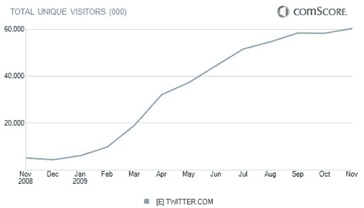

# Twitter 的世界是平的，因为全球增长已经停滞 TechCrunch

> 原文：<https://web.archive.org/web/http://techcrunch.com/2009/12/22/the-world-is-flat-for-twitter-as-in-global-growth-has-stalled/>

# Twitter 的世界是平的，因为全球增长已经停滞

随着微博网站的独立访客数量在 11 月份持平，Twitter 的国际流量继续持平。Twitter 在 11 月份有 6030 万独立访客，而 10 月份有 5830 万独立访客。尽管该网站在全球范围内的访问量增加了 200 万次，但这一微小的访问量增长只代表了 3.5%的流量增长。Twitter 11 月份的美国访问量也停滞不前；在经历了 10 月份流量下降 8%之后，美国流量增加了 10 万多一点，达到 1937 万独立访客。

在过去的几个月里，Twitter 已经推出了西班牙语、 [德语、](https://web.archive.org/web/20230123225634/http://techcrunch.com/2009/12/16/danke-twitter-rolls-out-german-version/) [法语](https://web.archive.org/web/20230123225634/http://techcrunch.com/2009/11/19/french-tweet-twitter-goes-french-in-time-for-leweb/)和[意大利语](https://web.archive.org/web/20230123225634/http://techcrunch.com/2009/12/10/twitter-italian/)版本，这将有助于提升其网站的国际使用。但是随着 Twitter 主页上的流量停滞，像 Seesmic 和 Tweetdeck 这样的第三方 Twitter 客户端正在迅猛发展。

首席执行官伊万·威廉姆斯[承认](https://web.archive.org/web/20230123225634/http://techcrunch.com/2009/10/20/web-2-0-summit-a-conversation-with-twitters-ev-williams/) Twitter 的增长停滞，但表示该网站的新功能可以推动流量的增长，包括[转发按钮、](https://web.archive.org/web/20230123225634/http://techcrunch.com/2009/11/10/hate-it-or-love-it-twitters-new-retweet-style-rolling-out/) [列表、](https://web.archive.org/web/20230123225634/http://techcrunch.com/2009/10/15/breaking-twitter-begins-lists-rollout/)和[地理位置](https://web.archive.org/web/20230123225634/http://techcrunch.com/2009/08/20/twitter-can-now-know-where-you-tweet/)功能。

当然，这些功能中的许多已经被添加到第三方 Twitter 客户端中，轻松占据了 Twitter 一半的使用量。