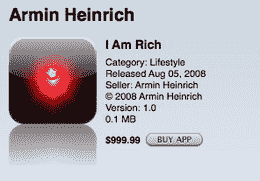

# 世界上第一个奢华的 iPhone 应用程序:999.99 美元的纯粹幸福 

> 原文：<https://web.archive.org/web/https://techcrunch.com/2008/08/06/the-worlds-first-luxury-iphone-app-99999-of-pure-bliss/>

# 世界上第一个奢华的 iPhone 应用程序:999.99 美元的纯粹幸福

*苏富比，空间站 Isis 9，2113:*
下一个拍卖的是[阿明·海因里希的](https://web.archive.org/web/20221006174645/http://xrl.us/omtat)“我很富有”大约是 2008 年为苹果 iPhone 数字化制作的，这是一款受时代知识分子欢迎的设备，也是我们自己受欢迎的 iSuppository 的前身。这件艺术品最初售价为 999.99 美元，是对那个时代的消费主义文化在大布朗宁前夕的尖锐评论。我们引用艺术家最初的使命:

> 你的 iPhone 或 iPod touch 上的红色图标总是提醒你(当你向其他人展示时，也提醒他们)你买得起这个。
> 
> 这是一件完全没有隐藏功能的艺术品。

该作品功能齐全，已经过美国联邦唱片业协会的测试和批准，并获得美国运输安全管理局临时管理局的批准，可在机场、城市、餐馆和浴室及其周围使用。我们从 500 万内布拉斯加欧元开始竞拍。有人出价吗？

[ *谢谢，[戴夫](https://web.archive.org/web/20221006174645/http://www.mobilitytoday.com/) ]*

更新:让这款应用更有价值的是，苹果在它发布后几天就将其从 iTunes 应用商店下架了。只卖出了八本。