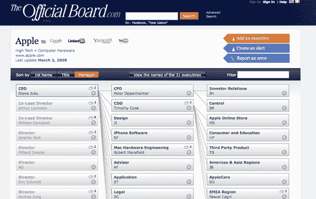
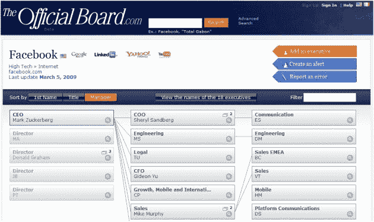

# 官方公告板发布了 20，000 家公司的维基组织结构图 

> 原文：<https://web.archive.org/web/https://techcrunch.com/2009/03/09/theofficialboard-launches-with-wiki-org-charts-for-20000-companies/>

# 官方发布了 20，000 家公司的维基组织结构图

我们都已经习惯了这样一种想法，即我们的个人信息现在是公开的，以至于我们在社交网络和网络上的其他地方分享它。关于不同组织内人员角色和职能的公司数据同样变得越来越公开。你需要做的就是在 LinkedIn 上搜索一个人的全部工作历史，或者通过 [Jigsaw](https://web.archive.org/web/20230128141539/http://www.jigsaw.com/) 找到他们的直接联系方式。现在你可以添加[官方板](https://web.archive.org/web/20230128141539/http://www.theofficialboard.com/)，一个更进一步的联系数据库。它显示了 20，000 家最大公司的组织结构图，所以你不仅可以查找像马克·扎克伯格这样的高管，还可以看到谁向他或她报告。

组织结构图并不总是公司内部权力最可靠的指标，但它们确实是一种直观显示特定公司网络内部权力关系的便捷方式。发布时，官方公告板在全面性和准确性方面存在问题。(参见[谷歌](https://web.archive.org/web/20230128141539/http://www.theofficialboard.com/org-chart/google#145477)。玛丽莎·梅尔在哪？约书亚·沙赫特真的直接向埃里克·施密特汇报吗？**更新**:他没有)。但是随着时间的推移会好起来的。像 Jigsaw 一样，它依赖其成员来填写每个公司的数据。大多数详细信息都是模糊的，除非你增加三个联系人，或者你可以每年支付 100 美元购买[高级访问](https://web.archive.org/web/20230128141539/http://www.theofficialboard.com/info/how-to-sign-up.html)。联系数据或现金都可以换成虚拟货币，然后虚拟货币可以用来访问数据。这种数据交换模式也类似于 Jigsaw，迈克尔曾经为此大发脾气。

但是官方委员会努力确保其数据的准确性，而不仅仅是依靠其成员的贡献。每封邮件都是保密的。会员只能通过官方委员会联系高管，这与 LinkedIn 的工作方式非常相似。此外，它还会检查输入到系统中的每个高管电子邮件地址，并鼓励每家公司的指定高管核实这些信息。(“联系高管”功能尚未激活，该公司正在等待，直到它积累了数万封经核实的电子邮件)。目前，该系统有 20 万名管理人员，分布在 80 个县。该服务还提供公司或个别高管的提醒。只要职位发生变化，就会发出警报。

官方委员会设在法国。它是由苹果法国公司前总经理、亚马逊欧洲副总裁托马斯·洛特(Thomas Lot)创立的。该网站启动时有 15 万美元的种子资金。

**更新**:原来 Forbes.com 也有一个[组织结构图维基](https://web.archive.org/web/20230128141539/http://orgchart.forbes.com/)，我被告知这是罗杰·麦克纳米在 Elevation Partners 入股福布斯媒体后推动的事情。说实话，看起来像是三心二意的努力，也很辛苦。所有这些服务面临的挑战是让拥有正确信息的人放弃它。对很多人来说，根本没有动力。

