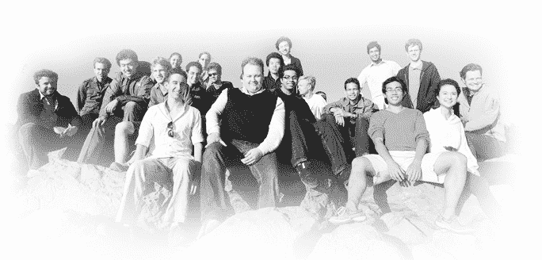

# 资金、资助和图书交易:Thiel 研究员正在取得成绩(接下来还有更多课程)

> 原文：<https://web.archive.org/web/https://techcrunch.com/2011/12/06/thiel-fellows-are-making-the-grade/>

众所周知，彼得·泰尔认为我们经济面临的下一个大泡沫不是膨胀的房地产或科技市场，而是高等教育。这位前 PayPal 首席执行官和脸书的早期支持者因其逆向观点而闻名，并不止一次公开批评高等教育是一个过度宣传和臃肿的行业。这位由企业家转型为投资者的人一直致力于寻找替代的(更好的)方法来激励、培养和支持想要有所作为的年轻人。

今年 5 月，泰尔和他的基金会说到做到，宣布了“20 岁以下泰尔奖学金”(20 Under 20 Thiel Fellowship)，该计划为 20 岁以下有才华的独立思考者提供 10 万美元和两年免费的学校教育，以追求他们的创业努力。这个项目由 24 个泰尔研究员发起，每个 wiz 的孩子都在追求他们自己鼓舞人心的科学和技术项目。([你可以在这里见到全班同学。](https://web.archive.org/web/20221209102637/http://www.thielfellowship.org/fellows/))

起初，泰尔基金会计划只颁发 20 个奖学金，但泰尔基金会负责人詹姆斯·奥尼尔说，在他们收到的 400 份申请中，有太多优秀的候选人，他们不得不增加 4 个名额。

这个项目进行了六个月，已经取得了令人印象深刻的进展。奥尼尔告诉我们，十多名研究员已经成立了公司，至少有一个已经在市场上推出了产品。事实上，这个项目的进展如此之好，以至于泰尔基金会已经决定在 2012 年推出第二个项目。该计划现在接受申请，截止日期为 12 月 31 日。候选人必须在 20 岁以下，直到该日期。

在为明年的课程做准备时，奥尼尔还揭开了帷幕，讲述了当前这一届年轻创新者在第一年的表现。安德鲁·许(Andrew Hsu)创立了一家名为 Airy Labs 的公司(19 岁时，他在斯坦福大学(Stanford University)攻读神经科学博士四年级时辍学)，为孩子们开发下一代社交学习游戏，获得了 150 万美元的风险投资。该轮由 Foundation Capital 牵头，参与方包括谷歌风投、里克汤普森(Rick Thompson)以及其他知名天使投资者和小型风险投资公司。

Eden Full 创建了 Roseicollis Technologies，将她的太阳能电池板跟踪发明“太阳追踪器”带到了发展中社区，她获得了 [Staples-Ashoka 青年社会企业家奖](https://web.archive.org/web/20221209102637/http://www.genv.net/staplesyv/info)，因其对太阳能行业的贡献获得了 30 万美元的邮政编码绿色挑战奖金。

戴尔·斯蒂芬斯最近与企鹅出版社签署了一项协议，出版他即将出版的新书《侵入你的教育》。

今天，该基金宣布[Grand Challenges Explorations](https://web.archive.org/web/20221209102637/http://www.grandchallenges.org/Pages/Default.aspx)(由比尔&梅林达·盖茨基金会创建的一项倡议，旨在让研究人员测试解决持续健康和发展挑战的非正统想法)授予泰尔研究员达伦·朱 10 万美元的赠款。

朱创建了 Synbiosys，LLC，这是一家合成生物学公司，专注于构建基础工具，使生物系统更易于工程化和将其下游应用商业化。具体来说，朱和 Synbiosys 将开展一项全球研究项目，旨在开发一种低成本的诊断平台，以诊断利什曼病，这是一种研究不足的传染病，影响着超过 1400 万人。

根据该基金会的说法，目前对该疾病的诊断依赖于昂贵和侵入性的筛选技术，因此 Synbiosys 正在使用合成生物学来建立一种更快速、廉价和敏感的诊断工具，该工具可以扩展到诊断其他传染病。

这些令人印象深刻的年轻人的早期成功无疑是鼓舞人心的，奥尼尔说，他认为这些人可以成为其他希望涉足技术领域的聪明年轻人的榜样。他说，这就是为什么泰尔奖学金根据他们是谁来挑选参与者，而不是他们所追求的特定项目。该计划鼓励研究员在他们的两年内重复和改变课程。

一路上他们得到了一些严肃的指导。奥尼尔说，他们每个季度都会组织一次务虚会，邀请专家就知识产权税、如何雇佣和激励员工、开发产品、推介投资者等主题进行演讲和研讨会。研究员还受益于三个“精挑细选”的导师，由泰尔基金会根据他们的兴趣选择。

对于有前途的企业家来说，这是一个很棒的项目，而且，按照它的结构，奥尼尔说，他们惊讶地发现，来自高等教育的批评比他们预期的要温和得多。一些教授和老师甚至鼓励他们的学生出去申请。

更重要的是，“任何 20 岁以下的人都有资格”申请。幸运的孩子。