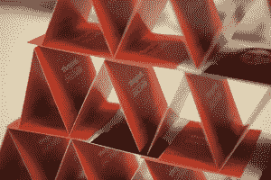

# ThingLink 启动实验室，首个项目:支持 NFC 的可打印图像 TechCrunch

> 原文：<https://web.archive.org/web/http://techcrunch.com/2011/10/13/thinglink-launches-labs-first-project-printable-nfc-tags/>

让你给在线图片添加富媒体标签的初创公司 ThingLink 今天宣布推出一个名为 ThingLink Labs 的内部孵化器，这将是一个专门创造和产品化图像交互领域创新的环境。

实验室的第一个项目是富媒体笔记，ThingLink 图像的印刷版本，也将包括 NFC 标签。

与设计师 Klaus Haapaniemi 合作的新款笔记本电脑将于今明两天在伦敦举行的 2011 年 Wired 大会上展示。代表们将收到自己的富媒体笔记，当通过支持 NFC 的智能手机阅读时，将链接到 About.me 上的在线个人资料。

如果你对 [ThingLink](https://web.archive.org/web/20230203154648/http://www.thinglink.com/) 不熟悉，该公司允许你给在线图片添加标签，当你将鼠标移到图片上时，标签会显示为蓝色的小点。这些点可以链接到网址，包括文本，或链接到许多服务，包括亚马逊，iTunes，YouTube，EventBrite，脸书，Twitter，Vimeo，Flickr，SoundCloud，Spotify，维基百科，Etsy 等等。

 迄今为止，这些充满热点的图像一直受到独立唱片公司、[大牌乐队](https://web.archive.org/web/20230203154648/http://thinglinkblog.com/2011/10/11/gorillaz-blink182-roll-out-thinglink-campaigns/)和推广人的欢迎，包括[例如](https://web.archive.org/web/20230203154648/http://www.prweb.com/releases/thinglink/ecommerce/prweb8783097.htm)，音乐艺术家推广人 TopSpin。还有几笔与唱片公司的大交易正在进行中。一些艺术家使用 ThingLink 图片，允许用户直接从照片本身播放曲目，而其他人则链接到该艺术家在网络上的其他社交网络。

通过将这些 ThingLink 图像转换为打印输出，有可能通过支持 NFC 的海报、传单、讲义和其他材料进行更广泛的分发。唱片公司甚至可能在未来使用它们来创造互动的实体专辑封面，以带回那种曾经来自细读 CD 或唱片衬垫笔记的参与感。

富媒体笔记是与 NFC 标签提供商 [UPM RFID](https://web.archive.org/web/20230203154648/http://www.upmrfid.com/rfid/upm_upm-rfid) 和 NFC 打印解决方案提供商 [TagAge](https://web.archive.org/web/20230203154648/http://www.tagage.net/) 合作创建的。

[YouTube http://www.youtube.com/watch?v=4u9P1WSZbp0]