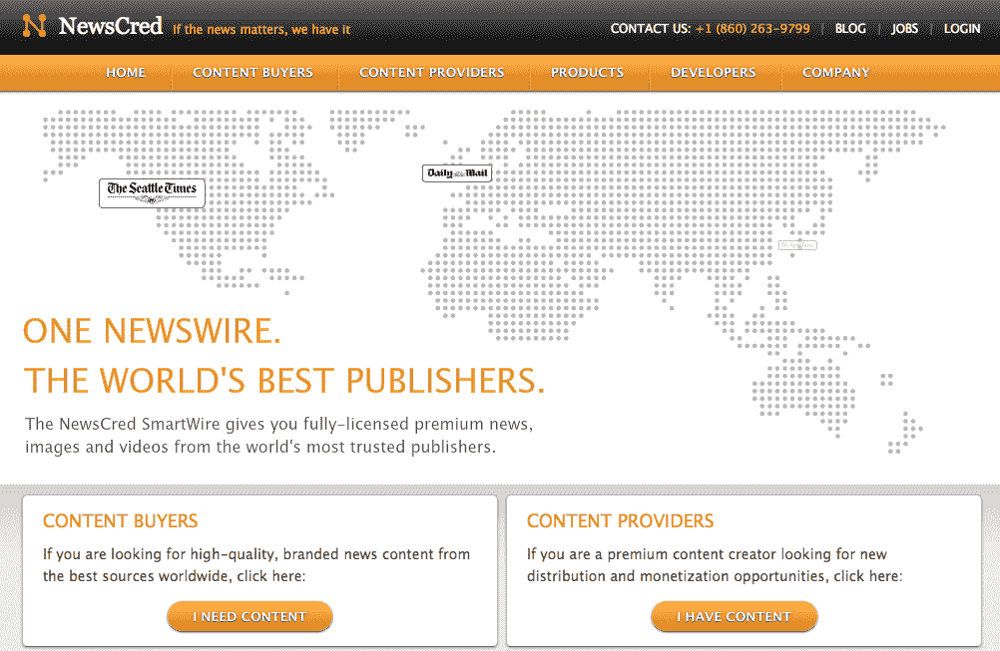

# 第三次有魅力吗？一家新的 NewsCred 筹集了 400 万美元来重塑新闻专线服务 TechCrunch

> 原文：<https://web.archive.org/web/https://techcrunch.com/2011/11/30/third-times-the-charm-a-new-newscred-raises-4-million-to-reinvent-the-newswire-service/>

创业公司 pivot 这是过程的一部分。但是，有多少初创公司多次转向，仍然设法从声誉良好的投资者那里筹集到大量资金？当然，也许这是泡沫的迹象，是初创公司确实资金过剩的迹象，或者也许这家公司只是在不断努力变得更好。

我们[第一次报道 NewsCred 是在 2008 年](https://web.archive.org/web/20221224144500/https://techcrunch.com/2008/05/12/newscred-just-how-trustworthy-is-your-favorite-blog/)，当时他们推出了出版商、作者和故事的可信度评分(通过社区投票加算法)，试图帮助读者过滤噪音，找到最高质量的新闻。

去年早些时候，NewsCred [重新推出了“宁报纸”](https://web.archive.org/web/20221224144500/https://techcrunch.com/2010/01/14/newscred-custom-newspapers/)，允许用户在几分钟内建立定制的在线报纸。这两种方法似乎都站得住脚，这家初创公司去年 9 月从 FLOODGATE 和 IA Ventures 筹集了 75 万美元的种子资金，以支持它的新面貌。

然而，这两种模式都不太受欢迎，而今天的新闻报道则介于两者之间。联合创始人兼首席执行官 Shafqat Islam 表示，两年的迭代和紧张导致团队决定放弃其消费者网站，重新优先关注简单(如果不是雄心勃勃)的目标，即重塑新闻专线服务的概念。

为了做到这一点，NewsCred 正在授权 700 多个优质媒体品牌的内容，如彭博、福布斯、卫报、华盛顿邮报和经济学人，并向客户收取访问其新闻 API 的费用，以及这些出版商的优质内容。

希望第三次尝试是魅力。而且，嘿，相当多的知名投资者愿意打赌这将是。今天，这家初创公司宣布获得了由 FirstMark 牵头的 400 万美元 A 轮融资，Lerer Ventures、AOL Ventures 和 Advancit Capital 通过 Shari Redstone 参与了投资。(FLOODGATE 和 IA Ventures 也进行了再投资。)

伊斯拉姆说，这是对这家初创公司重塑新闻专线使命的信任投票，通过这样做，将观众与“世界上最好的新闻业”联系起来。在其新的 B2B 方法中，NewsCred 希望为出版商和品牌提供从国际报纸到博客和 indy rags 的完全许可的全文文章、照片和视频。这家初创公司的内部编辑团队针对每个客户的特定需求和兴趣，无论是广泛的还是小众的，筛选和策划了数千篇文章。通过一个平台、一个许可证和一个账单，NewsCred 正努力让出版商和品牌轻松购买、管理和增加收入。

这家初创公司和它的编辑团队一起，使用 API 按照主题、地点、语言、来源和日期过滤和定制新闻文章。通过其专有的语义和自然语言处理技术，NewsCred 从 50 个国家的 700 多个来源中收集了 215，000 篇全文文章，使用 8 种语言，全部分为 20 个类别和 47，000 个主题。

Islam 说，这家初创公司的技术是平台不可知的，可以在平板电脑、手机、网络、脸书等平台上工作，并以 XML、RSS 或 JSON 格式提供内容、图像和多媒体。

至于它的收入模式？NewsCred 每月收取 API 许可费来获取其内容，这是基于新闻故事的数量以及许可的来源。初创公司获得的所有收入都与内容提供商分享，首席执行官表示，它已经向一些来源支付了六位数的费用。

对于记者来说，这是获得曝光率和接触新分销渠道的好方法，同时保持归属，并获得额外的收入。对于希望提高产量以跟上 24 小时数字新闻周期的出版商来说，NewsCred 可以接触到大量声音，能够定制内容，为利基受众创建有针对性的编辑版块，以及互补的广告机会，这可能很有吸引力。尤其是对于已经获得大量浏览量的出版商来说。

诚然，消费者在消费数字内容时希望获得各种不同的观点，而 NewsCred 无疑给了内容提供商和品牌一个获得优质新闻并向读者提供优质新闻的机会，但新闻消费者也对普通的老式 RSS 提要、聚合器、转发博客、辛迪加等保持警惕。NewsCred 可以通过庞大的编辑团队和狂热的管理来回避这一点，但这可能是一个滑坡。

出版商和内容制作商获得补充内容和收入流的一站式平台无疑很有吸引力，可能正是这一切的发展方向。只要它不需要另一个支点。更多信息，[请点击这里](https://web.archive.org/web/20221224144500/http://www.newscred.com/)查看。

你怎么想呢?有什么新闻报道吗？

