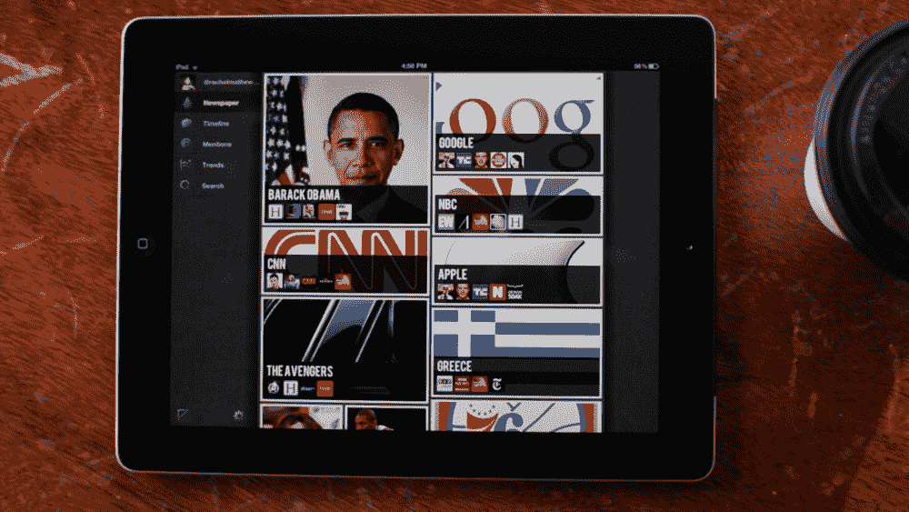
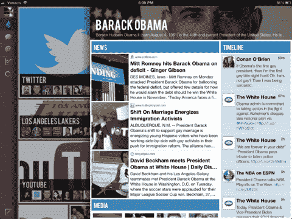

# 渴望旨在满足你对相关 Twitter 内容的渴望 

> 原文：<https://web.archive.org/web/http://techcrunch.com/2012/05/16/thirst-aims-to-slake-your-hunger-for-relevant-twitter-content/>

# 渴望旨在满足你对相关 Twitter 内容的渴望

Twitter 平台即将迎来专用应用的第二次浪潮吗？

在过去的几周里，我看到了一些从人们的个人信息流中过滤出最相关的新闻故事、视频和照片的产品。[渴望](https://web.archive.org/web/20230209125053/http://thirst.co/)就是其中之一，今天它将发布一款 [iPad 应用](https://web.archive.org/web/20230209125053/http://thirst.co/)。该公司得到了投资者近 100 万美元的支持，其中包括 BlueRun Ventures、Powerset 前首席运营官史蒂夫·纽科姆(Steve Newcomb)和 DCM 普通合伙人杰森·克里科里安(Jason Krikorian)。它是由两个最近从伯克利毕业的人发起的，分别是安努·维尔马和库纳尔·莫迪。

虽然口渴是在 Twitter 平台上开始的，但该公司实际上更多的是自然语言处理技术。Twitter iPad 应用更多的是围绕其 NLP 处理器是否工作良好的概念验证。维尔马说，很难跟上通过 Twitter 分享的信息，必须有一个更好的方式来呈现最重要的新闻。《渴望》使用一个定制的自然语言处理器，围绕不同的关键词或主题挑选出最重要的故事，如“同性恋婚姻”(因为上周巴拉克奥巴马总统宣布支持同性恋婚姻)。

不过，问题是，像这样的单个公司能发展成多大。迄今为止，Twitter 平台催生的最大退出都是相对较小的。Tweetdeck 以 4000 万到 5000 万美元的价格卖给了 Twitter。相比之下，迄今为止最大的 iOS 收购是 Instagram，或 Zynga，迄今为止最成功的脸书平台公司。你可能会说，Instagram 和 OMGPOP 等最近的并购交易归功于 Twitter 平台，因为社交网络是这两个应用的增长渠道，但很难说他们的成功有多少来自 Twitter 平台。也有很多基于 iPad 的新闻阅读器，如 Flipboard、Pulse 和 News.me，它们是饥渴的竞争对手。

维尔马再次表示，Twitter 仅仅是一个开始。口渴还有很多其他地方可以去。

【T2

[维梅奥·http://www.vimeo.com/42249625 w = 400 & h = 225]

[渴望 Twitter](https://web.archive.org/web/20230209125053/http://vimeo.com/42249625) 来自[渴望](https://web.archive.org/web/20230209125053/http://vimeo.com/user11740847)在 [Vimeo](https://web.archive.org/web/20230209125053/http://vimeo.com/) 上。