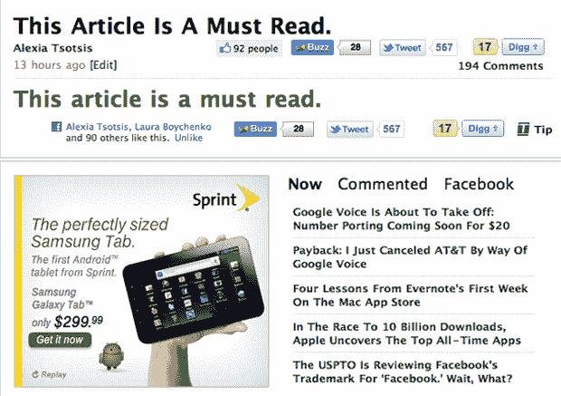

# 这篇文章解释了“这篇文章是必读的。”

> 原文：<https://web.archive.org/web/http://techcrunch.com/2011/01/20/this-article-explains-this-article-explains-this-article-is-a-must-read/>

你们中的许多人要求一个帖子来揭示这个帖子背后的故事。(警告:如果你很容易被激怒，就不要点击。如果你讨厌棒球内幕，请不要再看下去了)。

今天早上迈克写了一篇名为[“对死源的义务”](https://web.archive.org/web/20230202231533/https://techcrunch.com/2011/01/19/obligations-to-dead-sources/)的文章，其中他提到了《纽约时报》记者 Micheline Maynard 的一条推文。梅纳德关于不违背保护消息来源的承诺的推文实际上违背了她保护消息来源的承诺。我知道这很令人兴奋。

http://twitter.com/#!/MickiMaynard/status/27496785383522304

虽然梅纳德的推文更像是一个悖论(一个概念中的两个互斥断言)，而不是递归的(一个定义的重复应用)，但它让我想起了另一条推文，它突破了 140 个字符的逻辑界限。

Techmeme 创始人 [Gabe Rivera](https://web.archive.org/web/20230202231533/http://www.crunchbase.com/person/gabe-rivera) (他也是我的男朋友)在 2009 年发了这条[受大毒蛇启发的推文，它引起了喜欢递归幽默的人的共鸣。但是里维拉当时重复的和我们今天玩的都不是原创的，从](https://web.archive.org/web/20230202231533/http://twitter.com/#!/gaberivera/status/5104915222)[斐波那契](https://web.archive.org/web/20230202231533/http://www.mathacademy.com/pr/prime/articles/fibonac/index.asp)到比较科学 101，从[斯蒂芬霍金](https://web.archive.org/web/20230202231533/http://en.wikipedia.org/wiki/Turtles_all_the_way_down)到[友狗](https://web.archive.org/web/20230202231533/http://knowyourmeme.com/memes/xzibit-yo-dawg)，元引用无处不在。

http://twitter.com/#!/gaberivera/status/5104915222

无限循环的概念是我们对世界的理解中不可或缺的一部分，以至于语言学家诺姆·乔姆斯基在某个时候认为理解并能够扩展递归概念是我们与动物的区别。如果你想要更多的证据(并且很乐意)，只需谷歌一下[【递归】](https://web.archive.org/web/20230202231533/http://www.google.com/#hl=en&sugexp=ldymls&xhr=t&q=recursion&cp=4&qe=cmVjdQ&qesig=YoPwp4AkslNEacTas521HA&pkc=AFgZ2tkbEy67mbD6lZR3oZZvbIH4bmVoXH1x6zpWBtzLJrnke53jIGMHSywBSuNhSPhfD-HnLylStVQ6Q_FNWsemK_BQ2dr3Ew&pf=p&sclient=psy&site=&source=hp&aq=0p&aqi=&aql=&oq=recu&pbx=1&fp=25a0b2344dc0e416)。

由于聚合和内容农业的性质，新闻写作正趋向于带有[证明标题的博客文章，几乎没有实际内容，在评论部分有无休止的争论。商业内幕](https://web.archive.org/web/20230202231533/http://www.urbandictionary.com/define.php?term=provactive)甚至将 MG 的[推文](https://web.archive.org/web/20230202231533/http://www.businessinsider.com/did-someone-notify-the-next-of-kin-easyone-ndash-mg-siegler-2010-6)整篇贴出。

因此，当迈克建议我们尝试找出如何制作一个链接到自己的帖子时，我不仅看到了成为 meta 的机会，也看到了对新闻周期和业务进行微妙批评的机会。是的，我知道这会惹怒多少人。不，我不认为我的读者是理所当然的，但我经常希望他们有幽默感。或者耐心。

http://twitter.com/#!/spy tap/status/27797867192131584

当然，我不一定打算写后续文章，你们中的一些人似乎已经明白了(*)。令人震惊的是，实验对象没有撒谎。”*)但是像这样的评论*“我点击了 3 次链接，然后我意识到，然后我很难过。:'("*让我觉得我欠我的读者一些科学知识。毕竟，你们确实在为我买单，没有人喜欢被人觉得自己很蠢。相信我。

下面是最终的分析数据:在今天结束时，[“这篇文章是必读的”](https://web.archive.org/web/20230202231533/https://techcrunch.com/2011/01/19/this-article-is-a-must-read/)获得了 38，888 次现场浏览量，30，467 次 RSS 阅读器浏览量，204 条评论，566 条推文，92 个脸书赞和 17 个挖掘(不知道是否有人再关注 Buzz 按钮)。这是 TechCrunch 上 24 小时内最热门的流量帖子，尽管我认为还有许多人配得上这个头衔(尤其是“[2010 年前 20 名风投博主](https://web.archive.org/web/20230202231533/https://techcrunch.com/2011/01/19/top-20-vc-bloggers/ "The Top 20 VC Power Bloggers Of 2010")”)。

http://twitter.com/#!/Kyle MCE/status/27832146391474176

它还上了我们的“最多评论”栏目，在某个时候每 30 秒就有一条评论，尽管讨论的主题只是一个链接。怎么回事伙计们？

虽然帖子的标题肯定是故意的[点击诱饵](https://web.archive.org/web/20230202231533/https://techcrunch.com/2010/07/26/cow-clicker-facebook/)可能解释了高流量，但我很难理解这 204 条评论(我有点期待 iPhone 和 Android 会在那里爆发一场战斗)。

也许这最终证明了 TechCrunch 更多的是关于[评论](https://web.archive.org/web/20230202231533/http://twitter.com/#!/kmilden/status/27970075596165120)(和社区)而不是内容？毕竟这个[相似的帖子](https://web.archive.org/web/20230202231533/https://techcrunch.com/2010/09/03/ping-ping-ping-ping-ping-ping-ping/)和这个[相似的帖子](https://web.archive.org/web/20230202231533/https://techcrunch.com/2008/05/25/twitter-2/)都收到了相似程度的讨论。

如果确实如此，谢谢你。

强制性 Quora [引用](https://web.archive.org/web/20230202231533/http://www.quora.com/What-is-recursion)。