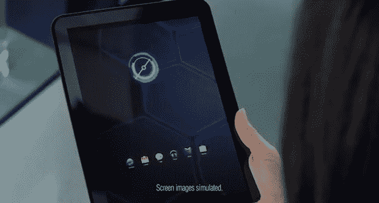

# 这最好不是 Xoom 2 

> 原文：<https://web.archive.org/web/http://techcrunch.com/2011/06/17/this-better-not-be-the-xoom-2/>

# 这最好不是 Xoom 2

互联网上议论纷纷，上面图片中的平板电脑是 Xoom 2。它出现在一个新的威瑞森广告中(嵌入在链接后)，虽然除了背面的大威瑞森标志外，它没有任何品牌，但它至少看起来像一个 [Xoom](https://web.archive.org/web/20230203070145/http://www.crunchgear.com/tag/xoom/) 。它拥有相同的哑光黑色配色方案，背部有纹理，正如 Droid-Life 指出的那样，它还拥有 Xoom 上相同的独特扬声器。但是请不要让它成为 Xoom 2。或者更确切地说，请不要马上发布这该死的东西。

最初的 Xoom 在二月底开始慢慢推出。它被认为是终极的蜂巢平板电脑——一种 Nexus 产品。但这并没有和[的销量体现出的那种](https://web.archive.org/web/20230203070145/http://www.crunchgear.com/2011/04/06/everyones-to-blame-for-the-xooms-low-sales-numbers/)。它是[笨贵](https://web.archive.org/web/20230203070145/http://www.crunchgear.com/2011/04/07/xoom-too-expensive-try-these-inexpensive-android-tablets-instead/)，不好拿，缺少一个 USB 主机端口和[功能性 microSD 卡槽](https://web.archive.org/web/20230203070145/http://www.crunchgear.com/2011/04/12/xooms-microsd-card-slot-enabled-through-custom-kernel/)。然后是蜂巢，由于缺乏应用程序，它甚至现在还没有完全成熟。威瑞森和摩托罗拉希望迅速从 Xoom 灾难中恢复，这是有道理的，但在任何时候推出 Xoom 2 都会适得其反。

人买了 Xoom。当然，平板电脑[没有看到 iPad 那样的销售数字](https://web.archive.org/web/20230203070145/http://www.crunchgear.com/2011/04/29/motorola-sold-250000-xooms-this-quarter/)，但是第一批采用者叫嚣着要昂贵的平板电脑。随着关于 Xoom 的负面新闻源源不断地出现，这些忠实的买家开始在网络上为他们的购买行为辩护。你不希望在将原版作为自 StarTAC 以来最好的东西进行营销后不久就发布新的改进版 Xoom，从而激怒第一批采用者。

摩托罗拉做了他们的蜂巢糖，现在他们必须吃掉它。支持这该死的设备是他们对买家的责任。当然，他们也有责任成为一家盈利的公司，拥有稳固的产品渠道。Xoom 2 最好在开发中。我不是说不应该。然而，看到自从 Xoom 发布以来，Android 3.x 中的[没有重大更新](https://web.archive.org/web/20230203070145/http://www.crunchgear.com/2011/05/10/hands-on-with-android-3-1-on-the-motorola-xoom/)，Xoom 2 将只是一个硬件更新，以解决对原始模型的批评。改为支持原著。

最初 Xoom 的主要症结是价格，现在仍然如此。只是太贵了，但这似乎是一个简单的解决办法。摩托罗拉将其定价为与 iPad 竞争，而不是与其他蜂巢平板电脑竞争。这当然是最早的蜂巢平板电脑，也是第一款有官方 MSRP 的平板电脑。然而，摩托罗拉还没有对[最近推出的蜂巢平板电脑](https://web.archive.org/web/20230203070145/http://www.crunchgear.com/2011/04/07/xoom-too-expensive-try-these-inexpensive-android-tablets-instead/)的较低价格做出反应，并正式降低平板电脑的价格，尽管它可以在仓库商店和网上折扣零售商中以更低的价格[找到。](https://web.archive.org/web/20230203070145/http://www.crunchgear.com/2011/06/16/wifi-xoom-going-for-500-at-costco/)

发泄够了。摩托罗拉不需要新的 Xoom。他们需要降低原版的价格，并用简单的营销活动来支持它。我仍然不明白除了我们这些人之外，还有谁会理解 Xoom 的超级碗广告的深层含义。

【YouTube = http://www . YouTube . com/watch？v=_INWezbkBJ8&w=640&h=390]