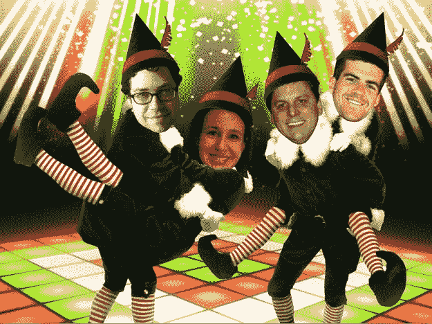
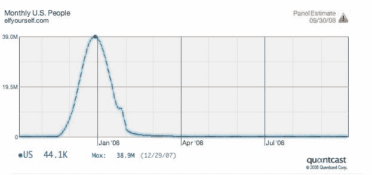

# 今年圣诞节，OfficeMax 的 ElfYourself.com 将有一个 JibJab 转折 TechCrunch

> 原文：<https://web.archive.org/web/https://techcrunch.com/2008/11/12/this-christmas-officemaxs-elfyourselfcom-will-get-a-jibjab-twist/>

# 今年圣诞节，OfficeMax 的 ElfYourself.com 将有一个 JibJab 扭曲

一年前，网络上一个令人惊喜的假日突破是[ElfYourself.com。](https://web.archive.org/web/20221006023315/http://www.elfyourself.com/)这是一个由 OfficeMax 创建的推广性病毒视频网站，让人们上传自己的照片并制作舞蹈精灵，然后他们可以将这些照片作为电子贺卡发送给家人和朋友。去年 12 月，ElfYourself 成为增长最快的网站，在美国的独立访客达到 3900 万(在整个活动期间，吸引了全球总共 1 亿独立访客)。

当 JibJab Media 的首席执行官 Greg Spiridellis 看到 ElfYourself 时，他产生了共鸣，因为 JbJab 是围绕一系列类似的[“主演你”](https://web.archive.org/web/20221006023315/http://sendables.jibjab.com/)视频组织的，这些视频允许人们上传他们的照片，以便他们可以在视频中担任主角，并以数字卡的形式发送。JibJab 视频也经常涉及跳舞的角色。

Spiridellis 决定在 Quantcast 上查找 ElfYourself 的流量数据，这是他看到的情况:

在那一个月里，它的流量与脸书不相上下。但是 Spiridellis 认为 JibJab 可以让网站更上一层楼。今年 2 月，他给 OfficeMax 的首席营销官打了一个电话，提出了一个合作伙伴关系:JibJab 将围绕其主演的 You 平台创建新的舞蹈精灵。不会有一种舞蹈，而是三种:迪斯科精灵、爵士精灵和乡村精灵。还有机会出售印在卡片、杯子和鼠标垫上的视频和个性化图像的数字下载。

它可以让你从昂贵的营销成本变成可能真正赚钱的东西。OfficeMax 同意了，今年 JibJab 将运营该网站，该网站计划于本周晚些时候重新启动。这是 JibJab 发给我们的一张挑逗性的照片，上面有一些 TechCrunch 的工作人员(迈克尔、马克、希瑟和我)。