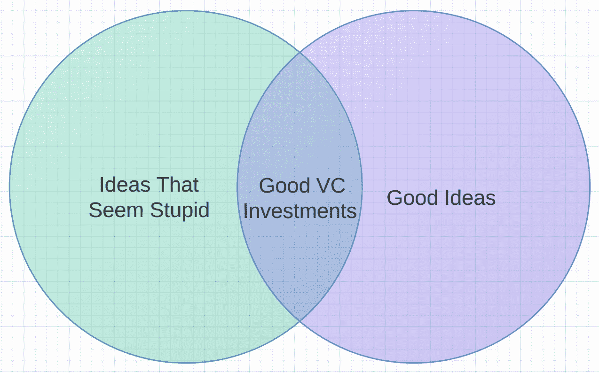
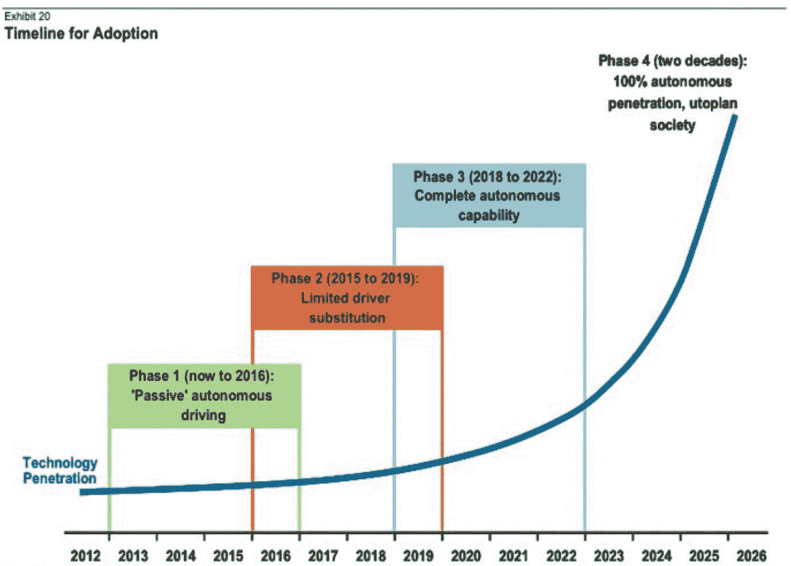

# 这个行业完全是荒谬的。让我们希望它保持这种方式。

> 原文：<https://web.archive.org/web/https://techcrunch.com/2014/03/01/this-industry-is-completely-ridiculous-lets-hope-it-stays-that-way/>

乔恩·埃文斯是工程咨询公司 HappyFunCorp 的首席技术官；六部小说、一部漫画小说和一本游记的获奖作者；自 2010 年以来一直是 TechCrunch 的周末专栏作家。

More posts by this contributor

好的。让我们从所有最近的科技新闻中退一步，用新的眼光来看待它——尽量不要爆发出略带歇斯底里的笑声。

在日本，价值约 5 亿美元的加密货币从一个魔术交易网站消失:收集卡片。在纽西兰，[世界上最伟大的使命召唤玩家](https://web.archive.org/web/20221208211844/http://www.tweaktown.com/news/35482/kim-dotcom-retiring-from-call-of-duty-hopes-to-be-king-of-titanfall/index.html)已经[发起了一个政党](https://web.archive.org/web/20221208211844/http://www.theregister.co.uk/2014/02/25/kim_dotcom_extradition_hearings_delayed/)来报复那些[逮捕他并没收他跑车的人](https://web.archive.org/web/20221208211844/http://www.listener.co.nz/commentary/the-internaut/kim-dotcom-megaupload-new-zealand-timeline/)。在英国，特勤局忙于收集和观看国产色情片。

在硅谷，强大的苹果公司刚刚透露，一个[明显的、基本的](https://web.archive.org/web/20221208211844/https://www.cs.columbia.edu/~smb/blog/2014-02/2014-02-23.html)编程错误摧毁了其所有设备*年*的安全性。谷歌，“多木背后少箭”谷歌，现在[有了自己的海军](https://web.archive.org/web/20221208211844/http://sacramento.cbslocal.com/2014/02/26/mysterious-google-barges-new-home-port-of-stockton/)，去配它的[空军和机器人陆军](https://web.archive.org/web/20221208211844/http://www.mercurynews.com/business/ci_25118059/google-plans-aerospace-and-robotics-projects-hangar-one?_ga=1.92507485.1525881384.1393607103)。与此同时，在沙丘路，风险投资家们非常担心他们投资的科技创业公司不够疯狂:

等等，更奇怪的是。牙买加奥林匹克雪橇队的部分资金来自价值 3 万美元的狗币。TechCrunch 的金·麦·卡特勒(Kim-Mai Cutler)正在向越南的一家调查性新闻公司众筹资金，以找出病毒式流行歌曲《Flappy Bird》被从应用商店下架的原因；这家合资企业已经被 T4 超额认购。哦是的。然后就是 [Shingy](https://web.archive.org/web/20221208211844/http://valleywag.gawker.com/this-man-is-representing-aol-on-live-television-1518467796) 。

本月晚些时候，我将去佛罗里达看望我的父母，我有点害怕任何关于科技行业的讨论。我担心事情会是这样的:

https://twitter.com/MattBors/status/414639889980735488

Mt.Gox 在*年*时间内丢失了数十万个比特币而没有察觉的说法完全不可信，近乎*疯狂*——但仍比 Mt.Gox 一度成为比特币中心的说法不疯狂。让我们面对它，比特币本身是非常荒谬的，我是作为一个加密货币的长期信徒这么说的。

以防不明显，我认为所有这些新高科技达达主义都很棒。我的意思是，这不是所有的*好*。有些是坏的，如果不是彻头彻尾的邪恶。但它仍然很棒。举个例子，美国国家安全局的大量数据收集项目令人捧腹。正如布鲁斯·施奈尔[所说](https://web.archive.org/web/20221208211844/http://www.theatlantic.com/technology/archive/2014/01/how-the-nsa-threatens-national-security/282822/):

> 我可以说出三个不同的 NSA 项目来收集 Gmail 用户数据。这些程序基于三种不同的技术窃听能力。他们依赖三个不同的法律权威。它们包括与三家不同公司的合作。这只是 Gmail。手机通话记录、网络聊天、手机定位数据也是如此。

施奈尔认为这是故意混淆视听；我认为这只是邪恶的 NSA 官僚本质上仍然是官僚的一个副作用，沉迷于将一切细分为单独的筒仓和流程(对 WTF 名称有奇怪的偏好)。)这就好像《办公室空间》中的弥尔顿与魔鬼做了一笔浮士德式的交易

[https://web.archive.org/web/20221208211844if_/https://www.youtube.com/embed/ddviJMs7pXo?feature=oembed](https://web.archive.org/web/20221208211844if_/https://www.youtube.com/embed/ddviJMs7pXo?feature=oembed)

视频

与此同时，互联网被搞砸了，旧金山的街道上充斥着不可救药的骗子:

但是等等！并不是一切都没了。我给你这张显然完全电子的幻灯片，来自摩根士丹利[分析师报告](https://web.archive.org/web/20221208211844/http://www.slate.com/blogs/moneybox/2014/02/25/morgan_stanley_on_autonomous_cars_utopia_by_2026.html)—*摩根士丹利！* —

“乌托邦社会。”摩根士丹利！

当然，这正是让局外人大喊“泡沫，泡沫，辛劳和麻烦！”因为他们的眼睛因嫉妒而变成绿色。"崩盘前先自大！"他们吟诵道，确信 2015 年将和 2000 年一模一样。

没有。抱歉。更有趣的事情正在这里发生。

这更像著名编剧威廉姆·高德曼曾经对好莱坞说的话:“没有人知道任何事情。”我以前说过，硅谷比人们意识到的更像好莱坞——风投当制片人，创始人当导演，几乎每个人都渴望轰动一时的电影——今天的硅谷就像高曼所说的好莱坞，20 世纪 70 年代的好莱坞，当时没有人知道什么会轰动一时，所以一股无政府主义的导演浪潮充斥着现场，斯皮尔伯格、卢卡斯、科波拉、逍遥骑士 T2，甚至上帝保佑我们，还有 T4、扎多兹、T5、T6，因为制片人把钱砸在了所有的事情上

让我们希望它保持这种方式。因为从那以后，好莱坞[找到了成功的公式](https://web.archive.org/web/20221208211844/http://www.slate.com/articles/arts/culturebox/2013/07/hollywood_and_blake_snyder_s_screenwriting_book_save_the_cat.html)，几乎每一部 tentpole 电影都遵循它们，原创性和导演的视野大多被归入独立电路，如果它存在的话。我担心同样的事情有一天会发生在科技世界；现在，全世界的目光都聚焦在我们身上，[湾区已经成为世界的中心](https://web.archive.org/web/20221208211844/http://www.businessinsider.com/business-insider-us-20-2013-2013-11)，对冲基金开始[涉足科技投资](https://web.archive.org/web/20221208211844/https://beta.techcrunch.com/2014/01/18/the-rise-of-the-hedge-fund-startup-investor-again/)，这个行业将发现自己在“成长”,变得稳重和受人尊敬，崇拜那些已经付出了自己的努力的五六十岁的人，而不是 20 多岁的 CEO，他们没有任何贡献，每个员工有 190 亿美元——[3.45 亿美元！](https://web.archive.org/web/20221208211844/http://blogs.wsj.com/corporate-intelligence/2014/02/19/facebooks-whatsapp-price-tag-19-billion/)——想花就花。

虽然我可能害怕这种结果，但这实际上不是我所期望的。*相反的*。我认为，科技行业不会被官僚、政客、I-bankers 和其他严肃的人拉拢，而是会被他们拉拢，让整个世界陷入令人眼花缭乱的马戏中，不停地快进，不断加速，疯狂而不可预测的荒谬，以及令人惊讶的颠覆性结果。我有点自鸣得意地怀疑，每一个试图从科技行业分一杯羹的准国王和拥王者，都会发现自己出乎意料地被我们吞噬。同样，这并不总是一件好事。但如果没有别的，它保证会非常有趣。