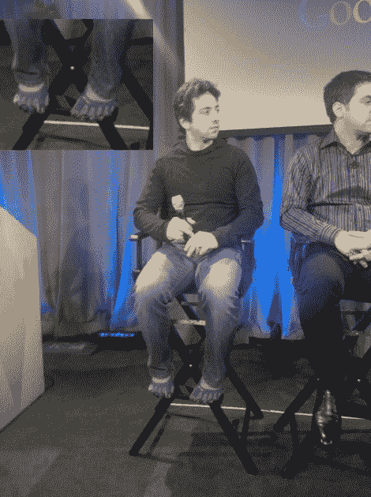
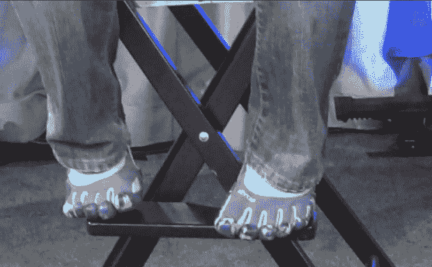

# 本季，疯狂猴子鞋成为 Chrome OS 活动 TechCrunch 的新热点

> 原文：<https://web.archive.org/web/https://techcrunch.com/2009/11/19/this-season-crazy-monkey-shoes-are-the-new-hotness-at-the-chrome-os-event/>

# 这一季，疯狂猴子鞋成为 Chrome OS 活动的新热点

维尔科姆，亲爱的！看看我们为你准备了什么！谢尔盖·布林穿着 VFF KSOs，这是克朗彻奇的最爱，格雷格称之为“疯狂的猴子鞋”我个人是一个 VFF 皈依者，我对 Sergey 愿意穿着这些到处走印象深刻。

对于不了解内情的人来说， [Vibram Five Fingers](https://web.archive.org/web/20221007034258/http://www.vibramfivefingers.com/) 是一款超轻跑鞋/运动鞋，每个脚趾都有单独的口袋。我穿着它们跑步，我喜欢它们——经过多年的滥用，它们解决了我很多跑步问题。克里斯托弗·麦克杜格尔(Christopher McDougall)的《生来奔跑的 T4》(Born to Run)让它们变得流行起来，但它们已经存在了几年。它们本质上是教你的身体如何再次赤脚跑步，就像很久很久以前你的祖先曾经自由地跑过新泽西的森林一样。

我的复习是[这里](https://web.archive.org/web/20221007034258/http://www.crunchgear.com/2009/08/10/review-vibram-five-fingers-classic/)。

它们绝对让你看起来像个怪物。然而，我怀疑，这个人拥有亿万美元的事实，多少减轻了人们对他的轻蔑和嘲笑。在我的情况下，当我跑的时候，人们只是嘲笑我，我哭了。汗水掩盖了泪水。

