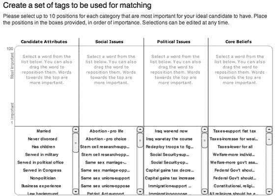

# 这个网站会告诉你投票给谁 TechCrunch

> 原文：<https://web.archive.org/web/https://techcrunch.com/2007/10/22/this-website-will-tell-you-who-to-vote-for/>

# 这个网站会告诉你投票给谁

如果你太急于亲自查看总统候选人，互联网现在可以帮你做到。

[Connect2Elect](https://web.archive.org/web/20230124233105/http://www.connect2elect.com/) 是一个新网站，用户可以添加候选人属性，发布对他们来说重要的职位，并查看他们应该投票给谁。问题按照社会(堕胎、同性婚姻、干细胞研究)、政治(伊拉克战争、税收、移民)和核心信仰(福利、持枪权)来划分。显然在分类上有一些重叠和争论的空间，但是基本的想法是你点击对你重要的问题并排序。然后，您会看到一个结果屏幕，其中显示了映射到您自己的候选值。瞧啊。你知道该投谁的票。

总的来说，我认为这项服务执行得很好(它是由 [introNetworks](https://web.archive.org/web/20230124233105/http://www.crunchbase.com/company/introNetworks) ，一家[白色标签社交网络](https://web.archive.org/web/20230124233105/http://techcrunch.com/2007/08/14/34-more-ways-to-build-your-own-social-network/)初创公司建立的)。但我觉得仅仅根据他们的官方政策来选择候选人有点站不住脚，因为这些政策仅仅反映了当前的民意。

在相关的内容中，请看我们最近对 [PoliticalBase](https://web.archive.org/web/20230124233105/http://www.crunchbase.com/product/political-base) 的[报道，这是一个围绕候选人和问题的新的数据库驱动的初创公司，让我们知道你希望我们在即将到来的与共和党总统候选人米特罗姆尼](https://web.archive.org/web/20230124233105/http://techcrunch.com/2007/10/09/cnet-founder-shelby-bonnie-unveils-his-new-startup-politicalbase/)的播客讨论中提出什么问题。

