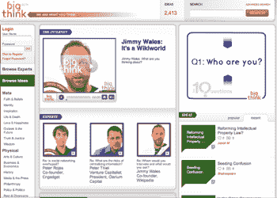

# 关于 BigThink  的想法

> 原文：<https://web.archive.org/web/https://techcrunch.com/2008/01/07/thoughts-about-bigthink/>

 一个新的视频网站，展示来自政界、学术界、科学界和商界的大思想家[今天在](https://web.archive.org/web/20230314031805/http://www.nytimes.com/2008/01/07/technology/07summers.html?_r=1&oref=slogin)推出测试版。名为 [BigThink，](https://web.archive.org/web/20230314031805/http://www.bigthink.com/)它将彼得·泰尔和前哈佛大学校长拉里·萨默斯作为投资者。它从南非风投(也是主要投资者)大卫·弗兰科尔那里筹集了七位数的天使投资，他以个人名义投资，还有萨默斯、泰尔、楠塔基特 Nectars 和 Plum TV 的企业家汤姆·斯科特以及电视制片人加里·戴维·古德伯格( *Spin City* 和 *Family Ties* )。

该网站是作为一个寻找智力视频小吃的地方而建立的。通常，每个视频都展示了一位公共知识分子或学者在三到五分钟内回答一个尖锐的问题，背景是鲜明的白色。Big Think 推出了来自 85 位“嘉宾”的 2000 个剪辑，包括参议员约翰·麦凯恩(关于两党制)、心理学家史蒂芬·平克(关于人性)、经济学家保罗·克鲁格曼(关于后代是否会恨我们)。[萨默斯](https://web.archive.org/web/20230314031805/http://www.bigthink.com/policy-politics/2008-elections/912)和[泰尔](https://web.archive.org/web/20230314031805/http://www.bigthink.com/science-technology/the-internet/1540)有自己的视频(嘿，他们为网站付费)。甚至维基百科的联合创始人吉米·多纳尔·威尔士、华尔街日报的沃尔特·莫斯伯格和 Engadget 的彼得·罗哈斯都有视频。(我在下面嵌入了沃尔特叔叔的文章，他在文章中驳斥了互联网是政治游戏规则改变者的观点)。

【http://www.bigthink.com/swf/video_player_404x303.swf】

即使有 2000 个剪辑，这个网站现在也觉得很空闲。但是应该很快就能填好。创始人彼得·霍普金斯告诉我，他已经拍摄了另外 100 小时的视频，需要编辑，这家初创公司将很快开始每天的采访日程。视频的质量总体来说不错，尽管灯光让莫斯伯格和理查德·布兰森这样的人看起来有些粉红。一些公共知识分子就是不应该出现在镜头前，不管他们有多聪明。网站的设计在避免混乱方面做得很好，但是导航需要改进。例如，很难找到某个人的所有视频。

 整个网站旨在引发知识界的争论。每个视频都旨在传达一个重要的思想，观众可以对每个视频进行评级，投票决定他们是否同意，添加他们自己的评论，或提出他们希望看到讨论的新想法。“展望未来，”霍普金斯说，“我们将向受邀与会者的观众征集问题，并将要求选定的嘉宾对他们从用户那里收到的反馈做出回应。”观众可以以书面、视频或音频幻灯片的形式提交问题。这种来回辩论的质量将决定网站的成败。要么人们会觉得辩论很刺激，继续回来，要么不会。

BigThink 与 [Fora 争夺相同的受众群体。电视](https://web.archive.org/web/20230314031805/http://fora.tv/)(见我们之前的[帖子](https://web.archive.org/web/20230314031805/https://techcrunch.com/2007/10/29/foratv-raises-2-million-seed-round-from-adobe-and-will-hearst/))，它从会议和其他公共演讲场所收集了更多公共知识分子、政治家和商业名人的视频，并在其网站上展示了他们的三分钟短片。当 YouTube 遇到 Fora.TV 时，霍普金斯更多地看到了他的努力。他通过电子邮件说:

> 我是 Fora 的粉丝，我认为他们在制作更多高质量在线内容方面有很好的方法。他们看到了捕捉制作内容并以原始形式提供的潜力。这给了他们难以置信的扩展产品的能力。在制作内容方面，我们通过提供专门为 8 英寸观看体验制作的内容来进行竞争。但是，我们不打算在短期内赶上他们的产品规模。
> 
> 我们的不同之处在于，我们希望让自己与众不同的是，用户能够像我们邀请的参与者一样积极地做出贡献。Fora 是关于在一个方向上提供大量高质量的内容，而 Big Think 是关于使用一些高质量的内容在两个方向上开始思想交流。

论坛有一些互动内置，以及在每个视频的论坛讨论的形式。我认为真正的区别在于，Fora 的内容往往是从较长的演讲中挑选出来的，而 BigThink 则以三分钟的片段作为其生产和消费的主要单位。一个问题是，这是否足够，或者 BigThink 是否能想出一种方法，在得到许可的情况下，将其视频微块串联成长格式视频。这在网络上可能无关紧要，但如果 BigThink 想要将其最好的视频打包成其他格式，如 DVD 或普通电视，它现在应该找到一种方法。只是一个建议。

一个更大的问题是无处不在的 YouTube 因素，以及我们是否甚至需要一个“智能”视频的利基网站。是的，你可以在 YouTube 上找到智能视频，尽管它们往往有不同的风格。你更想看什么，这个[英国教授](https://web.archive.org/web/20230314031805/http://www.bigthink.com/the-world/the-united-states/2142)喋喋不休地谈论美国历史，还是这个[“醉史”](https://web.archive.org/web/20230314031805/http://www.youtube.com/watch?v=6V_DsL1x1uY)亚历山大·汉密尔顿和亚伦·伯尔之间的决斗(嵌入下方)目前在 YouTube 上的热门视频？我也是这么想的。

[YouTube http://www.youtube.com/watch?v=6V_DsL1x1uY&rel=1]