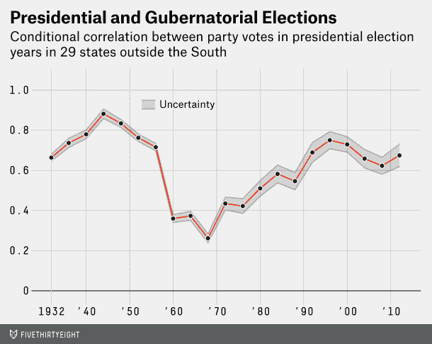
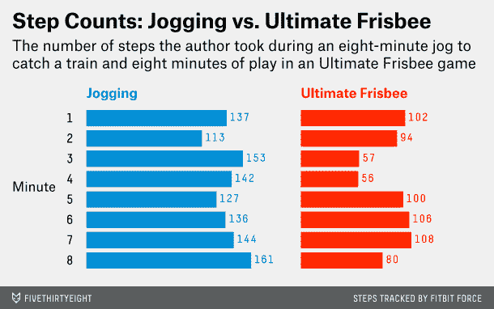

# Nate Silver 的新新闻网站 的三个数据驱动的金块

> 原文：<https://web.archive.org/web/https://techcrunch.com/2014/03/17/three-data-driven-nuggets-from-nate-silvers-new-news-site/>

Nate Silver 是《纽约时报》著名的统计博客作者，他曾在 2012 年总统选举中准确预测了 50 个州中的 50 个州，他已经建立了一个专门的新闻网站来报道数据新闻。保留旧的博客名称， [538](https://web.archive.org/web/20230323204641/http://fivethirtyeight.com/) ，重新推出的网站致力于采用西尔弗认为更严谨的方法来书写数字。有了 [ESPN 的现金](https://web.archive.org/web/20230323204641/http://www.mediaite.com/online/nate-silver-explains-why-he-sold-538-brand-to-espn/)，Silver 雇佣了在统计分析、数据可视化、计算机编程和数据素养报告方面有技能的作家。

从《华尔街日报》的“数字”专栏到《卫报》的数据博客，已经有很多媒体渠道致力于数据新闻。那么，银的 538 有什么新的？

这里有三个故事，我认为这是 538 区别于其他媒体的地方

**1。每篇论文的新统计分析**

通常，当记者使用图表和图形时，它完全是描述性的，取自现有的数据集，如劳工部的失业趋势图。在此基础上，作者将对这些趋势意味着什么提出自己的观点。

西尔弗的作者更像是用图表来论证的学者。因此，例如，538 推出了一个专题“[所有政治都是总统的](https://web.archive.org/web/20230323204641/http://fivethirtyeight.com/features/all-politics-is-presidential/)”，这表明州长选举越来越多地与总统候选人的受欢迎程度挂钩。为了说明这种情况，作家丹·霍普金斯设计了下面的图表来说明政党的选票如何与州长的选票越来越相关。

这和学者们开自己的博客没什么不同。例如，这就是罗格斯大学教授布鲁斯·贝克如何创办了一个有影响力的教育博客。但是这种用学术方法来描绘论点对于媒体来说是相当新颖的。

**2。写关于数字的文章**

538 押了一个大赌注，认为读者在谈论研究时希望有一些怀疑。例如，538 做了自己的小工具审查，研究各种健康追踪器，如 Fitbit 和 Jawbone UP，如何测量一天的步数。当我在过去看到[这种情况时，](https://web.archive.org/web/20230323204641/http://allthingsd.com/20130715/fitbit-flex-vs-jawbone-up-and-more-a-wearables-comparison/)作者看到了每个追踪者说他们走的步数的差异。

538 的方法是仔细分解健康追踪器在不同活动中如何计数，比如慢跑与极限飞盘的分分钟分解。

这种帖子不适合那些在文章中大放厥词的互联网浏览者。我当然不得不通过挖掘这篇文章来收集有用的信息，但这也是我见过的关于这个主题的最全面的第一人称文章。

**3。方程式。有方程式**

我很少在新闻报道中看到数学方程式，更不用说从著名的[贝叶斯定理](https://web.archive.org/web/20230323204641/http://en.wikipedia.org/wiki/Bayes'_theorem)中改编而来的方程式了。在一篇探讨媒体如何撰写健康建议的文章中，作家杰夫·莱克提出了这个公式，以帮助读者了解他们是否应该相信标题:

*对标题的最终意见=(最初的直觉)*(对标题的研究支持)*

在一篇 1600 字的数学文章中，Leeks 声称“总的来说，健康标题就是广告。目标是让你阅读文章，不一定要准确地代表研究。”

因此，在查看了所有可能的健康证据元素后，从随机对照试验到该研究是否在人类身上进行，Leeks 解释了如何从数学上确定一条健康建议是否适合你。

我最近看到的最接近这一点的方法来自于《卫报》上周的一篇专栏文章，文章谈到从大规模健康研究中获取个人建议是多么不切实际。538 方法只是承认《卫报》的文章是已知的，然后概述一个详细的、量化的方法来处理这个事实。

**大赌注:我们都是书呆子**

在一个由保守的电台狂热分子、TMZ 粉丝和互联网搜刮者组成的维恩图中，538 的听众在大峡谷的另一边。Silver 面向受过教育的观众，他们喜欢怀疑论、细微差别和可检验的假设。没有专家。

我不会费心去评判 538，因为我(真的)有偏见。我尝试过[成为一个人的民意调查者](https://web.archive.org/web/20230323204641/https://techcrunch.com/2013/07/20/how-google-surveys-could-turn-anyone-into-a-professional-pollster-as-shown-in-1-graph/)，[量化我的咖啡因摄入量，](https://web.archive.org/web/20230323204641/http://www.thedailybeast.com/articles/2013/12/02/what-happened-when-i-replaced-coffee-with-30-seconds-of-exercise.html)探索我性生活的[卡路里燃烧概况](https://web.archive.org/web/20230323204641/https://techcrunch.com/2013/07/05/how-health-trackers-could-reduce-sexual-infidelity/)，以及[大量引用的统计数据揭穿](https://web.archive.org/web/20230323204641/https://techcrunch.com/2012/07/22/how-to-spot-bad-statistics-privacy-hysteria-edition/)。今天早上，我把自己连接到一个商业级脑电图设备上，测量绿茶对我注意力的影响。有时候这些数据驱动的产品很受欢迎，有时候则不然。

西尔弗的实验并不是测试数据新闻是否可行；这是对互联网新闻受众有多书呆子的测试。538 一直都是数据。如果西尔弗成功了，那将是因为新闻业低估了公众对数据驱动分析的需求。