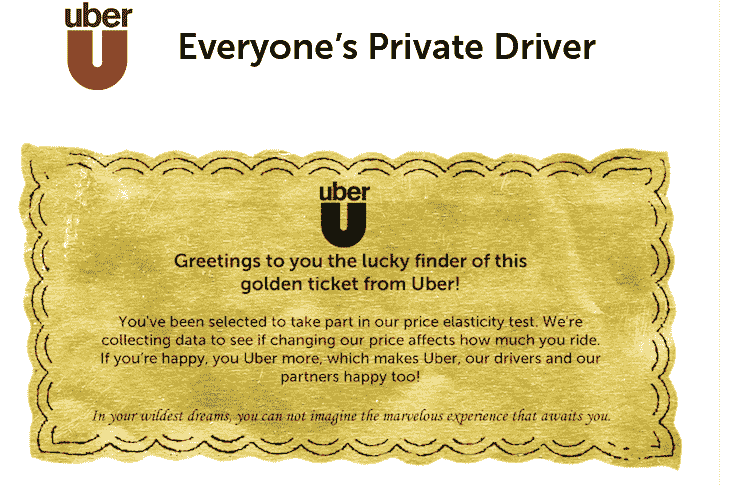

# 乘车票:优步测试在旧金山降价 TechCrunch

> 原文：<https://web.archive.org/web/http://techcrunch.com/2011/07/22/ticket-to-ride-uber-testing-reduced-pricing-in-san-francisco/>

# 乘车票:优步测试在三藩市降价

让我们面对现实吧。虽然优步总体上很棒，而且有望颠覆出租车行业，但对于许多消费者来说，这项服务仍然太贵，无法定期使用。在旧金山出租车罢工后，该公司于 6 月降低了价格，但这只是暂时的。今天，优步[透露](https://web.archive.org/web/20230204223108/http://blog.uber.com/2011/07/22/did-you-find-a-golden-ticket/)它正在三藩市市场测试降低利率。

优步将这一测试与威利·旺卡和巧克力工厂的“黄金门票”相比较，他说在三藩市随机抽取 600 名用户将能够享受到优惠的价格(从 10%、20%到 30%不等)。如果你在测试中，当你的帐户使用优步时，你将自动获得优惠费率。

即使是 20%到 30%的折扣[也会在价格上产生很大的差异](https://web.archive.org/web/20230204223108/https://techcrunch.com/2011/03/02/a-week-with-uber-and-this-blogger-is-totally-hooked/)，并可能使服务更具吸引力。

目前还不清楚优步及其司机在这方面的经济效益如何。由于旧金山出租车罢工，优步的司机不得不减薪一天。优步削减了收入，将罢工的决定权还给了司机，以帮助弥补差额。这更像是一种营销噱头，在经济上并不奏效。

但正如优步在其帖子中所说，这是一个价格弹性测试。因此，如果该公司降低价格，现有用户的需求可能会增加，优步游乐设施将赚更多的钱。如果使用率上升，这也意味着会有更多的司机。

一名被选为测试一部分的优步用户向我们发送了更多信息，包括以最高价格(旧金山至旧金山机场)收费的乘坐将不属于折扣范围。此外，优步表示将进行长达 3 个月的测试

那么，如果你是现有的旧金山优步用户，你有“黄金券”吗？你得到折扣了吗？

