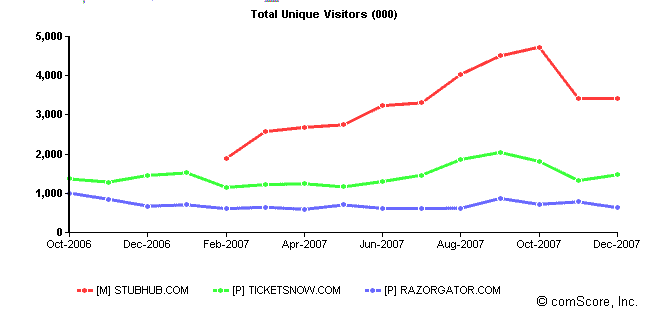

# TicketMaster 以 2.65 亿美元收购在线黄牛票

> 原文：<https://web.archive.org/web/http://techcrunch.com/2008/01/15/ticketmaster-buys-online-scalper-ticketsnow-for-265-million/>

# TicketMaster 以 2.65 亿美元收购在线黄牛票

 正好赶上超级碗，在 [IAC 解散之前，](https://web.archive.org/web/20230316102215/https://techcrunch.com/2007/11/05/barry-diller-uncomplicates-his-life%E2%80%94splits-iac-five-ways/) Ticketmaster 达成协议，以 2 . 65 亿美元收购在线票贩子 [TicketsNow。在此之前，易贝去年以 3 . 1 亿美元收购了 StubHub。TicketsNow 是仅次于 StubHub 的第二大在线票贩子，2006 年售出了价值 2 亿美元的门票。消息人士告诉我们，Ticketmaster 最初看到 RazorGator](https://web.archive.org/web/20230316102215/http://www.pehub.com/article/articledetail.php?articlepostid=9812) 的价格也差不多，但在尽职调查期间，这笔交易失败了。他们看了一眼书，就通过了。另一位消息灵通人士告诉我们，TicketsNow 的 2.65 亿美元收购价格是 EBITDA 的 35 倍，大约相当于 5X 的收入(6000 万美元)。

 黄牛、诶、经纪人在这些二级市场上卖的很多票，最初都是从全世界的票贩子手里买的。所以提价对于 Ticketmaster 来说是一个错失的机会，它自己的 TicketExchange 表现平平。

TicketsNow 的交易显示了二级赛事门票市场变得有多热，Ticketmaster 的加入可能有助于该行业的合法化(参见我们之前关于该行业一些问题的报道)。

《华尔街日报》(WSJ)报道了这个故事[(需要订阅):](https://web.archive.org/web/20230316102215/http://online.wsj.com/article/SB120036522352890281.html?mod=googlenews_wsj)

> Ticketmaster 总裁兼首席执行长肖恩·莫里亚蒂(Sean Moriarty)说，公司计划与拥有场馆或推广活动的客户分享新部门的收入，但他说资金分配的细节还没有最终确定。他说，此举凸显出公众和音乐会行业参与者对门票经销商的看法发生了转变。经销商曾经被视为见不得人的黄牛党，现在，很大程度上由于互联网，他们变得更加受人尊敬。
> 
> “五年前不愿意让门票转售的客户现在想要分一杯羹，”莫里亚蒂说。二级门票市场的规模很难判断，但据估计，美国二级门票市场每年的规模在 25 亿至 50 亿美元之间。

对于一家即将剥离成为自己股票的公司来说，这是一个不错的增长市场。

根据 comScore 的数据，TicketsNow 在 12 月份有 150 万独立访客，和一年前差不多，而 StubHub 吸引了 340 万访客，并且在易贝的庇护下发展良好(尽管它在 11 月份受到了重创)。

