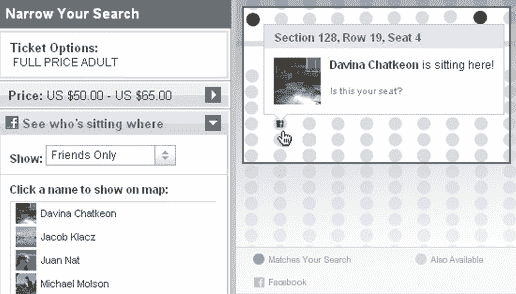
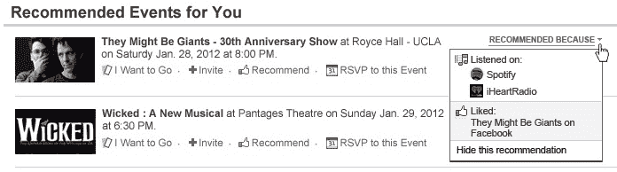

# Ticketmaster 的新脸书应用程序从您的听力活动中推荐音乐会 TechCrunch

> 原文：<https://web.archive.org/web/https://techcrunch.com/2012/01/18/ticketmaster-recommended-listening/>

# Ticketmaster 的新脸书应用程序会从你的听力活动中推荐音乐会

在今晚推出的所有[新开放图表应用](https://web.archive.org/web/20221206090106/https://beta.techcrunch.com/2012/01/18/open-graph-websites/)中， [Ticketmaster 的新脸书体验](https://web.archive.org/web/20221206090106/http://apps.facebook.com/ticketmaster/)最令人印象深刻。当然，它可以分享你已经“购买”了门票，但许多应用程序都有类似的发布功能。Ticketmaster 的应用程序之所以酷，是因为它从 Spotify 或 Rdio 等服务中提取你的脸书个人资料的音乐应用程序活动，并推荐你实际听过的附近艺术家的音乐会，而不仅仅是你说你喜欢的那些音乐会。

自从内森·哈伯德在[与 LiveNation](https://web.archive.org/web/20221206090106/https://beta.techcrunch.com/2009/02/10/ticketmaster-and-live-nation-conduct-25-billion-merger-create-live-nation-entertainment/) 合并后成为首席执行官以来，Ticketmaster 已经走过了漫长的两年。现在，它会提前向你显示服务费，而不是在你结账时把它们附加在账单上。这激怒了艺术家和场地，他们认为这会吓跑销售，但 Ticketmaster 以透明的名义这样做了。

电子商务执行副总裁基普·莱文(Kip Levin)告诉我，长期以来，该公司一直是直播行业所有问题的替罪羊。现在，它开始反击，把顾客放在第一位——这可能是人们没有预料到的，因为它收取那些讨厌的服务费。

8 月份，Ticketmaster 开始允许你用你的脸书资料给你购买的座位贴上标签。这样，决定买什么座位的朋友就可以看到你的座位在哪里，那些离你很近的座位。如果能坐在朋友旁边，人们会更愿意买一张指定座位的票。这是一个例子，说明优化客户体验也有利于公司的底线。

Ticketmaster 的新 canvas 应用程序带来了脸书的整个活动发现和购票流程。你会看到你的朋友回复或分享的他们已经买了票的音乐会的提要，然后是个人推荐。由于脸书数据权限，它可以根据你的喜欢和收听活动建议附近的活动，而不必询问你的偏好。

【T2

几个竞争对手推出了脸书开放图票务[应用，包括 Ticketfly](https://web.archive.org/web/20221206090106/http://www.ticketfly.com/ticketfly-debuts-facebook-purchase-app/) ，但没有一个提供基于听力的推荐或交互式座位地图。

许多发布脸书应用的网络服务主要使用社交网络作为分销和营销渠道。最好的公司，如 Ticketmaster，会要求您提供个人数据，并负责任地使用这些数据来改进他们的产品。它已经开始工作了。我刚被我最喜欢的乐队之一 [Neon Indian](https://web.archive.org/web/20221206090106/http://www.facebook.com/neonindian) 推荐了一场即将到来的演出，我经常听这个乐队的歌，但是从来没有喜欢过。