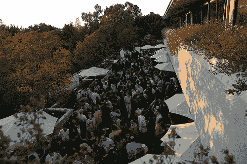

# 我们第六届年度八月资本派对的下一批门票现已发售 

> 原文：<https://web.archive.org/web/http://techcrunch.com/2011/06/30/tickets-6th-annual-august-capital-party-are-on-sale-now/>

# 我们的下一批门票，我们的第六届年度八月资本党现在出售

**更新:**门票现已售完。下周回来看看我们的下一组票。

夏天到了，我们的第六届年度八月资本派对即将到来。上周我们发行了 100 张票，不到一个小时就卖光了。今天我们将发行下一组 100 张门票。八月的资本派对将于 7 月 29 日下午 5:30-10:00 在门洛帕克华丽的沙丘路举行，紧接着我们的[移动第一次仰卧起坐](https://web.archive.org/web/20230203044144/https://techcrunch.com/2011/06/24/mobile-crunchup-summer-party/)。这个派对是一个很好的方式，可以看到创业演示、网络、赠品、喝点饮料和在阳光下玩得开心。门票 40 美元，很快就会卖光。如果你想来，请快点行动。如果您今天无法购买门票，请继续关注——我们将在本周五发放门票，并将在下周发放更多门票。

这里出售门票。

我们的移动第一仰卧起坐卖完了。然而，我们仍然有数量有限的记者通行证。联系 [Elin Blesener](https://web.archive.org/web/20230203044144/mailto:elin@beta.techcrunch.com) 请求考虑记者证。

这是派对的后勤安排。

**关于八月之都第六届夏季派对**
7 月 29 日，下午 5:30-10:00
加州门罗帕克沙山路 2480 号，[地图](https://web.archive.org/web/20230203044144/http://www.mapquest.com/maps?address=395%20Page%20Mill%20Rd&city=Palo%20Alto&state=CA&zipcode=94306-2024#f21e7daab34eb1e1ea6e6b75)
[获取门票](https://web.archive.org/web/20230203044144/http://mobilefirstcrunchupandaugustcapitalparty2011.eventbrite.com/) @ Eventbrite: $40 视情况而定。门票每周分批发售。请继续关注 TechCrunch，因为它们很快就会售罄。#tcaugustcapital

**赞助:**
合并后的 CrunchUp-Summer Party 还为初创企业和品牌提供了一个绝佳的赞助平台，可以接触到会议和网络参与者。请联系 [Jeanne Logozzo](https://web.archive.org/web/20230203044144/mailto:jeanne@beta.techcrunch.com) 或 [Heather Harde](https://web.archive.org/web/20230203044144/mailto:heather@beta.techcrunch.com) 了解更多关于赞助套餐和定制机会的信息。