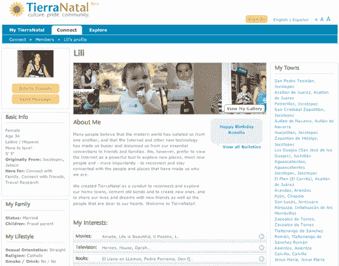

# TierraNatal:连接北美的墨西哥人

> 原文：<https://web.archive.org/web/http://www.techcrunch.com:80/2007/08/17/tierranatal-connecting-mexicans-in-north-america/>

7 月，西班牙裔社交网络 [TierraNatal](https://web.archive.org/web/20151003195137/http://www.tierranatal.com/) 推出了一个寻求墨西哥人团聚的模式，无论他们住在哪里。

这个双语网站专注于基于位置的网络，用户被要求说明他们在墨西哥的出生地(或家乡)。用户被鼓励使用这项服务，作为与可能已经移居到其他地方(如美国)的朋友和亲戚保持联系的一种方式。列出了超过 30 万个墨西哥城镇和城市。

从设计角度来看，这是我最近见过的最好的社交网站之一。常见的一系列社交网络功能(个人资料、照片、博客等)与一些看起来不错的图形和功能布局相结合。

该网站与 MySpace 和 LatinoAIM 页面的西班牙语/墨西哥语版本竞争。

TierraNatal 由 Liliana Townshend 创建，由圣地亚哥的数字心灵感应公司开发。

