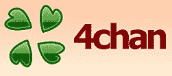

# 《时代》杂志因被 4Chan | TechCrunch 质疑而束手无策

> 原文：<https://web.archive.org/web/https://techcrunch.com/2009/04/27/time-magazine-throws-up-its-hands-as-it-gets-pwned-by-4chan/>

# 《时代》杂志被 4Chan 打败了

4Chan 的黑客们成功地完全击败了《时代》杂志的在线投票，选出了全球最有影响力的 100 位人物。排在名单首位的是克里斯托弗·普尔，又名穆特，4Chan 在线论坛的创始人，其成员使用一些编码让他的名字排在名单的首位。他们不仅帮助 moot 赢得了投票，还安排了接下来的 20 个名字拼出“Marblecake，也是游戏。”Marblecake 是一个淫荡的性指代，但也可能是 4Chan 的一个在线集体行动“Chanology 项目”起源的聊天室的名称。

这只是“人民的选择”名单，而不是《时代》杂志编辑挑选的官方名单，但它仍然让你怀疑《时代》杂志的编辑们是否会费心在网上阅读任何东西。这是非常[有据可查的](https://web.archive.org/web/20230325203041/https://techcrunch.com/2009/04/21/4chan-takes-over-the-time-100/)4Chan 社区试图操纵投票结果。然而，时间刚刚举手表决，并[宣布模拟法庭胜出](https://web.archive.org/web/20230325203041/http://www.time.com/time/arts/article/0,8599,1894028,00.html)。《时代》显然意识到了这一争议，但仍然试图通过写下以下内容来证明这一选择的合理性:

> 穆特否认知道他的追随者有任何影响投票的一致计划，尽管 TIME.com 的技术团队确实发现并阻止了几次黑客攻击投票的企图。

除了 Time.com 的技术团队做得不太好，因为前 21 名还是拼出了 Marblecake 那句话。《时代》知道是 4Chan 写的，但还是举手了。Time.com 的执行主编 Josh Tyrangiel 试图通过承认投票毫无意义来平息批评。他说，“我要提醒任何怀疑结果的人，这是一次互联网民意调查。怀疑结果是关键所在。”或者，重点可能是指定一个网络名人，并制造一场争议，以便人们点击阅读结果。打得好。