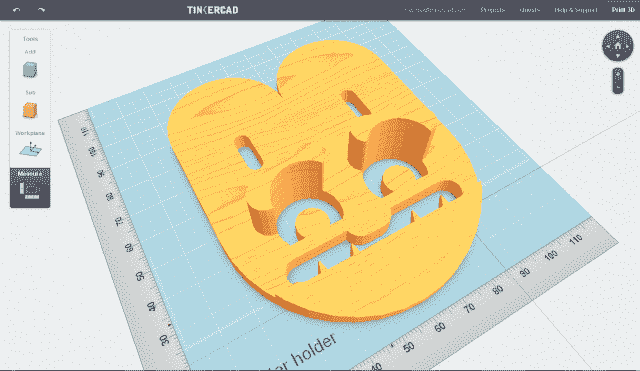
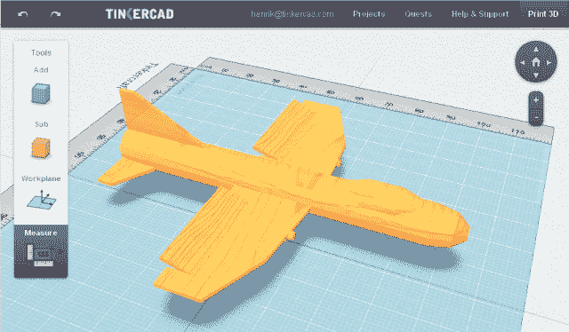

# Tinkercad 筹集 100 万美元，旨在普及 3D 打印技术

> 原文：<https://web.archive.org/web/http://techcrunch.com/2011/11/08/tinkercad-raises-1-million/>

# Tinkercad 筹集 100 万美元，旨在普及 3D 打印

独家报道——[tinker cad](https://web.archive.org/web/20230203062930/http://tinkercad.com/)是一家旨在将基于浏览器的 3D 打印 CAD 引入大众的初创公司，已经获得了来自 [True Ventures](https://web.archive.org/web/20230203062930/http://www.crunchbase.com/financial-organization/true-ventures) ，Jaiku 创始人 [Jyri Engestrom](https://web.archive.org/web/20230203062930/http://www.crunchbase.com/person/jyri-engestrom) ，Delicious 创始人 [Joschua Schachter](https://web.archive.org/web/20230203062930/http://www.crunchbase.com/person/joshua-schachter) ，Eghosa Omogui 和塔赫尔·哈维里瓦拉的 100 万美元种子资金。

该公司的使命是“接触并教授”广大受众使用 CAD 软件，并使用 3D 打印机创造“有趣而有意义”的东西，如珠宝、玩具、汽车零件等。

Tinkercad 的联合创始人兼首席执行官凯·拜克曼解释说，人们只需要一个浏览器和几分钟就可以使用基于浏览器的软件，并准备好 3D 项目进行打印。

“我们使用类似游戏的任务来教授我们所谓的‘设计素养’，理解物理事物的设计。通过降低准入门槛，我们的用户已经能够创建和打印各种各样的精彩项目，”他补充道。

Tinkercad 是免费的，它鼓励在知识共享许可下共享设计。一旦用户使用该软件创建设计，根据我的初步测试，这似乎很容易使用，他们可以直接从打印服务如 [Shapeways](https://web.archive.org/web/20230203062930/http://www.shapeways.com/) 和[I . materialize](https://web.archive.org/web/20230203062930/http://i.materialise.com/)订购设计，或下载 STL 文件使用其他打印服务或个人 3D 打印机，如 Makerbot 的 [Thing-O-Matic](https://web.archive.org/web/20230203062930/http://store.makerbot.com/thing-o-matic-kit-mk7.html) 。

如果你对这类东西感兴趣，可以去看看 Tinkercad，我也强烈建议你去看看 GrabCAD。

