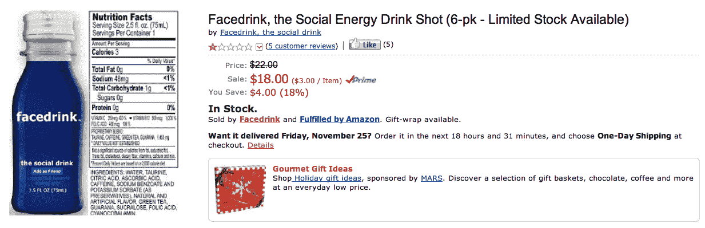

# 厌倦了脸书？在扎克起诉 TechCrunch 之前，试试 Facedrink Energy Shot

> 原文：<https://web.archive.org/web/https://techcrunch.com/2011/11/22/tired-of-facebook-try-facedrink-energy-shot-before-zuck-sues/>

# 厌倦了脸书？在扎克起诉之前，试试 Facedrink 能量枪

“它给你社交能量。它让你尝到友谊的滋味。”是 [Facedrink](https://web.archive.org/web/20230131160307/http://drinkfacedrink.com/) ！你最好去买一些，因为它随时会被起诉。跟随非官方的马克·扎克伯格活动人偶的脚步，一个叫巴里·穆斯塔法(ROFLCOPTER)的家伙创造了一种律师磁铁能量饮料。它以脸书颜色为主题，并自豪地在标签上显示“添加为朋友”按钮。我怀疑这是一个骗局，但有一张真瓶子的照片，评论家证实它在你嘴里留下的味道比被你爸爸戳到还要糟糕。

这位名叫巴里·穆斯塔法(Barry Moustapha)的人鼓吹道:“Facedrink 通过为你提供社交或与老板打交道所需的额外能量，实现了我设定的目标。”[亚马逊](https://web.archive.org/web/20230131160307/http://www.amazon.com/gp/product/B004ZRMMVO)上的评论者似乎不同意，尽管:

> “我所有的朋友都把它喝光了，开始觉得奇怪的是，我是队伍中唯一一个(除了我的朋友汤姆)再为我买饮料的人……随着时间的推移，我觉得我对它太舒服了。我开始和我的父母，我的老板，那些从高中起就没见过面的人一起喝。对 FaceDrink 过于随意最终导致我发表了一些评论，认为我的表弟可能是同性恋，我的老板是个混蛋，从那以后，我减少了和谁一起喝酒。我应该一起戒掉它，但此时我可能会有轻度上瘾。”

Facedrink 将是一个很好的节日礼物，甚至是一个更好的收藏家物品，因为穆斯塔法不可能逃脱这一点。脸书[成功地将“脸”](https://web.archive.org/web/20230131160307/https://techcrunch.com/2010/11/23/patent-office-agrees-to-facebooks-face-trademark/)一词注册为商标，专门防止这种对其名称的剥削。但我认为可能有一个友好的方式来解决这个问题。脸书，收购 Facedrink，并迅速将他们的业务转移到你华丽的新门洛帕克总部的自助餐厅。

毕竟，“无论是工作、学校、运动，还是只是完成日常事务，face beat p都能为你提供应对这一切的能量。”

