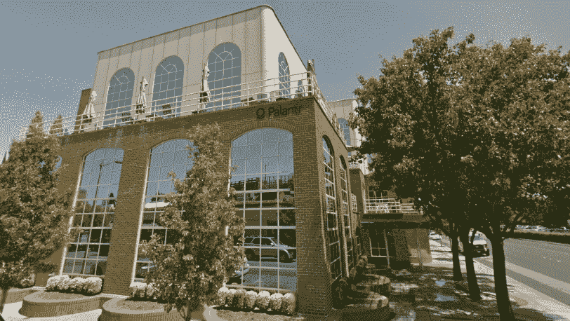

# 为什么创业公司都涌向顺丰？硅谷已经没有空间了 

> 原文：<https://web.archive.org/web/https://techcrunch.com/2012/06/23/title-why-are-startups-flocking-to-sf-theres-no-more-room-in-silicon-valleys-inn/>

***编者按:** [德里克·安德森](https://web.archive.org/web/20221225015308/http://twitter.com/derekjandersen)是 [Startup Grind](https://web.archive.org/web/20221225015308/http://startupgrind.com/) 的创始人，这是一个 12 个城市的系列活动，旨在帮助教育、激励和联系企业家。他也是前电子艺界人士和 [Vaporware 实验室](https://web.archive.org/web/20221225015308/http://vaporwarelabs.com/)的创始人。*

 *关于旧金山和硅谷之间的房地产地盘之战，已经有很多报道了。大多数人指出，这些公司瞄准的许多开发商都住在城里。夜生活、可步行性和文化被认为是这一趋势的原因。但是，如果硅谷的核心对创业公司失去了吸引力，为什么没有房地产空间？答案是硅谷一如既往的火热，原因如下。

这些报告的基本前提是，随着 Zynga、Twitter 和 AirBnB 等公司选择在这座城市扎根，旧金山正在赢得创业房地产之战。这种趋势对硅谷来说并不新鲜。帕洛阿尔托市中心已经经历了无数次增长周期，包括这次。

当科技市场升温，帕洛阿尔托市中心的办公室空置消失时，创始人必须做出决定，是继续留在低空置位置，还是前往增长不那么受抑制的地方。Rip 最近的文章中引用的租赁率/空置率图表显示，红木城和山景城之间的空置率最低，帕洛阿尔托为 2.2%。截至今天，山景城市中心的空置率几乎相同。

“帕洛阿尔托市中心和山景城的空置率实际上为零，”代表一些大型硅谷科技公司的卡西迪·特利公司副总裁布莱恩·里本说。“这些数字包括非常不受欢迎或价格明显过高的写字楼。这些市中心市场的大部分活动是玩音乐椅游戏。大部分空间并没有完全面向公众销售，通常会在前一份租约到期前几个月就被卖掉。

帕洛阿尔托房地产市场最大的“问题”可能不是这个城市的吸引力，而是它自己的居住者。如今，Palantir 不仅出租所有可用的东西，还预租任何可用的空间。

一个又一个创始人私下向我抱怨帕兰蒂尔的房地产瘾。他们的标志可能不在大楼上，但他们在大学大街上。这会让一家充满希望的初创公司获得 100 万至 1 亿美元的资金吗？答案是:旧金山。

考虑一下 Pinterest。尽管多方消息称他们非常想留在帕洛阿尔托，但他们还是搬到了这座城市。但是这该死的旅馆已经没有房间了。没有空缺！像 Stripe 这样的其他公司在帕洛阿尔托市中心，不得不搬到城里发展。沃蒂森在山景城，但也向北移动。

对于一家在帕洛阿尔托的初创公司来说，这是一个不可避免的问题:当没有更多发展空间时，我们该何去何从？Brian Rieben 补充道，“找到一个价格合理、可扩展的地方和靠近一个潜在的丰富的招聘基地同样重要。”

因此，SV faithful 面临的真正困境可能是，帕洛阿尔托市中心的 Palantir 和 A9 等公司的增长如何长期影响硅谷？如果像谷歌、雅虎和惠普这样的前帕洛阿尔托初创公司在年轻时搬到这座城市，他们还会回来吗？当然，脸书的发展很像帕洛阿尔托市中心的帕兰蒂尔，并没有让这座城市成为一片废墟，但他们在达到帕兰蒂尔目前的入住水平之前就搬走了。

甚至在考虑门洛帕克的位置之前，脸书就试图在南帕洛阿尔托的斯坦福研究园获得超过 100 万平方英尺的土地。他们非常努力地让帕洛阿尔托长期运转。IDEO、Quora、Spec(也在市区)这样的公司呢？他们能去哪里？相信我，这些公司对在硅谷之外寻找新办公室一点也不兴奋，但他们可能别无选择。

Pinterest 会在 5 年内再次将整个团队连根拔起，搬回硅谷吗？帕洛阿尔托市中心总是会失去一些公司，因为它们的增长超过了目前的供应，但像 Palantir 这样的公司的扩张会不会迫使最热门的年轻初创公司在不断增长的旧金山场景中深深扎根，从而影响硅谷的未来？这是个问题。

虽然大公司都涌向这座城市，但这不应该被认为是他们的首选。旧金山是创业的好地方，但如果帕洛阿尔托空间的规模和成本与旧金山不相上下，根据许多创始人告诉我的，大多数人会选择留下来。这使得这成为一个供需问题，甚至不仅仅是一个生活方式问题。

现实是市场非常火爆，硅谷旅馆根本没有空房。*