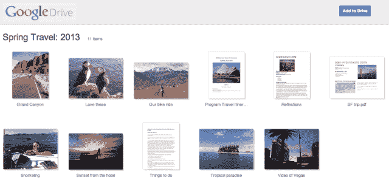
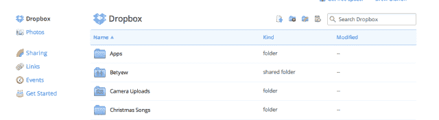

# 为了追赶 Dropbox 的设计能力，Google Drive 改进了其共享文件夹的布局 

> 原文：<https://web.archive.org/web/https://techcrunch.com/2013/04/02/to-chase-dropboxs-design-prowess-google-drive-improves-its-layout-for-shared-folders/>

# 为了追赶 Dropbox 的设计能力，Google Drive 改进了共享文件夹的布局

对于一个提供文件托管的服务来说，要吸引尽可能多的用户，方法是有限的。有与其他应用程序的集成，无缝的桌面和移动体验，以及设计。

Dropbox 一直是这一领域的领导者，为用户提供了一个极其干净简单的界面。它的浅蓝色和白色设计是该公司的标志，谷歌驱动显然注意到了这一点。

今天，团队[宣布了共享文件夹](https://web.archive.org/web/20221006183510/https://plus.google.com/u/0/+GoogleDrive/posts/4HNsvSVQmhj)的一点视觉刷新，这在今天之前绝对是一个丑陋的体验。此外，只需点击一下，您就可以将共享项目添加到您的驱动器中:

> 在接下来的一周里，被邀请打开共享文件夹的用户将会注意到文件夹内容的视觉布局有了很大的改善。你甚至可以点击一个项目来预览和翻转内容。
> 
> 想要保留共享文件夹吗？使用右上角的“添加到驱动器”按钮将其直接存储在您的驱动器中，以便在所有设备上快速访问。

一旦你得到了它，它就会变成这样:

【T2

Drive 诞生于谷歌的电子表格和文档等服务套件，现已成为存储所有文件的统一服务。听起来很像 Dropbox 的产品，只是 Dropbox 没有 Drive 的编辑功能。这是一个巨大的优势。

如果你熟悉 Dropbox，这里是你已经习惯的轻快的布局:

Box 希望存储世界上所有的企业文件，这也与谷歌的商业应用版本 Drive 有竞争力。不过，Dropbox 和 box 都有自己的优势，因为它们可以找到进入其他产品的途径，将自己的种子传播到人们的工作和生活中，这是谷歌做不到的。[亚马逊也加入了竞争](https://web.archive.org/web/20221006183510/https://beta.techcrunch.com/2013/01/25/amazon-takes-on-google-facebook-dropbox-by-adding-auto-uploads-to-its-cloud-drive-photos-app/)，希望成为每个人文件的指定目的地。

谷歌拥有搜索、电子邮件和视频是一回事，但当你把每个人的个人和工作文件都混在一起时，这就让竞争更加激烈了。由首席执行官拉里·佩奇带头，它开始整合和消费化其所有产品的选择是明智的。你可以拥有世界上最尖端的技术，但如果它看起来像垃圾，那么人们就不会使用它。

在云端托管文件并不性感，但它肯定是一项有利可图的业务。所有这些服务都免费为你提供储物空间，一旦装满，你可以支付更多费用。天哪，我们已经走了多远了。还记得巨大的硬盘吗？

[图片来源: [Flickr](https://web.archive.org/web/20221006183510/http://www.flickr.com/photos/doctorow/2966542111/)