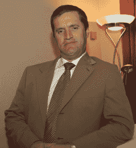

# 对史蒂夫还是不对史蒂夫？TechCrunch

> 原文：<https://web.archive.org/web/http://techcrunch.com/2010/04/13/to-steve-or-not-to-steve/>

史蒂夫·乔布斯管理学院又开始流行了。根据最近的调查，年轻人最崇拜的商人是 55 岁的乔布斯，而不是 25 岁的脸书首席执行官马克·扎克伯格。风险资本家现在给企业家的管理建议是[要像史蒂夫](https://web.archive.org/web/20230202230743/https://techcrunch.com/2010/03/14/notes-on-leadership-jobs-grove-campbel/)一样。

事情并不总是这样。在我 26 岁的时候，我共同创立的公司聘请了一位非常聪明和有天赋的首席执行官约翰·昆泽，他在解释如何成为一名更好的经理时引用了苹果和 NeXT 的创始人。

“史蒂夫·乔布斯，”约翰说，“坚持选择 NeXT 总部的硬木地板。”

我愣了一下。“那是好还是坏？”

“很糟糕，格伦，”约翰说。"你认为 NeXT 的地板清洁工会有什么感觉？"

这是在 1998 年，当时乔布斯是一个流亡创始人的警示故事。从那以后，我总是用捡地板的人的眼光看待乔布斯的回归。

尽管苹果已经成长为市值 2000 亿美元的巨头，乔布斯也赋予了更多的责任，但该公司在许多方面已经变得更加狭隘，被乔布斯的个性所定义。去年出版了 2500 本关于企业家精神的自助书籍，但是很少有人解释乔布斯式的狂热在创建公司中的作用。商学院和会议已经将企业家精神制度化，将其作为一种业余爱好，就像法律或医学一样，但它更多的是一种气质、运气和灵感。对我来说，创业远不是别人教的课程，而是我做自己的唯一机会。

**性格如压力**

但是如果，正如约翰正确指出的那样，做你自己就意味着无视他人，那该怎么办呢？谷歌的拉里·佩奇和谢尔盖·布林亲自批准了谷歌 20，000 名员工中的大部分，脸书的马克·扎克伯格[特别定制了侮辱性的名片](https://web.archive.org/web/20230202230743/http://money.cnn.com/magazines/fortune/fortune_archive/2005/11/28/8361945/index.htm)，特斯拉的埃隆·马斯克宣布[他打算繁殖出整个星球的低等生物](https://web.archive.org/web/20230202230743/http://www.newyorker.com/reporting/2009/08/24/090824fa_fact_friend)。当我实际上感觉这是一个公司的驱动力时，我们把这种暴行视为一种特质或副作用。没有什么比这更能让这么多人的作品感到个性和真实。

在我现在领导的公司，Redfin，我疯狂地评估完美完成的项目，想知道为什么每个项目不是更 Redfin，更精彩 T10。但是如果我对美好的品味实际上并不美好呢？还有[要求精彩的](https://web.archive.org/web/20230202230743/http://blog.redfin.com/blog/2010/03/how_to_be.html)公平吗？你用来提问的词是什么？

我的第一批老板之一，才华横溢的基里尔·谢克曼知道如何提问。每当我试图向他展示我的作品时，他都会举起一只手说:“等等……它甜吗？”

我仍然记得在一个设计上花光了时间，只是把我有的发给了他。当我走进他的办公室时，他已经打印出了设计，并把它放在一张不祥的干净的桌子上。他坐在桌前，双手交叉在一起。他在那里多久了？他的姿势非常优美。

“这是什么？”他问。

“你是说有点晚了？”

“我是说这****是什么？”

“而且有点半生不熟？”

“我的意思是什么？”基里尔激动地说。很难知道哪一次屈服于平庸会是你的最后一次。

"即使真的完成了，那也是非常非常蹩脚的？"

“我的意思是……是的，”基里尔说。

**公司是终极艺术品，而不是产品**

基里尔让我感受到了他的感受:一家初创公司几乎可以像一件艺术品一样具有个性和连贯性，不仅仅是因为它制造了什么，而是因为它本身，它是如何运营的，它是谁。

以 2009 年最热门的公司之一 Zappos 为例。Zappos 与众不同的不是它的技术或商业模式——鞋类电子商务——而是它的文化。当我参观 Zappos 的时候，就像[参观一个新的星球](https://web.archive.org/web/20230202230743/http://www.newyorker.com/reporting/2009/09/14/090914fa_fact_jacobs):我旁边的参观者被要求按铃，分享他最尴尬的记忆；我们走过时，员工们欢呼雀跃；我被拍到戴着汉堡王风格的皇冠。

一个公司的个性是一个创始人和她的团队最深刻的创新，像空气一样无处不在，不为人注意，又必不可少。它成为员工和消费者的意义来源，然后成为收入来源。

基于功能和事实，人们不会为一部 iPhone 多付钱。我们为它强烈的观点——关于美和简单的首要地位——买单，这些观点与我们最喜欢的自己联系在一起。这个被人造草皮覆盖、被媒体淹没的世界渴望的是[一点点个性](https://web.archive.org/web/20230202230743/http://blog.redfin.com/blog/2010/03/shameless_in_seattle.html)。

这种个性深深植根于一家伟大公司的 DNA 中，甚至可以在它最小的指甲缝中找到:[理查德·布兰森的斗牛和斗牛士维珍航空视频](https://web.archive.org/web/20230202230743/http://www.youtube.com/watch?v=eyygn8HFTCo)，Flickr 联合创始人愉快的“Mabuhay”问候(“现在你知道如何用他加禄语打招呼了”)或者，更严重的是，谷歌的[决定放弃世界上最大的市场](https://web.archive.org/web/20230202230743/http://www.nytimes.com/2010/01/13/technology/companies/13hacker.html)——这种[在一个不是由其创始人驱动的公司](https://web.archive.org/web/20230202230743/http://www.avc.com/a_vc/2010/01/the-founder-factor.html)中绝不会发生。

我们都为谷歌的决定喝彩。但是拉里和谢尔盖压制了多少来自通情达理的人的反对意见才得以实现呢？我们大多数人缺乏的不是自己对对错的看法，而是坚持到底的信念。

 
如果你对别人的感受很敏感，那就很难做到。几个世纪以来，我们经济中的创造者第一次成为了它的统治者，他们的个性不仅塑造了他们的产品，还塑造了整个公司。就好像文森特·梵高不是被关在疯人院里，而是被允许指挥成千上万人的活动。正如约翰所意识到的，结果是令人痛心的，但偶尔也是美丽的，其规模之大是世人难以想象的。

*[格伦·凯尔曼](https://web.archive.org/web/20230202230743/http://twitter.com/glennkelman)是 Redfin 的首席执行官，Redfin 是一家在线房地产经纪公司试图改变房地产游戏，使之有利于消费者。此前，他、基里尔·谢因克曼(Kirill Sheynkman)和乔·麦克维(Joe McVeigh)共同创立了 Plumtree Software，该公司于 2002 年上市，后来被甲骨文收购。在 TechCrunch 的其他地方，格伦写了关于第二次创业者的文章，从衰退中幸存的文章，筹集资金的文章，以及如何分配股票的文章。*

照片来源:Flickr 上的史蒂夫·乔布斯[演讲；Kirill Sheynkman by](https://web.archive.org/web/20230202230743/http://www.flickr.com/photos/marzipanguy/)[Kirill s . on Flickr](https://web.archive.org/web/20230202230743/http://www.flickr.com/photos/kirillsway/)