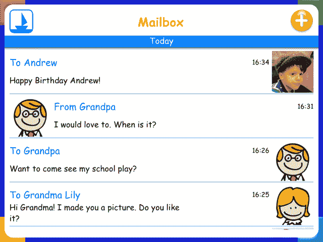
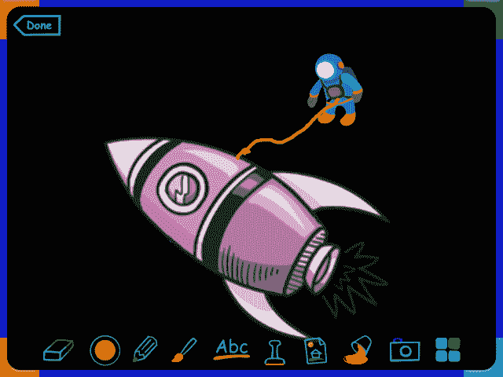

# Tocomail 推出专为儿童设计的电子邮件服务 TechCrunch

> 原文：<https://web.archive.org/web/https://techcrunch.com/2014/02/12/tocomail-debuts-an-email-service-designed-for-kids/>

今天发布的新 iPhone 和 iPad 应用程序 to mail，旨在成为孩子们的第一个电子邮件服务。这款应用的设计不仅考虑到了儿童，还与作为 Tocomail 早期采用者的儿童进行了合作。但更重要的是，to email 提供了家长控制，允许妈妈和/或爸爸指定孩子可以使用 to email 发送电子邮件，以及他们可以接受来自谁的电子邮件。

这家公司是由莫斯科工程和物理学院的老朋友和老同学丹尼斯·博尔戈夫和帕维尔·伊斯托明于去年创立的。博尔戈夫于 1998 年来到美国，最终在一家名为 Lobby7 的公司工作，该公司于 2003 年被 Nuanace Communications 收购。后来，他继续开发 Nuance 的语音移动界面——这项技术后来被用于其他移动应用和服务，包括苹果的 SIRI。

这两位创始人还在 2002 年建立了另一家公司——Warelex，该公司于 2008 年被德国公司 Shape Services GmbH(即时通讯应用 IM+的制造商)收购。)他们在那里呆了 5 年多，直到建造了一个盒子。

博尔戈夫说，当他 7 岁的儿子迈克尔要他自己的电子邮件账户时，他想到了一个孩子电子邮件应用程序的想法。

“我同意今天每个人都需要一个电子邮件帐户，但我想为迈克尔提供一个安全的电子邮件服务，它也有一个很好的移动应用程序，使用起来直观有趣，”博尔戈夫告诉我们。“但是经过大量的研究，我意识到没有任何东西可以满足所有这些要求，所以帕维尔和我决定创建 Tocomail。”

这个应用程序本身很容易使用。家长为他们的孩子注册并创建帐户，这个过程大约需要五分钟。此时，他们还会配置一个“安全联系人”列表，允许他们的孩子向其发送电子邮件，例如，像奶奶或爷爷这样的人，以及其他家庭成员或亲密的家庭朋友。

一旦设置好，孩子们就可以使用 iOS、Android(很快)或网络发送和接收电子邮件。因为我们的想法是提供一种不仅对孩子安全，而且有吸引力的服务，所以 Tocomail 包括一些有趣的工具，如画板、自定义头像创建、图片时间轴等等。该应用程序的设计也很丰富多彩，这让它更像是为孩子设计的东西，而不是一个无聊的专业电子邮件客户端。

除了让家长监督孩子可以和谁交流之外，Tocomail 还提供了让家长关注邮件内容的功能。例如，有一个脏话过滤器和一个隔离箱，有问题的邮件将被转移到那里。

Tocomail 目前是免费使用的，但一套更全面的家长控制功能每月收费 2.99 美元，每年收费 29.99 美元。这包括受监督的一般联系人列表，超出了免费版本中的“安全”列表。来自这些联系人的电子邮件将被隔离，直到家长审查它们。孩子们也可以发送电子邮件，但同样，父母能够审查，然后批准这些信息。Bolgov 解释说，隔离的电子邮件也可以路由到父母的常规电子邮件帐户，以便于访问，他们可以批准或拒绝通知电子邮件本身的消息。

在未来的版本中，Tocomail 将引入监视欺凌模式的技术——这可能对那些没有密切监督每一封邮件或不知道具体需要注意什么的父母有所帮助。

在 Tocomail 的 beta 测试期间，该公司发现 6 至 9 岁的孩子大多写非常短的电子邮件，几乎就像发信息一样。展望未来，创始人计划通过一个可选的消息“气泡”视图来进一步支持这种行为，在这个视图中，孩子们可以看到他们的电子邮件更像是他们联系人的即时消息。

其他社交网络功能，如状态更新和时间表也将在以后的版本中引入。

总部位于波士顿的 Tocomail 得到了天使和其他私人投资者 50 万美元的种子资金支持。这项服务在这个领域与其他公司竞争，如 [Maily](https://web.archive.org/web/20230129062838/https://techcrunch.com/2012/07/25/maily-for-ipad-is-your-kids-first-email-application/) 或 [Toymail](https://web.archive.org/web/20230129062838/https://techcrunch.com/2013/11/15/toymail/) 。

[YouTube http://www.youtube.com/watch?v=MRlOBtgUXFk]