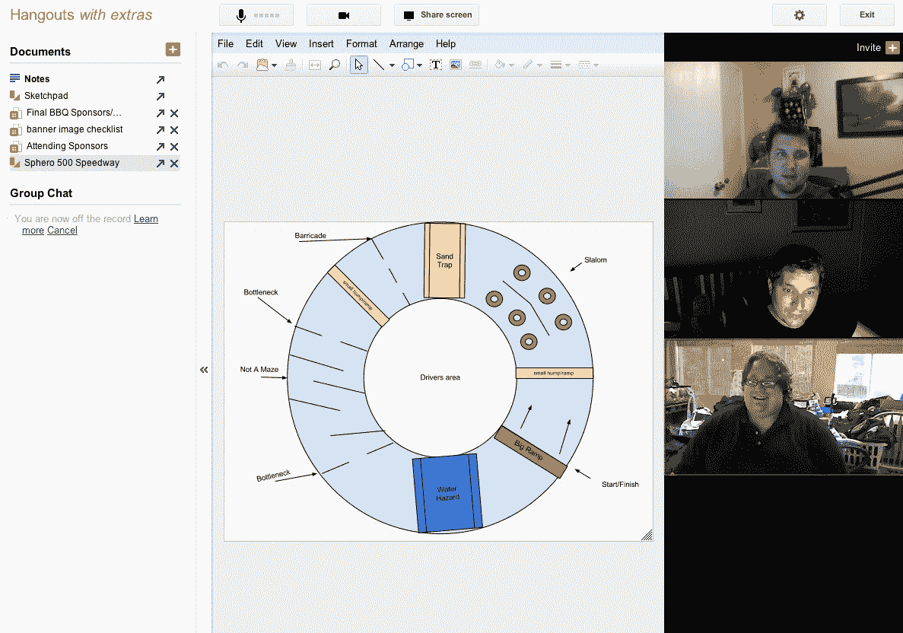

# 工具与玩具:为什么时间表没有改变 

> 原文：<https://web.archive.org/web/http://techcrunch.com/2011/09/24/tools-vs-toys-why-the-timeline-changes-nothing/>

昨天，Erick 和我就脸书和 Google+进行了一次有趣的讨论，我站在了 G+一边。为什么？因为工具很重要，玩具不重要。诚然，脸书每天 5 亿的访问量从数字上证明了我是错的，但就总体可用性和质量而言，我不情愿地站在 Google Plus 一边。

众所周知，[脸书凭借其应用功能和新的时间线功能赢得了互联网](https://web.archive.org/web/20230203105846/https://techcrunch.com/2011/09/22/button-down/)，这是一种数据视图，提供了一种进入遥远过去的时间机器。我看到了几年前我的孩子们的照片，他们的脸比现在看起来更天真、更有生气。这种感觉很棒，但只持续了 15 分钟。现在，脸书向我展示了一系列从我出生以来发生的事情，这是一个相当令人印象深刻的壮举，因为我一生中有三分之二的时间没有互联网。

另一方面，Google Plus 推出了增强的 Hang-Outs。让谷歌去挥霍生产力软件吧。虽然我觉得 Google Plus 的价值充其量只能说是可疑的，但我认为 hang-outs 是一个很好的工具，而且相当具有破坏性。我可以用来共享草图、文档和照片的房间？而不必下载 WebEx 或 GotoMyPC 或其他垃圾屏幕共享应用程序？这就是我想要生活的世界。

我喜欢谷歌的工具。他们善良，强壮，有用。Google Wave 很棒(当它存在的时候), hang-outs 对于想要一起工作的技术人员来说很棒。他们的目标是稳步减少谷歌广告产品和互联网之间的摩擦，他们通过发布谷歌程序员希望自己使用的工具来实现这一目标。

另一方面，脸书正在寻找一个神奇的触发器，将所有这些眼球变成付费客户。Zynga 似乎通过销售社交游戏解决了一些谜题，但通过发布时间轴，脸书显然决定挖掘他们已经拥有的有价值的内容——你的图片、你的偏好和你的推荐。我现在可以将歌曲嵌入我的时间线，这一事实很能说明问题:添加一个音乐功能，你就有了一个可以与 iTunes 竞争的音乐商店。

这是工具对玩具。谷歌给你在信息经济中工作的工具，而脸书给你在其中玩耍的玩具。我不知道哪个更好。

我是来埋葬 Google Plus *和*脸书的，不是来赞美他们的。这两项服务本质上都是时间接收器，旨在抚慰成千上万孤独者的灵魂。可以肯定的是，我两个都用，但是这些增加的东西改变了什么吗？他们正在改善我们的生活吗？

尼尔·波兹曼的粉丝会从我的声音中听出一点刺耳，我觉得这是合理的。正如广播媒体在二十年前控制了我们的思想一样，一对一的媒体在 21 世纪初控制了我们的思想。我们需要几代人的时间才能对社交媒体的诱惑免疫，到那时技术将会继续发展。

目前，G+/FB 战争中正在酝酿着某种领土意识，我担心这种意识很快会像 Android/iPhone 之战一样具有腐蚀性，让兄弟与兄弟、父亲与儿子之间发生争斗。我并不是说我特别在乎谁会赢——我可以选择接受或离开这两个服务，除了一份令人印象深刻的可以与我互动的人的名单之外，它们都没有给我提供任何东西。当然，我感谢这两家公司给了我这个机会，但我相信我在网上的社交网络上和大约 100 个人交谈过，在现实生活中就更少了。简而言之，如果我这么受欢迎，为什么我仍然孤独？

然而，总的来说，我可以看到人们*使用* G+，而人们只是玩脸书。这是一个重要的区别，因为男人和女人每天都把他们幼稚的事情放在一边，想要进入正题。谷歌至少在某些方面支持他们，而脸书显然没有。