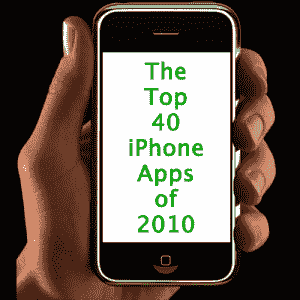

# 2010 年 40 大 iPhone 应用

> 原文：<https://web.archive.org/web/https://techcrunch.com/2010/12/26/top-40-iphone-apps-2010/>

***编者按**:这篇客座博文由移动应用目录 [Appolicious](https://web.archive.org/web/20230326084736/http://www.appolicious.com/) 收购的 [AppVee](https://web.archive.org/web/20230326084736/http://www.appvee.com/) 和 [AndroidApps](https://web.archive.org/web/20230326084736/http://www.androidapps.com/) 的前 CEO 兼创始人 Alex Ahlund 撰写。你可以阅读他之前的 iPhone 应用精选[这里](https://web.archive.org/web/20230326084736/https://techcrunch.com/2010/08/07/30-best-iphone-apps/)和[这里](https://web.archive.org/web/20230326084736/https://techcrunch.com/2009/08/15/the-35-best-iphone-apps-of-the-year-so-far/)*

iTunes 应用商店很大。超过 30 万个应用程序。我看着这个庞然大物从无到有，短短几年就变成了一个十亿美元的产业。我们已经接近这一点有一段时间了，但现在比以往任何时候都更明显的是，应用程序的曝光率是至关重要的。健康的大多数 iOS 应用程序用户直接从他们的设备上发现新的应用程序，而不是使用 iTunes。如果你专门看一下 iPhone，你会发现只有很小一部分应用程序可以使用它。

目前共有 20 个类别，游戏提供另外 20 个子类别。每个子类别分为三个列表，在 iPhone 上最多显示 100 个应用程序。从前 25 名和特色列表中挑选一小部分，你会发现大约有 12000 个应用程序同时出现。这表明只有大约 4%的应用程序获得了可见性。人们可以在 iTunes 上浏览超过这个数字的内容，但这很快就变成了一项艰巨的任务。

人们的期望是，市场将决定一款应用的价值，但事实并非总是如此。如果你看看排行榜，就会发现它们充斥着克隆品、廉价仿制品和冲动型商品。99 美分的购买实在太诱人了。没有适当的曝光(以及潜在的更合适的定价方案)，许多真正伟大的应用永远不会出现。

尽管如此，我还是整理了我认为是今年最好的应用程序。一些人得到了应得的曝光，而另一些人则在混乱中迷失了。汇编“最佳”列表的困难之处在于，在具有主流吸引力的应用和真正创新的应用之间取得平衡。在选择中有许多因素(例如应用程序本身的优点，而不仅仅是它所利用的既定服务的有用性)，并不是每个好的应用程序都可以入选。

我将展示 2010 年最热门的应用:

**热门 iPhone 应用:**

**1。 [Instagram](https://web.archive.org/web/20230326084736/http://www.appolicious.com/tech/apps/391751-instagram-burbn-inc)** :拍摄一张照片或从你的图库中选择一张，对其应用视觉效果，然后将其发布到脸书、Twitter、Flickr、Tumblr 或 Foursquare。虽然有很多照片滤镜应用程序，但 Instagram 与众不同，因为它很容易获得独特而专业的结果。不需要老式相机或 Photoshop 技能的独立造型。
http://www.youtube.com/watch?v=BglRcQeq3t0

**2。 [Chase Mobile](https://web.archive.org/web/20230326084736/http://www.appolicious.com/finance/apps/223524-chase-mobile-jpmorgan-chase-co)** :虽然我不用 Chase 处理银行业务，但这款应用值得认真认可。对于一个不以突破技术极限而闻名的行业来说，Chase 做了一些非常酷的事情。不用去银行中心或自动取款机，你只需拍下支票的正反面，金额就会存入你的账户。总比开车去银行好。

**3。[亚马逊](https://web.archive.org/web/20230326084736/http://www.appolicious.com/shine/apps/453547-price-check-by-amazon-amazon-com)的价格查询**:当然，有几款条码扫描应用。有些工作比其他人更好，但价格检查几乎完美无瑕。考虑到我几乎从亚马逊购买所有东西(从维生素到电子产品)，我可能有点偏见。但不管怎样，这个应用程序提供了一个简单有效的方法来查看商店里实物商品的价格，看看你是否能在网上买到更便宜的商品。

**4。[查找我的 iPhone](https://web.archive.org/web/20230326084736/http://www.appolicious.com/tech/apps/251464-find-my-iphone-apple-inc)** :这是苹果发布无需付费 MobileMe 账户的“查找我的 iPhone”功能的一大举措。有了这个，你可以看到你的手机在地图上的位置，显示信息，锁定手机或彻底清除它。

**5。谷歌语音:期待已久，谷歌语音已经被搁置了很久。我以为它永远不会问世(可能是因为 AT & T 的反对),但出乎大多数人意料的是，它获得了批准。使用 Google Voice，您可以用一个独特的号码来代替您的通话计划，包括拨号、短信、语音邮件和信息转录。**

**6。 [Twitter](https://web.archive.org/web/20230326084736/http://www.appolicious.com/tech/apps/92422-twitter-twitter-inc)** :在收购 Tweetie 之后，Twitter 重新推出了这个作为 iPhone 的官方 Twitter 应用。它仍然是旗手。你一天拉下几次刷新？

**7。 [Dropbox](https://web.archive.org/web/20230326084736/http://www.appolicious.com/finance/apps/88066-dropbox-dropbox)** :我是数字游牧生活方式的大力支持者，所以我总是在云上备份。无论我是否带着电脑，我都希望能够访问、查看、检索和共享我的任何文件，Dropbox 应用程序可以帮助我做到这一点。它确实需要一个 Dropbox 账户，但它免费提供高达 2gb 的存储空间。

8。 [SpringPad](https://web.archive.org/web/20230326084736/http://www.appolicious.com/finance/apps/190357-springpad-spring-partners) :虽然 Evernote 应用程序很棒(我用它来记录我的大部分笔记和想法)，但 SpringPad 真正加强了移动笔记。你可以写一个快速备忘录，拍一张快照，扫描一个项目的条形码来记住，或者让应用程序搜索附近的商店和餐馆来添加。有比 Evernote 更多的选择，而且快速卸载一个想法似乎更快。

**9。 [Foursquare](https://web.archive.org/web/20230326084736/http://www.appolicious.com/tech/apps/50946-foursquare-foursquare)** :好吧，这款软件今年没有推出，但没有它，任何最佳 iPhone 应用榜单都不会完整。签到，一年前看起来如此古怪，现在却成了数百万人的困扰，他们应该感谢 Foursquare。告诉人们你在哪里，获得市长职位，徽章，也许还有其他奖励。最新的更新只是增加了评论和照片签入功能。( [Gowalla](https://web.archive.org/web/20230326084736/http://www.appolicious.com/tech/apps/51027-gowalla-alamofire) 看起来也还不错)。

10。[天火网页浏览器](https://web.archive.org/web/20230326084736/http://www.appolicious.com/tech/apps/420136-skyfire-web-browser-skyfire-labs-inc) :我还没遇到过不讨厌 iPhone 缺少 Flash 支持的人。虽然天火绝不是一个完美的解决方案，但它为我们提供了一种在 iPhone 上观看网络 Flash 视频的方式。不幸的是，它不支持 Flash 游戏，也不是所有的网站都支持 Flash 视频。

**11。Kindle**:我是那种喜欢用电子墨水 Kindle 而不是 LCD iPad 阅读的人。对于像我一样的数百万人来说，Kindle 应用程序是一个完美的伴侣。然而，虽然我不会到处带着我的 Kindle，但我总是带着我的手机。只要启动应用程序，你就可以从上次停止的地方继续阅读。

**12。[Word Lens](https://web.archive.org/web/20230326084736/http://www.appolicious.com/tech/apps/491769-word-lens-quest-visual)**:Word Lens 是为数不多的真正展现 iPhone 潜力的 app。将你的手机对准任何用另一种语言书写的标准印刷文字(标志、报纸等)。)而 Word Lens 会用翻译的文案代替。令人惊奇的是，它会实时完成。目前，它只支持英语到西班牙语的翻译(反之亦然)，但更大的语言支持正在进行中。它有一些怪癖，但速度和准确性令人印象深刻。

**13。Groupon** :这是团购服务 Groupon 的一个可靠的配套应用，在有限的时间内提供大幅折扣的产品或服务。该应用程序使这个过程更容易管理，而不需要网站。有一些像讨论这样的辅助功能，但保留它的真正原因是为了方便查看日常交易。

**14。 [Hashable](https://web.archive.org/web/20230326084736/https://techcrunch.com/2010/12/12/hashable-iphone/)** :如果你是一个重度社交者或者只是喜欢介绍人，Hashable 就是适合你的应用。它可以让你通过 Twitter 或电子邮件介绍他人，并用#午餐或#justmet 等标签标注你的所有会议，这样你就可以稍后回去搜索它们。每次使用该应用程序时，你也会获得“Hashcred ”,这将使你在排行榜上排名上升。这是一个商务 app，但是感觉很好玩。

**顶级娱乐应用**:

15。[网飞](https://web.archive.org/web/20230326084736/http://www.appolicious.com/omg/apps/201176-netflix-netflix-inc) :我是网飞流媒体的超级粉丝，这个应用是在你的 iPhone 上观看流媒体内容的好方法。我原以为 3G 上的电影流会很慢，但惊讶地发现，在短暂的加载时间后，它变得非常流畅。质量设置根据连接情况有所降低，但总的来说，效果很好。

**16。Hulu**:我对 Hulu 应用程序持观望态度，因为网飞涵盖了我的许多媒体需求。这款应用需要你订阅 Hulu Plus 服务，价格与网飞流媒体账户相同。然而，Hulu 包含许多很棒的电视内容，可以填补网飞留下的许多空白。该应用程序本身感觉很可靠，在外观和速度方面，流媒体质量似乎与网飞不相上下。

**17。 [TuneIn Radio](https://web.archive.org/web/20230326084736/http://www.appolicious.com/music/apps/77643-tunein-radio-synsion-radio-technologies)** :网络电台的问题在于，尽管它很棒，但它不允许访问本地电台。TuneIn Radio 可让您收听全国数千家真正的广播电台。它有很多功能，比如暂停和倒带直播，是除了 Pandora 和 Slacker 之外的又一大亮点。

**18。Rhapsody** : Rhapsody 是一个吃到饱的音乐收听服务。很长一段时间以来，iPhone/iPod Rhapsody 用户如果想带着自己的歌曲，就会受到冷落。但现在，有了 Rhapsody 应用程序，你可以在不需要活跃的互联网连接的情况下，随心所欲地听来自该服务的音乐。

**19。 [TextPics](https://web.archive.org/web/20230326084736/http://www.appolicious.com/tech/apps/375730-textpics-creative-sms-art-for-iphone-texting-ftw-innovations)** :表情符号添加到给其他 iPhone 用户的短信中很有趣——问题是你没有 iPhone 的朋友看不到它们。TextPics 试图通过给你一堆 ASCII“图纸”来解决这个问题，你可以发送文本或包含在电子邮件中。最好的部分是它们由标准文本字符组成，因此任何人都可以在任何设备上接收它们。

**顶级 iPhone 游戏**:

20。愤怒的小鸟:要忽略愤怒的小鸟并不容易——你通常会发现它经常出现在第一名的位置。这是 iPhone 世界中最先出现的现象之一，催生了季节性版本、玩具甚至电影合约。我怀疑它甚至需要一个描述，所以如果出于某种原因，你刚刚从岩石下爬出来，去下载愤怒的小鸟。

**21。[植物大战僵尸](https://web.archive.org/web/20230326084736/http://www.popcap.com/extras/pvz/)** :我来自休闲游戏行业，所以我是 PopCap 的粉丝已经很久了。PvZ 是一款流线型的线性塔防游戏。你的目标是使用各种不同的植物从普通的豌豆射手到爆炸的地雷植物来保护你的家免受一大群僵尸的攻击。一个简单，快节奏的赚钱方法来升级你的防御，这个游戏是一个有趣的动作，策略和僵尸的融合。
http://www.youtube.com/watch?v=w5S85iPlM1Y

**22。[贸易国](https://web.archive.org/web/20230326084736/http://www.appolicious.com/games/apps/431427-trade-nations-amplified-games-inc)** :这是我在 iPhone 上最喜欢的免费增值游戏之一。在某些方面，它像一个合作的实时策略游戏。你建造房屋来创造工人，发展木材场来引进木材，收获小麦作为食物，等等。这是一种有益的体验，最好在短暂、高效的爆发中进行。每一个动作都需要时间，所以在休息的时候签到做一点管理总是很有意思的。

**23。[Gun Bros](https://web.archive.org/web/20230326084736/http://www.appolicious.com/games/apps/410946-gun-bros-glu)**:iPhone 上的大部分双截棍生存射击游戏都是简单、浅薄的体验。Gun Bros .通过提供免费增值升级系统、独特的视觉风格和强大的平衡机制，将这种类型提升到了一个新的水平。如果你是一个快节奏的自上而下射手的粉丝，这是一个可以抓住的。

**24。[侠盗猎车手:唐人街之战](https://web.archive.org/web/20230326084736/http://www.appolicious.com/games/apps/148449-grand-theft-auto-chinatown-wars-rockstar-games)** :我一般不喜欢波特斯，但这次做得很对。《GTA: CW》是任天堂 DS 的忠实翻译。游戏以 3D 头顶视角呈现，结合了原版 GTA 和 GTA 4 的元素。尽管外观与前者相似，但它实际上更像后者，熟悉自由城的人会发现自己在这里如鱼得水。

**25。如果你曾经想在 iPhone 上玩光晕，这是你目前最接近的选择。像原来一样，你在一个郁郁葱葱的科幻环境中战斗，同时利用一个巨大的未来武器库和力量，如减慢时间的能力。凭借改进的图形，更广阔的环境，独特的游戏组件，如驾驶车辆，以及一系列的视觉效果，N.O.V.A 2 肯定会为原著和新人的粉丝提供引人入胜的体验。**

**26。[益智特工](https://web.archive.org/web/20230326084736/http://www.appolicious.com/games/apps/368093-puzzle-agent-telltale-inc)** :这就是我喜欢做这些榜单的原因。像益智代理这样的游戏应该得到认可，因为它跳出了盒子，提供了引人入胜的体验。你在游戏中扮演一名来自谜题调查部门的 FBI 特工，该游戏将经典冒险游戏的元素与发人深省的谜题结合在一起。加上古怪的艺术作品和良好的声音表演，这是一个尝试。

**27。[节奏灵](https://web.archive.org/web/20230326084736/http://www.appolicious.com/games/apps/263525-rhythm-spirit-monad)** :节奏灵是今年的卧铺热门。它受到了评论家的喜爱，但却被许多 iPhone 游戏玩家忽视了。该游戏是一款基于节奏的格斗游戏，以日本民间传说为基础的丰富故事情节为特色。富有想象力的角色，独特的游戏性和真正令人敬畏的技术禅配乐使节奏精神成为格斗和节奏游戏迷的必备。

**28。布娃娃冲击波 2** :轨迹游戏在 iPhone 上风靡一时。虽然这种类型已经出现了许多低于平均水平的应用程序，但 Ragdoll Blaster 2 却脱颖而出。异想天开，蒸汽朋克灵感的图形和大量的关卡设计和背景艺术，RB2 是一个深刻和有益的谜题。

**29。[蜘蛛侠:大混乱](https://web.archive.org/web/20230326084736/http://www.appolicious.com/games/apps/366680-spider-man-total-mayhem-gameloft)** :蜘蛛侠的世界创造了最好的游戏环境之一，尽管过去许多尝试的结果喜忧参半。iPhone 的全面伤害成功地提供了一个非常有吸引力的，高度可玩的网络投掷体验。这种坚实的殴打给你所有的蜘蛛侠的技能，因为你摇摆通过城市景观，网上坏人，并从事一些良好的老时尚全武行。《全面大混乱》在视觉上非常棒，并且具有真正优秀的战斗技巧。

**30。[镜之刃](https://web.archive.org/web/20230326084736/http://www.appolicious.com/games/apps/368079-mirror-s-edgetm-electronic-arts)** :自从电影《山风》出来，我就迷上了跑酷。我甚至报名参加了 it 培训，结果或多或少有些不幸。所以现在，镜子的边缘是我周末从屋顶跳下的最接近的地方。我是游戏机上游戏的忠实粉丝，所以最初我小心翼翼地尝试了 iPhone 的改编。然而，我很快发现，这个版本在直观的控制和有效的、设备友好的侧滚视角方面令人惊讶地胜任。流畅的动画和精美的 3D 图形令人想起最初的控制台版本，有助于独特的令人满意的运行和跳跃体验。

**31。[剪绳](https://web.archive.org/web/20230326084736/http://www.appolicious.com/games/apps/390755-cut-the-rope-chillingo-ltd)** :我本来不想喜欢这个游戏的。仅仅一天之后，它就蹿升到了 App Store 的第一名。我认为肯定有什么不正当的行为在起作用。但事实是，不管是否使用了“创造性的”营销方法，这个游戏都非常有趣。目标是把一块挂在绳子上的糖果放进一个可爱的怪物嘴里。这并不像听起来那么简单。许多障碍挡在你的路上，不久，你会发现自己完全沉迷于帮助小家伙得到他的糖果。

**32。[水果忍者](https://web.archive.org/web/20230326084736/http://www.appolicious.com/games/apps/205954-fruit-ninja-halfbrick-studios)** :有些游戏纯粹是因为简单而有趣——水果忍者就是其中之一。当 3D 水果跃入眼帘时，你用手指划过屏幕将它们切成两半——就这么简单。切片水果的无尽冲击，同时避免游戏结束炸弹。每次训练都以缓慢稳定的速度开始，随着你的进步，动作逐渐变得更加激烈和疯狂。

33。[奥斯莫斯](https://web.archive.org/web/20230326084736/http://www.appolicious.com/games/apps/282532-osmos-hemisphere-games) :在玩奥斯莫斯的过程中，你会获得某种禅宗般的满足感。你控制一个阿米巴样的斑点，它必须消耗更小的实体才能生长，然后驱逐它们才能移动。你必须保持警惕，以保持这种谨慎的平衡行为，但奥斯莫斯的冥想平静氛围创造了一种独特的放松、宁静的体验。【http://www.youtube.com/watch? v=34zjz-nBvE0

**34。[蓝精灵村](https://web.archive.org/web/20230326084736/http://www.appolicious.com/games/apps/434255-smurfs-village-capcom-interactive-inc)** :当谈到目前在 App Store 上提供的免费增值管理游戏时，体验往往过于浅薄和可预测。《蓝精灵的村庄》不是这样。虽然你的目标仍然是建设和发展你的村庄，但这个游戏充满了任务、迷你游戏甚至松散的叙事。《蓝精灵的村庄》以美妙的音乐和出色的高分辨率图像为特色，肯定会给那些在 80 年代观看周六早间卡通片的人灌输一种温暖的怀旧感。

**顶级技术成就游戏:**

iPhone 在处理能力方面已经取得了很大的进步，开发者开始想办法充分利用硬件。以下游戏真实地展示了 iPhone 的强大功能:

**35。[现代战斗 2:黑飞马](https://web.archive.org/web/20230326084736/http://www.appolicious.com/games/apps/392632-modern-combat-2-black-pegasus-gameloft)** :要把一款主机级第一人称射击游戏带到你手那么大的设备上，可不是一件简单的事情。这是处理、资产和可用性之间的小心平衡。幸运的是，现代战斗很好地实现了这一目标。高分辨率的图形，令人印象深刻的视觉效果，以及详细的环境，让《现代战争 2》有足够的理由被认为是今年的一项技术成就。

36。[星球大战街机:猎鹰枪手](https://web.archive.org/web/20230326084736/https://techcrunch.com/2010/11/17/star-wars-iphone-falcon-gunner/) :你会想在转椅上玩这个游戏。360 度的图形利用 iPhone 的陀螺仪让你旋转并从千年隼的炮塔上射击 TIE 战斗机。游戏非常简单，但是 360 度的效果和 3D 图形让你置身于不同于其他游戏的活动中。你也可以在增强现实模式下玩，这种模式会将背景切换到你的相机视图，让它看起来像是 TIE 战斗机在你的房间里或在空中飞行。

37。[武士 2:复仇](https://web.archive.org/web/20230326084736/http://www.appolicious.com/games/apps/405185-samurai-ii-vengeance-madfinger-games-a-s) :我喜欢真正推动风格和性格的游戏，武士 2:复仇就是这样。从视觉上看，这款游戏可能是卡普空的主机宝石 Okami 的弟弟妹妹。这种艺术就像是日本水墨画和动漫的结合，给了复仇一种惊人的丰富和独特的风格。粗粗的轮廓、平淡的色彩和夸张的动作创造了一个独特的漫画外观，在 App Store 中大胆地脱颖而出。

**38。[真实赛车 2](https://web.archive.org/web/20230326084736/http://www.appolicious.com/games/apps/490517-real-racing-2-firemint-pty-ltd)** :第一款真实赛车在去年发布时风靡了 App Store。这是少数几个展示 iPhone 真正能力的应用之一。真实赛车 2 在保持这一传统方面没有令人失望。RR2 是 iPhone 上最好看的赛车游戏。从详细的赛道和环境，到实际许可的汽车本身，这肯定会给最愤世嫉俗的驾驶模拟爱好者留下深刻印象。虽然真正的赛车 2 已经包装了更多的游戏模式，多人游戏选项和汽车，但它仍然使用其前身近乎完美的控制方案选项。

**39。 [Rage HD](https://web.archive.org/web/20230326084736/http://www.appolicious.com/games/apps/446806-rage-hd-id-software)** :我一般不喜欢任何游戏的“上轨”机械师。如果我一定要扮演一个火车上的射手，我更有可能去投币洗衣店玩一些狼行动。但这并不能抹杀 Rage HD 是目前 App Store 中最好看的两款游戏之一的事实。锐利的纹理、动态的灯光和高多边形渲染使这成为一个令人印象深刻的壮举。现在，如果他们能把我们从铁轨上撬下来，我们就能拥有一个非常棒的射手了。

**40。[无限刃](https://web.archive.org/web/20230326084736/http://www.appolicious.com/games/apps/478390-infinity-blade-chair-entertainment-group-llc)** :无限刃是迄今为止苹果手机上最漂亮的游戏。由 Epic 开发，使用的引擎是为令人难以置信的技术演示 Epic Citadel 提供动力的，因此 Infinity Blade 在视觉上与现代游戏机游戏相当也就不足为奇了。游戏包括在屏幕上轻敲和滑动各种虚张声势的动作，当你对抗一系列试图阻止你接近上帝之王的守卫时。除了战斗，游戏还包括一些有趣的 RPG 元素和一个功能性的故事情节，为所有的混乱提供背景。尽管它没有提供最深刻或最令人满足的游戏体验，但 Infinity Blade 成功地为高端苹果手机游戏引入了新的视觉基准。
http://www.youtube.com/watch?v=ibnc_g_BJQk

告诉我们您想将哪些应用程序放在此列表中。