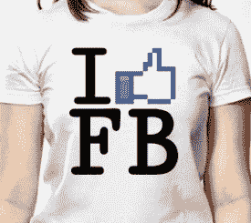

# 脸书的顶级品牌有哪些？TechCrunch

> 原文：<https://web.archive.org/web/https://techcrunch.com/2010/05/21/top-brands-facebook/>

# 脸书的顶级品牌有哪些？

[AllFacebook](https://web.archive.org/web/20221208131401/http://allfacebook.com/) 有一个很好的功能，你可以在这里看到[表现最好的脸书页面](https://web.archive.org/web/20221208131401/http://statistics.allfacebook.com/pages)是什么——这意味着迄今为止哪些页面聚集了最多的追随者。问题是明显存在明显的滞后，因此呈现的数据是不准确的(例如，它少算了流行的[德州扑克页面](https://web.archive.org/web/20221208131401/http://www.facebook.com/TexasHoldEm)的粉丝数近 150 万)。

进入[粉丝页面列表](https://web.archive.org/web/20221208131401/http://fanpagelist.com/)，它完全致力于对脸书上最受欢迎的页面进行排名，以及对各种类别的排名，如演员、政治家、电影、游戏、电视节目、新闻、运动员等等。

最有趣的类别之一是脸书上的[顶级品牌列表。](https://web.archive.org/web/20221208131401/http://fanpagelist.com/category/brands/)

让我们看一看，好吗？

脸书最受欢迎的品牌是… [脸书](https://web.archive.org/web/20221208131401/http://www.facebook.com/facebook)，拥有 900 多万粉丝。前 25 名中仅有的其他互联网/科技品牌是 [YouTube](https://web.archive.org/web/20221208131401/http://www.facebook.com/youtube) (拥有 5082029 名粉丝的第 4 名)和[谷歌](https://web.archive.org/web/20221208131401/http://www.facebook.com/Google)(拥有 1269926 名粉丝的第 21 名)。食品和服装品牌似乎做得更好。

如果你想知道为什么[苹果](https://web.archive.org/web/20221208131401/http://apple.com/)在顶级品牌排名中无处可寻:库比蒂诺公司甚至没有一个合适的脸书页面(看起来[facebook.com/apple](https://web.archive.org/web/20221208131401/http://www.facebook.com/apple)被别人拿走了)。[微软做了](https://web.archive.org/web/20221208131401/http://www.facebook.com/Microsoft)，但仅以 117444 名粉丝排在第 99 位。但是，嘿，至少他们还是进了前 100 名，对吧？

以下是脸书十大品牌(完整名单，点击[进入](https://web.archive.org/web/20221208131401/http://fanpagelist.com/category/brands/view/list/sort/fans/)):

1) [脸书](https://web.archive.org/web/20221208131401/http://www.facebook.com/facebook)(9024542 粉丝)
2) [星巴克](https://web.archive.org/web/20221208131401/http://www.facebook.com/starbucks)(7217370 粉丝)
3) [可口可乐](https://web.archive.org/web/20221208131401/http://www.facebook.com/coca-cola)(5529595 粉丝)
4)[YouTube](https://web.archive.org/web/20221208131401/http://www.facebook.com/youtube)(5082221 粉丝)
5) [迪士尼](https://web.archive.org/web/20221208131401/http://www.facebook.com/disney)(3475487 粉丝)

PS:你可以在这里花 19.99 美元买到那件 t 恤。