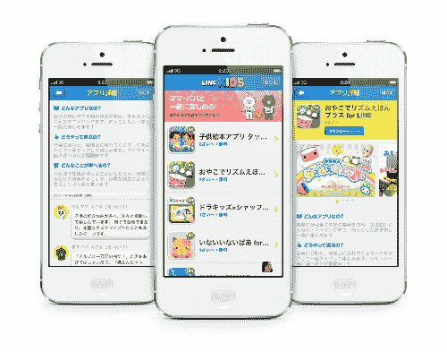

# 日本顶级消息应用程序系列将儿童应用程序添加到其不断增长的产品列表中技术危机

> 原文：<https://web.archive.org/web/https://techcrunch.com/2012/12/26/top-japanese-messaging-app-line-adds-kids-apps-to-its-growing-product-roster/>

# 日本顶级消息应用程序系列将儿童应用程序添加到其不断增长的产品列表中

日本最大的智能手机短信应用程序 Line，覆盖了该国大约三分之一的手机用户，刚刚宣布为六岁及以下的儿童发布 Line Kids (通过谷歌翻译链接)。Line Kids 目前仅在日本上市，开发商 NHN 日本(总部位于韩国的 NHN 公司的附属公司)表示，目前还没有计划在国外上市。但是，正如 Kim-Mai Cutler 在 11 月份的《T2》Line(T3)个人资料中指出的那样，该应用有可能成为全球非常重要的消息传递工具，将自己作为一个家庭友好型平台进行营销将有助于扩大用户群(尤其是如果 Line 与中国移动联手开发微信，正如《T4》最近的传言所暗示的那样)。

 
该服务已经提供了一个翻译引擎，可以在聊天室处理英语、汉语、日语和韩语，允许来自不同国家的用户见面和交流。特殊表情符号(或称“贴纸”)的销售帮助 NHN 截至 7 月份的月销售额达到 375 万美元，而且这个数字还在继续攀升。为了体验让 Line 的表情符号如此受欢迎的奇思妙想，来看看它对“江南 Style”的新模仿吧:

【YouTube http://www.youtube.com/watch?v=nqdI34iZ4js]

Line Kids 是一个免费下载的软件，包括一个教育组件，里面有图画书和歌曲，家长和孩子都可以参与其中。虽然该应用程序是无广告的，但父母可以在应用程序内进行额外的购买。

这是本月宣布的第二个新产品系列，旨在扩大服务范围，让用户在应用上停留更长时间。12 月 18 日，Line 推出了 [Line Cafe](https://web.archive.org/web/20221206185236/http://translate.google.com/translate?hl=en&sl=auto&tl=en&u=http%3A%2F%2Flineblog.naver.jp%2Farchives%2F21359707.html) ，即有相同爱好和兴趣(如照顾孩子、美食、旅游或电影)的用户可以见面的聊天室。用户还可以开设只接受邀请的“私人咖啡馆”