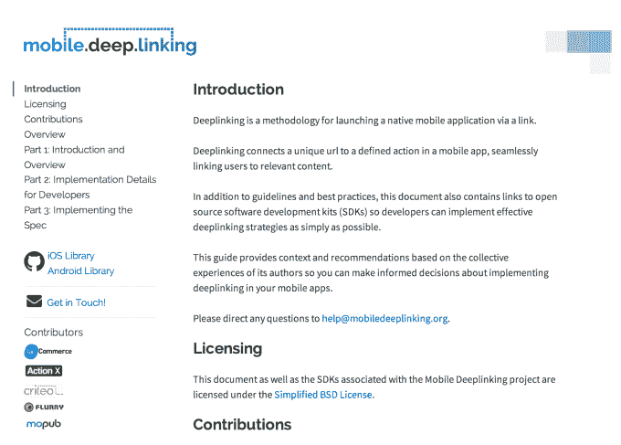

# 顶级移动营销人员联手推动交叉链接应用的新规范 

> 原文：<https://web.archive.org/web/https://techcrunch.com/2014/02/27/top-mobile-marketers-team-up-to-push-a-new-specification-for-cross-linking-apps/>

移动深度链接是一种技术，通过支持用户在应用之间移动的链接，使应用更像网络一样工作。今天推出了一种新的移动深度链接规范，以及一系列最佳实践。这个名为[MobileDeeplinking.org](https://web.archive.org/web/20221209220458/http://mobiledeeplinking.org/)的项目得到了几家知名移动技术公司的支持，包括 Criteo、TapCommerce 和 ActionX，以及 Flurry 和 MoPub 的贡献。

然而，这并不是移动技术公司第一次引入面向开发者的移动深度链接工具。之前来自 [Quixey](https://web.archive.org/web/20221209220458/https://beta.techcrunch.com/2013/08/02/ready-for-a-web-of-apps-quixey-launches-appurl-a-new-way-to-enable-deep-linking-across-mobile-applications/) 和深度链接服务 [Deeplink.me](https://web.archive.org/web/20221209220458/https://beta.techcrunch.com/2014/02/04/mobile-deep-linking-service-deeplink-me-debuts-a-native-ad-sdk/) 的努力从去年就开始了，而 [Tapstream 的“延迟深度链接](https://web.archive.org/web/20221209220458/https://beta.techcrunch.com/2014/01/23/tapstream-is-making-mobile-ads-smarter-with-deferred-deep-links-a-way-to-point-users-to-app-landing-pages-after-they-install/)才刚刚推出，仅举几个例子。一些开发者已经使用这些工具实现了深度链接——例如，Deeplink.me 在本月早些时候表示，其服务的采用率为“数千人”

当被问及为什么该组织认为有必要引入另一种开放规范时，TapCommerce 联合创始人兼首席执行官 Brian Long 解释说，这一次，它不仅仅是提供一套开放的工具，而是由领先公司财团支持的开源倡议。

“其他解决方案仅由一个非常小的个体创业公司支持，因此还没有被广泛使用，”他说。“有了我们的解决方案，各大品牌将可以放心地实施由几家上市公司和行业领导者支持的解决方案。”

在其他一些产品中，Long 还指出，必须集成专有代码才能实现深度链接，有时这甚至包括公司托管的路由 URL。

这在一定程度上是正确的——并不是所有的解决方案都要求这样做，而是提供路由 URL 作为一个选项，例如 Quixey，它实际上建议开发人员在自己的网站上托管自己的 [JavaScript 重定向](https://web.archive.org/web/20221209220458/http://appurl.org/docs/javascript-redirect)，因为这将允许他们使用 AppURL 方案，而不必使用 Quixey 的[appURL.org/go](https://web.archive.org/web/20221209220458/http://appurl.org/docs/appurl-org-go)。

但是，不同解决方案的一知半解仍然让开发人员感到困惑。因为没有一个规范被移动领域的顶级玩家广泛认可，一些应用程序制造商可能对采用这项技术犹豫不决。

像[MobileDeepLinking.org](https://web.archive.org/web/20221209220458/http://mobiledeeplinking.org/)一样，拥有多个支持者的另一个好处是增加了对规范如何工作的投入，以及规范上线后将会受到的潜在影响。该规范的工作小组包括了代表数十万个应用程序和数十亿次应用程序下载的集成的贡献者。

Long 表示:“我们与领先移动公司 Flurry、MoPub、TapCommerce 和 Criteo 的产品负责人一起工作了几个月，共同制定了一个规范，提供了一套丰富的功能，这些功能易于实施，并随着行业的发展而进一步完善。

通过[MobileDeepLinking.org](https://web.archive.org/web/20221209220458/http://mobiledeeplinking.org/)，开发者可以使用开源代码在他们的应用中实现深度链接，并将始终控制体验，同时还可以访问 iOS 和 Android 上的高级功能，以进行错误处理、营销自动化和高级分析。

实施过程提供了几种不同的设置选项，包括带库和不带库。如果开发者选择使用这些库，可以在 Github 上找到。

这个特殊的规范虽然今天才推出，但它立即获得了更广泛的行业支持，因为所有相关公司都将推荐它作为未来所有应用程序和合作伙伴的标准。这就留下了一个问题，其他人到目前为止推出的规范会发生什么变化？假以时日，我们将知道他们是选择维持他们的替代方案，还是放弃它们，加入一个更大的团队。

然而，值得指出的是，虽然是开源的，但 MobileDeepLinking.org 并不是真正意义上的行业“标准”——也就是说，它不是移动应用程序，例如，类似于 web 的 HTTP 协议。这意味着许多竞争对手可能仍然选择打造自己的道路，试图吸引自己的客户。

关于新规范的更多信息可以在[MobileDeepLinking.org 域名](https://web.archive.org/web/20221209220458/http://mobiledeeplinking.org/)上找到。