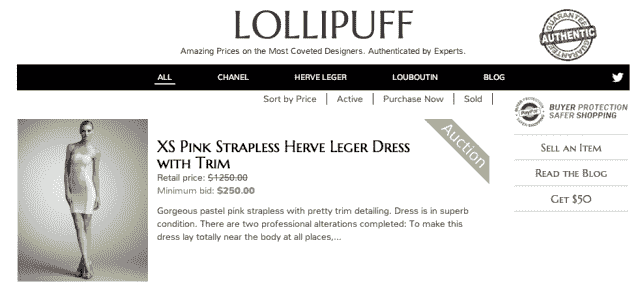
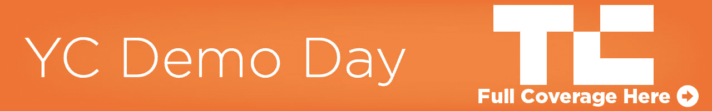

# 来自 Y Combinator 的 W13 演示日的 7 大初创公司

> 原文：<https://web.archive.org/web/https://techcrunch.com/2013/03/26/top-y-combinator-startups/>

Y Combinator 在这一季比以往任何时候都更难进入 T1，并且在舞台上表现出了实力。今天，33 家初创公司在孵化器 2013 年冬季演示日亮相。挑选最有希望的不是一件容易的事情。但是，经过团队讨论并听取风投和创始人的意见后，TechCrunch 选出了七家有潜力颠覆大企业、让世界变得更美好的初创公司。

YC 的老板保罗·格拉厄姆说，他和他的合作伙伴比以往任何时候都更挑剔 2013 年冬季班录取哪些初创公司。这一次，YC 的女性联合创始人人数创下了[的历史新高](https://web.archive.org/web/20221226041543/https://techcrunch.com/2013/03/26/y-combinator-female-founders-percent-demo-day/)，尽管她们仍然只占全班的 10%。47 家创业公司中有 14 家目前拒绝接受采访，但是你可以在我们关于第一批[和第二批](https://web.archive.org/web/20221226041543/https://techcrunch.com/2013/03/26/y-combinator-winter-2013-demo-day-batch-1/)的文章中读到所有 33 家已经公开展示的创业公司。你也可以看看我们关于一个更精简、更强大、更谦虚的 Y 组合子的想法。

恭喜所有到场的人。但是现在，我们的最爱。

#### [Thalmic](https://web.archive.org/web/20221226041543/http://www.thalmic.com/) :可穿戴手势设备

Thalmic 实验室开发了一种戴在前臂上的传感器，用于检测映射到手部运动的电信号。这款名为 MYO 的设备是一款手势控制器，不需要 Kinect 式的摄像头。Kinect 等基于摄像头的系统的局限性在于，你必须在固定的空间内做出有限的手势。Thalmic 称这是人机界面“一代人一次”的转变。它可以用来浏览幻灯片、玩游戏或通过蓝牙控制其他无线设备。

当它在 2 月份开放预购时，人们在短短两天内以 149 美元一台的价格购买了 1 万台 myo，销售额总计 150 万美元。你可以在这里和这里阅读更多关于 Thalmic 和 MYO [的 TechCrunch 报道。](https://web.archive.org/web/20221226041543/https://techcrunch.com/2013/02/25/thalmic-labs-myo/)

#### [Watsi](https://web.archive.org/web/20221226041543/http://watsi.org/) :资助治疗的非营利组织

Watsi 是 Y Combinator 的第一个非营利组织。(或者，正如 YC 的保罗·格拉厄姆开玩笑说的，这是孵化器的第一家“有意”不以盈利为目的的公司。)是一个全球医疗保健的众筹平台。本质上，人们可以集资来支付有需要的人的医疗费用。例如，它帮助的第一个病人是尼泊尔的一名 12 岁女孩，她的父母负担不起去该国首都做手术的交通费。Watsi 的社区在八天内众筹到了这个项目。

该公司表示，它正在与 13 家医疗机构合作，平均每周资助 17 名患者。100%的捐款直接用于资助医疗保健，Watsi 计划以几种方式支付费用，包括可选的小费。你可以在这里阅读更多[我们的报道。](https://web.archive.org/web/20221226041543/https://techcrunch.com/2013/01/25/y-combinator-backs-its-first-non-profit-watsi-paul-graham-says-hes-never-been-so-excited-to-invest/)

#### [棒棒糖](https://web.archive.org/web/20221226041543/http://lollipuff.com/):正品拍卖

作为设计师商品的易贝，Lollipuff 试图通过为顾客提供香奈儿、鲁布托和赫夫莱杰的奢侈品认证层来规避在线购买设计师商品的风险。这意味着零假冒，所以你可以放心购买奢侈品。

自 1 月份试运行以来，该平台已完成超过 45，000 美元的订单，在 3 个月内增长了 10 倍。在同样长的时间内，这家初创公司的用户周环比增长了 13%。创始人费德乐在作为设计师认证者开设了一个成功的博客后产生了这个想法。在一项统计中，Deyle 提出了在网上购买设计师商品问题的症结所在:在易贝出售的 Herve Leger 75%是假货。“你会在《香奈儿》上花 3000 美元吗？”最终，她希望通过软件和人类专业知识的结合来扩展这一认证过程。“我们一半以上的用户以前从未使用过易贝，”她说，估计真正的设计师零售市场价值 300 亿美元。[点击](https://web.archive.org/web/20221226041543/https://techcrunch.com/2013/03/17/yc-backed-lollipuff-is-an-ebay-like-marketplace-for-authenticated-designer-clothing-and-accessories/)阅读更多关于棒棒糖的报道。

 电商店铺如何知道卖哪些产品，卖多少钱？Semantics3 希望利用大数据来回答这些问题。它的大胆目标是在一个集中的位置索引网上所有的产品和价格。然后，它向电子商务商家出售数据许可证或 API 访问权。这可以让他们看到还有谁在卖他们正在卖的产品，他们要价多少，他们的价格如何变化，以及哪些产品卖得好。除了传统的电子商务，Semantics3 还希望帮助应用开发者和其他垂直行业。

如果它能向美国 200 万电子商务市场中排名前 1%的人出售每年 12，000 美元的许可证，它每年可以赚 2.4 亿美元，并帮助新一波商业企业家取得成功。[点击此处阅读更多关于语义 3 的内容](https://web.archive.org/web/20221226041543/https://techcrunch.com/2013/02/25/yc-backed-semantics3-is-a-massive-consumer-products-database-to-rule-them-all/)。

#### [Wevorce](https://web.archive.org/web/20221226041543/http://wevorce.com/) :科技驱动的文明离婚标准

 Wevorce 提供了一个处理离婚的系统，试图避免打官司的痛苦和费用。它涵盖了六大步骤——离婚计划、共同父母计划、养育协议、财务规划、财务协议和离婚协议。它的服务是离婚专家和在线工具的结合。很明显，这个系统对早期客户有效。该公司表示，110 名 Wevorce 客户中有 109 人从未将他们的离婚案件诉诸法庭。离婚已经成为现代文化的一种制度，因为人们寻求满足感，即使这需要做出一些艰难的决定。如果我们能使这一过程变得顺利，我们将成为一个更快乐、适应力更强的社会。

#### 健康保险:Kayak

simply insurated 希望让购买健康保险像预订机票一样简单。该公司表示，这个过程通常要经过一个健康保险经纪人，在纸质副本、电话和传真之间，可能需要两到三天才能得到报价。此外，它还表示，由于奥巴马医改减少了佣金，有 2000 万份保单无法再由传统经纪人提供服务。有了简单保险，你就不需要经纪人了。你只需上网，对所有主要供应商进行并排比较。

在过去的六个月中，该公司的经常性收入每月增长 60%。许多人把健康保险看得如此复杂，以至于他们无法做出最好的决定，尽管这对他们或他们的雇主来说是一笔巨大的费用。简单的保险可以引导人们选择最实惠有效的计划，这样当他们受伤时，他们会得到照顾。

#### [FlightCar](https://web.archive.org/web/20221226041543/http://www.flightcar.com/) :机场汽车共享

 Flightcar 是一家汽车共享初创公司，专门专注于机场周边的旅行。车主开车到离给定机场五分钟路程的 Flightcar 位置，放下他们的车，并获得黑车服务到他们的航班。有了 Flightcar，车主可以保证免费停车、免费洗车、在路边上下车。作为交换，用户授权 Flightcar 在他们离开时将他们的汽车出租给其他旅行者。从业务的租赁方面来看，Flightcar 是 SFO 最便宜的汽车租赁机构。

这家初创公司在 10 周前成立，已经出租了 450 多辆汽车——自那以来，它的收入每周增长 10%，目前每周收入为 12，000 美元。到目前为止，Flightcar 停放的汽车中有 75%已经被租出。创始人认为这个市场是每年 110 亿美元的租赁市场和每年 50 亿美元的机场停车市场的结合。“这是一个巨大的机会，”他们说。点击这里，阅读我们之前对飞行汽车[的报道。](https://web.archive.org/web/20221226041543/https://techcrunch.com/2013/02/15/flightcar/)

