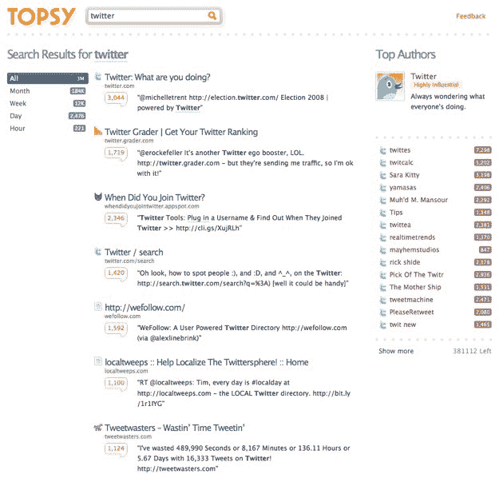

# 托普斯搜索发布:转发是网络的新货币 TechCrunch

> 原文：<https://web.archive.org/web/https://techcrunch.com/2009/05/26/topsy-search-launches-retweets-are-the-new-currency-of-the-web/>

潜行三年的新搜索引擎[托普斯](https://web.archive.org/web/20230217175325/http://www.topsy.com/)发布，嗯，[现在](https://web.archive.org/web/20230217175325/http://www.topsy.com/)。

在谷歌之前，AltaVista 等搜索引擎根据网页与查询的匹配程度来确定相关性。然后是谷歌，它将网络视为一个文件网络。今天，所有的搜索引擎都分析网络上的链接行为。当一个网页被大量链接时，它比其他围绕相同主题/关键词争夺注意力的网页更有影响力。杰夫·贾维斯[在 2005 年](https://web.archive.org/web/20230217175325/http://www.buzzmachine.com/2005/08/13/wired/)很好地总结了这一切*“在这个新世界里，链接就是货币。链接授予权限。链接建立品牌。链接等值。”还有很多，但是链接创造价值的概念是互联网搜索的驱动力。*

现在已经不是 2005 年了。当时，博客让谷歌很不爽，因为它们的更新速度非常快，而且不规则。谷歌必须决定多久索引一次页面。索引是昂贵的，所以有一个权衡。Ping 服务器和博客搜索引擎短暂崛起，填补了这一空白，但谷歌频繁地索引最受欢迎的博客，以至于这些博客搜索引擎不再好到哪里去。

然而现在，我们创造了如此多的实时内容，以至于谷歌和其他引擎都跟不上。这些内容大部分在 Twitter 上，但是 FriendFeed、脸书、Digg 和许多其他服务也在增加。结果是——除了谷歌，越来越多的人在推特上搜索。对于我这样一个痴迷于新闻和当下发生的事情的人来说，Twitter 搜索占我总互联网搜索量的 25%。随着时间的推移，这一比例不断上升。

这就是托普斯的用武之地。严格来说，它不是一个像 Scoopler 那样的实时搜索引擎，我们在本月早些时候曾写过。托普斯只是一个搜索引擎。这就有了一个从根本上寻找好结果的新方法:Twitter 用户。

大约 3000 万 Twitter 用户是一群小型内容搜索机器。托普斯说，这些用户每天都在互联网上发送数万个有趣的链接。

其中一些用户比其他人更有影响力。有些链接是由很多 Twitter 用户发送的，有些链接只发送一次。这些链接，结合 Twitter 消息本身的信息，是托普斯搜索引擎的基础。

结果是…惊人的。

尤其是新的东西渗透得非常快。例如，搜索脸书，会显示很多关于今天早些时候宣布的资助的新闻。这些链接按照 Twitter 用户发送最多的链接排序，更有影响力的 Twitter 用户发送的链接权重更大。你可以在任何时间(从 2008 年 9 月开始)，上个月，一周，一天或一小时内对结果进行排序。有史以来，脸书的最佳搜索结果是脸书网站和开发者网站等。但在过去的一小时和一天里，都是关于资金的新闻。

结果显示了热门链接，以及关于该主题的最有影响力的用户。点击那个用户，你会看到他们关于这个话题的所有推文。[这里是](https://web.archive.org/web/20230217175325/http://topsy.com/twitter/techcrunch?contains=facebook)例如 TechCrunch 和脸书的结果。

用户影响力当然是一个[热门话题](https://web.archive.org/web/20230217175325/https://techcrunch.com/2008/12/26/should-twitter-add-authority-based-search/)。托普斯并不关注追随者的数量。更确切地说，当别人转发你发出的链接时，你就获得了影响力。而当你转发别人的时候，你就失去了一点影响力。所以转发你的人越多，你获得的影响力就越大。所以，是的，[转发](https://web.archive.org/web/20230217175325/https://techcrunch.com/2009/05/26/the-awesome-potential-of-retweet/)是网络上的新货币。[跟你说了](https://web.archive.org/web/20230217175325/http://friendfeed.com/techcrunch/ab36ac6a/retweets-are-going-to-become-serious-currency)。

托普斯成立于 2006 年，迄今为止已经筹集了近 1500 万美元的风险和债务资金。更多关于资金和创始人的信息在托普斯的页面上。

这里有一段视频，视频中托普斯的创始人介绍了这项服务及其运作方式:

[YouTube http://www.youtube.com/watch?v=5CnuCYXcvFA&hl=en&fs=1]