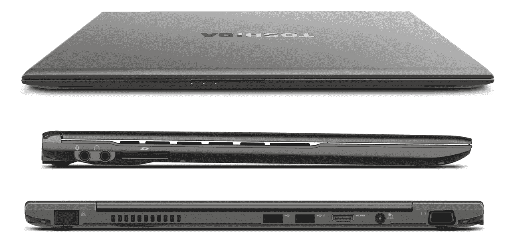

# 东芝发布首款超极本 portgéZ830 

> 原文：<https://web.archive.org/web/http://techcrunch.com/2011/09/01/toshiba-announces-their-first-ultrabook-the-portege-z830/>

# 东芝宣布推出首款超极本 portgéZ830

这花了足够长的时间，但似乎随着英特尔的[超极本](https://web.archive.org/web/20230203045950/http://techcrunch.com/tag/ultrabooks/)规格，PC 笔记本电脑制造商实际上开始组装一些笔记本电脑，与纤薄而成功的 [MacBook Air](https://web.archive.org/web/20230203045950/https://techcrunch.com/2011/07/20/updated-macbook-air/) 相竞争。第一批产品有点贵，但东芝公司刚刚宣布了一款低于 1000 美元的产品，在功率上没有太大的妥协。而且确实够薄。

让我们把规格说明一下:

*   0.63 英寸(15.9 毫米)厚
*   13.3 英寸 LED 背光显示屏(1366×768)
*   2.5 磅
*   英特尔酷睿 i3、i5、i7 处理器
*   板载英特尔高清 3000 显卡
*   128GB 固态硬盘
*   镁合金底盘，采用“蜂窝结构”以增强刚性
*   背光防泼溅键盘
*   2 个 USB 2.0、1 个 USB 3.0(右侧)、HDMI 和 VGA 输出
*   130 万像素网络摄像头
*   指纹识别器(可选，在 B2B 模式下)

没有指定 RAM。我要求东芝澄清规格和价格，但他们只愿意透露“低于 1000 美元”。他们还声称音响系统得到了增强，但对比什么还不清楚。像这样的小型笔记本电脑通常有相当糟糕的声音，这仅仅是因为扬声器驱动器的尺寸、深度和位置的限制。据推测，东芝为尽可能接近这些限制而感到自豪，这是任何人都可以做到的。

它是否真的有竞争力取决于你能以如此低的价格得到什么。可能是一笔交易，也可能是一笔艰难的交易。我们只能等东芝透露了。

至于设计，它很薄，很有棱角，很有效率，但我不会说它与众不同。你当然不能挑剔它的厚度或重量，尽管它缺乏空气的统一单一形状设计(我不知道我透过侧面看是什么感觉)。以下是一些最具代表性的照片:

至于可用性，预计在 11 月。不过，请看好你的钱包。我们预计今年年底前，华硕、宏碁(他们的[今天早上泄露](https://web.archive.org/web/20230203045950/https://techcrunch.com/2011/08/31/cant-wait-for-ultrabooks/))和其他公司也会向超极本领域提交类似的申请，或许价格或配置会更好。