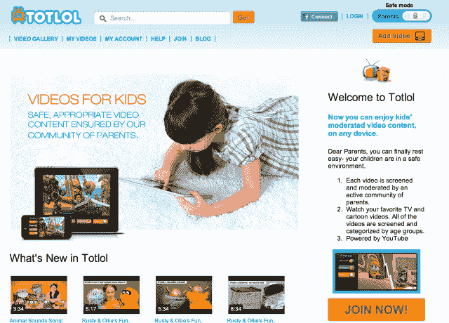
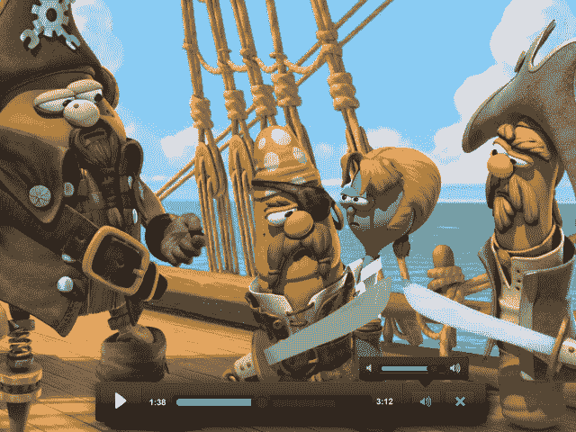
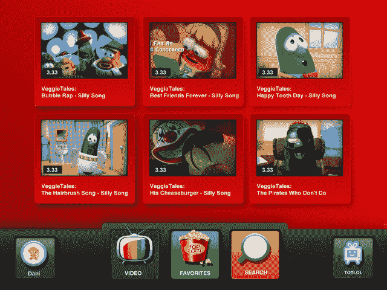
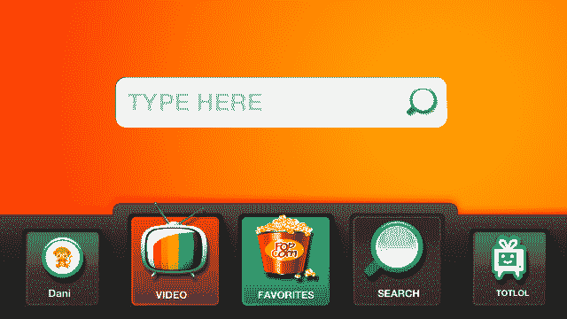

# Totlol 在网络和手机上提供了一个儿童安全的替代 YouTube 的选择

> 原文：<https://web.archive.org/web/https://techcrunch.com/2013/11/18/totlol-delivers-a-kid-safe-alternative-to-youtube-on-web-mobile/>

早在 2008 年，一家名为 [Totlol](https://web.archive.org/web/20230308072023/http://www.totlol.com/) 的初创公司出现了，[在一个单一的目的地网站上为父母提供一系列儿童友好的视频剪辑](https://web.archive.org/web/20230308072023/https://techcrunch.com/2008/11/01/totlol-the-new-saturday-morning-cartoons/)。但那家公司，一个人的表演，最终走进了死胡同，关闭了店铺。如今，它带着新的创始人回来了，这些人正在重振品牌，并将体验移植到手机上。

想法本身足够扎实，虽然移动端的执行力还是有点欠缺。任何父母都会告诉你，YouTube 不是你想让你的孩子在无人监管的情况下冲浪的地方。只需点击几下鼠标，他们就可以从观看埃尔默教授孩子们关于他们周围的世界，到他[咒骂](https://web.archive.org/web/20230308072023/http://www.youtube.com/watch?v=cfqMFhsHnbQ&list=RDffoSTf4VEkQ)或[在纽约中央公园对孩子们](https://web.archive.org/web/20230308072023/http://www.youtube.com/watch?v=G_Yc7NY0ZCE)咆哮。

在其早期的版本中，Totlol 试图通过管理更适合年轻观众的 YouTube 视频来解决这个问题。但这项业务受到了 YouTube 服务条款变化的影响，该条款禁止在只提供 YouTube 视频而不在同一页面上提供其他内容的网站上销售广告。创始人罗恩·伊兰最终关闭了这家公司。

如今，对儿童友好型视频内容的需求在很大程度上由许多有线电视频道和网飞来满足，其中许多频道可以点播。Totlol 现在希望通过一个新的网站和一个负担得起的移动应用程序(可以免费使用应用内购买)来融入这个组合。

公司的新创始人[、天使投资人、三个孩子的父亲迈克尔·阿维尼](il.linkedin.com/in/micav)和[蒂芙尼·斯特尔曼](https://web.archive.org/web/20230308072023/http://www.linkedin.com/pub/tiffany-stelman/40/a14/876)已经接管了品牌和业务。他们觉得今天比 Totlol 刚推出时更需要这样的东西，事实上，我们现在生活在一个多屏世界，我们的设备随时都与互联网相连，孩子们在学会走路之前就开始玩 iPads。

特别是 Avni，当他看到他的孩子在 YouTube 上找到成人内容是如此容易时，他感到震惊，并开始寻找解决方案。企业家经常会遇到这样的情况，当他找不到合适的人选时，他决定自己创业。

四个月前，两位合作伙伴决定重振 Totlol，并创建了一个社区网站，负责任的父母可以通过首先观看 YouTube 视频，然后分享 URL 并将其分类来帮助建立内容库。网站成员也帮助监管内容，将视频标记为不合适，然后提醒 Totlol 的“家长编辑”小组再看一眼。然后联系上传标记视频的成员，以进一步讨论情况(可以想象，如果某人成为惯犯，可能会采取进一步的措施)。

父母在网上的仪表板是成员可以通过分享视频为社区做出贡献的地方，但移动应用程序在很大程度上是一个简单的视频浏览器，已经处于“儿童模式”

该公司在今天的公开发布之前与大约 100 个家庭进行了一次小规模的测试，现在有超过 1000 个视频可供观看，每天都有更多的视频添加进来。大多数视频是针对初学走路的孩子和幼儿园小朋友的，但这项服务支持针对任何幼儿的视频，一直到 12 岁。

新的 Totlol 也可以从 YouTube 上下载视频，但计划在未来增加更多来源，以及时间限制设置、可视化搜索引擎和 Android 版本的移动应用程序等其他功能。至少目前来看，这项创收计划不包括投放广告，而是包括应用内购买。例如，家长可以在应用程序中购买视频播放列表，比如教育播放列表。

**手机上的**

iOS 应用程序本身可能需要做一些工作。在安装、创建帐户并登录后，它仍然提示我在重启 iPhone 后使用脸书再次登录。在你开始之前，它会抛出数学问题来证明你是成年人(例如，“16 + 58 是多少？”)，所以它不像网飞的“只给孩子”部分那样“不干涉”父母，孩子们可以自己使用。

iPhone 应用程序只能在横向模式下工作，屏幕底部的大按钮占据了太多空间，有时很难真正看到视频缩略图中的内容。视频的标题文本在智能手机的界面上也相当小——tot lol 在 iPad 上要好得多。最后，红色背景似乎也是对网飞的一种奇怪的认可，而应用程序、网站和品牌本身的其余部分更倾向于蓝色、白色和橙色。

根据 Stelman 的说法，设计决策的目标是保持应用程序简单，便于儿童使用，该团队正在努力使其在未来更加完善。

这家总部位于以色列的四人创业公司目前正在启动。从广义上来说，这项服务与儿童电视和网飞竞争，但更具体地说，它也在与其他为儿童提供策划体验的初创公司竞争，如 [KIDO'Z](https://web.archive.org/web/20230308072023/http://kidoz.net/) 或 [Kid Mode](https://web.archive.org/web/20230308072023/https://play.google.com/store/apps/details?id=com.zoodles.kidmode&hl=en) ，它们提供视频内容之外的游戏，或[happy for iPad](https://web.archive.org/web/20230308072023/https://techcrunch.com/2012/04/17/happly-for-ipad-helps-curious-kids-discover-the-websafely/)，其中包括教育材料。

Totlol 现在在网上直播，或者在 iTunes 应用商店[这里](https://web.archive.org/web/20230308072023/https://itunes.apple.com/us/app/totlol-safe-videos-for-kids/id703392400?mt=8)。