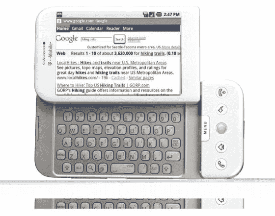

# 触摸安卓系统:虽然不是 iPhone，但也很接近了

> 原文：<https://web.archive.org/web/https://techcrunch.com/2008/09/23/touching-the-android-its-no-iphone-but-its-close/>

所以今天我终于接触到了一部安卓手机。T-Mobile、谷歌和 HTC 在纽约市上演了一场大型媒体马戏(见我们的[现场报道](https://web.archive.org/web/20230326155147/https://techcrunch.com/2008/09/23/t-mobile-g1-launch-liveblog/))，谷歌联合创始人谢尔盖和拉里穿着旱冰鞋出来告诉我们这款手机有多酷，因为你可以像入侵电脑一样入侵它。(Sergey 编写了一个应用程序，使用内置的加速度计来测量当你把手机扔向空中时，它落地需要多长时间，因为，嗯，他是一个极客)。你真的要记住这一点。会有很多 Android 手机，随着时间的推移，它们都会变得更好。它是一个平台，雅达，雅达，雅达。

T-Mobile G1 比 iPhone 便宜 20 美元，现有用户的价格为 180 美元，并提供两种数据计划:每月 25 美元(无限网络访问和有限短信)和每月 35 美元(无限一切)。这款手机将于 10 月 22 日在 T-Mobile 商店发售，但是现有用户已经可以在网上开始预订了。期待巨大的营销推动。这将是 T-Mobile 历史上最大的营销活动。(虽然他们没有在新闻发布会上说，但我怀疑谷歌正在买单)。商业广告已经在 YouTube 上发布了。

但是这款手机如何与独一无二的 iPhone 相抗衡呢？它没有 iPhone 那么完美(无论是硬件还是用户界面)，但也非常接近了。(CrunchGear 的约翰·比格斯称之为[“近乎完美”](https://web.archive.org/web/20230326155147/http://www.crunchgear.com/2008/09/23/the-g1-almost-perfect/))。更重要的是，它在许多方面都与 iPhone 相匹配。它有 GPS、WiFi、触摸屏、加速度计、摄像头、Gmail、谷歌地图、基于 Webkit 的浏览器(就像 iPhone 上的 Safari)和应用程序市场。

第一部 Android 手机甚至有一些 iPhone 没有的东西，比如像危险助手一样从屏幕下弹出的全键盘(安迪·鲁宾的旧公司)。它还配有一个像黑莓手机一样的小滚动球(我以为 RIM 在这方面有专利)。我提到指南针了吗？它内置了一个(除了加速度计和 GPS 之外)，所以当你在谷歌地图上查看街景并转动手机时，它会向你显示你所面对的照片。我敢肯定，某个开发人员会编写一个很酷的徒步旅行应用程序，可以利用指南针。哦，还有一件事。您可以同时运行多个应用程序。那是巨大的。

但就这样吗？这是谷歌对 iPhone 的回应吗——键盘和指南针？恐怕是的。Android G1 还能做一些 iPhone 做不到的小事情。电子邮件是推送的，而不是拉取的，所以你总是最新的。(尽管，奇怪的是，你已经可以在 iPhone 上用微软 Exchange 推送和同步电子邮件、联系人和日历[，但不能用任何其他邮件服务器)。你在谷歌应用中做的任何事情，无论是电子邮件还是日历，都会自动同步到你的谷歌账户。(听说，你是微软的](https://web.archive.org/web/20230326155147/https://techcrunch.com/2008/03/06/iphone-20-enterprise-ready-developer-ready/) [Meshers](https://web.archive.org/web/20230326155147/https://techcrunch.com/2008/04/22/microsofts-mesh-revealed%E2%80%94sync-all-apps-and-all-files-to-all-devices-as-long-as-theyre-windows/) ？).这款手机配有一个音乐播放器，可以播放任何无数字版权管理的歌曲，还可以链接到亚马逊的 MP3 商店。接招吧，iTunes。

触摸屏界面可以让你滑动页面或拖放东西。当你滚动联系人列表时，触摸屏上会出现一个标签，你可以下拉它来加快滚动，这是一个很好的功能。手机的每个部分都内置了搜索功能。你可以“深入”按下一个专用的搜索按钮，在几乎任何应用程序中启动搜索。

但请记住，归根结底，这并不是真正的 Android 与 iPhone 之争。这是关于网络电话和你口袋里的砖头。仅仅在这些功能上与 iPhone 相匹配——尤其是网络浏览和电子邮件——就足以帮助重新定义移动市场。牌桌的赌注刚刚提高。从现在开始，手机需要和电脑一样强大。所有其他的不需要申请。