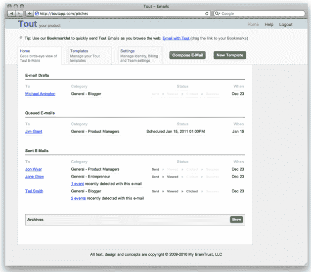

# ToutApp 为您的电子邮件客户端添加智能内容管理器 TechCrunch

> 原文：<https://web.archive.org/web/http://techcrunch.com/2011/06/21/toutapp-adds-an-intelligent-content-manager-to-your-email-client/>

# ToutApp 为您的电子邮件客户端添加了智能内容管理器

已经有很多初创公司帮助用户管理电子邮件客户端中的联系人，如 [Gist](https://web.archive.org/web/20230203152137/http://www.crunchbase.com/company/gist) 或 [Rapportive](https://web.archive.org/web/20230203152137/http://www.crunchbase.com/company/rapportive) ，但有没有一款应用可以帮助你更好地管理电子邮件的内容呢？输入[tout app](https://web.archive.org/web/20230203152137/http://toutapp.com/welcome)(500 startups 夏季加速器项目[的一部分](https://web.archive.org/web/20230203152137/https://techcrunch.com/2011/06/09/500-startups-unveils-its-2nd-batch-from-foodspotting-for-fashion-to-iron-chef-in-your-livingroom/))，这是类固醇的预录电子邮件回复。这家初创公司宣布，他们已经完成了 500 Startups，埃丝特·戴森，埃里克里斯，丹尼尔埃斯卡帕，纽约市种子基金，约书亚贝尔和其他人的 35 万美元种子轮。

ToutApp 旨在智能解决重复邮件问题。该应用程序真正针对的是那些发送大量内容相似的出站电子邮件的用户。当你注册 Tout，并整合你的 Gmail 帐户时，该应用程序将解析你的电子邮件，并识别你发送的不同类型的群发邮件。因此，如果你是一名企业家，Tout 将把你给记者的邮件推销和给投资者的邮件推销分开。

然后，您可以向您的联系人发送电子邮件，只需选择 Tout 中已创建的模板之一，并根据联系人在各个领域调整内容。

Tout 还包括一系列电子邮件的附加功能，包括跟踪浏览量、点击率、安排电子邮件等。Tout 将自动同步您的 CRM 联系人，并记录电子邮件，打开和点击。目前，你只能通过 Tout 发送电子邮件(不能回复)，但最终，你将能够做到这两者。

自公司六个月前成立以来，ToutApp 已经通过模板、点击/查看跟踪和分析帮助超过 2，500 人在日常电子邮件中节省了超过 80，000 分钟。ToutApp 是由 Tawheed Kader 创建的，他之前是在线压光服务 HipCal 的联合创始人，hip cal 于 2006 年被出售给 Plaxo。

新的现金将用于产品开发；这家初创公司将很快发布一款 iPhone 应用。

