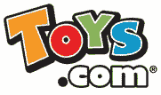

# 玩具反斗城以 510 万美元的价格收购 Toys.com

> 原文：<https://web.archive.org/web/https://techcrunch.com/2009/02/27/toysrus-buys-toyscom-at-auction-for-51-million/>

# 玩具反斗城在拍卖会上以 510 万美元买下 Toys.com

在一场激烈的竞购战中，玩具反斗城以 510 万美元的价格在拍卖会上买下了 Toys.com 域名。托伊斯鲁斯非常想要这个领域，原因显而易见。除了玩具反斗城和域名控股公司[free.com、boys.com、girls.com 和 divorce.com 等域名的所有者](https://web.archive.org/web/20230326192113/http://www.catnip.com/)之外，所有人都退出了 300 万美元的拍卖。最后的 200 万美元只是那两家公司来回几个小时。

玩具反斗城真的没有太多选择。如果它想成为人们第一个联想到玩具的东西，它真的不能允许任何人拥有这个领域，即使是在当前的经济形势下。谁说房地产死了？