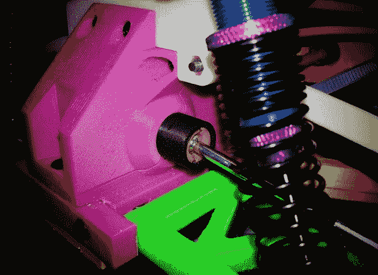

# 追踪这款 3D 打印的 OpenRC Truggy 的进展，这是遥控汽车爱好者的梦想 TechCrunch

> 原文：<https://web.archive.org/web/https://techcrunch.com/2013/04/06/track-the-progress-of-this-3d-printed-openrc-truggy-a-remote-control-car-enthusiasts-dream/>

# 跟踪 3D 打印的 OpenRC Truggy 的进展，这是一个遥控车爱好者的梦想

如果你对 3D 可打印的东西感兴趣，或者对遥控汽车感兴趣，那么 OpenRC 项目很适合你。一位名叫丹尼尔·诺里的瑞典绅士正在分享他在 3D 打印 Truggy 上的进展，并与他创建的 [OpenRC 项目组](https://web.archive.org/web/20230128173358/https://plus.google.com/communities/112745535856143176146/stream/654677a1-47ca-4f15-b6ec-c1f633b337d2)分享配方。如果你不确定的话，truggy 是一种越野车。

家庭和企业使用的 3D 打印机的成本都在下降，因此世界各地的消费者很快就有可能在他们的客厅里拥有这些设备。更疯狂的事情发生过。我们已经看到了 3D 打印的 [iPhone 底座](https://web.archive.org/web/20230128173358/https://techcrunch.com/2013/03/15/sculpteo-shows-us-what-3d-printing-is-really-good-for-creating-adapters-for-old-ipod-docks/)、[小提琴](https://web.archive.org/web/20230128173358/https://techcrunch.com/2013/03/06/this-diy-3d-printed-violin-is-nearly-ready-to-play-beautiful-music/)、[陶器](https://web.archive.org/web/20230128173358/https://techcrunch.com/2013/03/06/lets-create-pottery-because-virtual-pottery-and-3d-printing-were-made-for-each-other/)，甚至还有一只[儿童机械手](https://web.archive.org/web/20230128173358/https://techcrunch.com/2013/02/04/two-global-makers-come-together-to-make-a-robotic-han-for-a-boy-in-south-africa/)。

如果你能用它打印出你自己定制的遥控车，算我一个。虽然并非所有的零件都是可打印的，例如车轮，但对于真正的死忠遥控车迷来说，这些零件可能已经放在车库里了。

这里有一个 Norée 今天上传的视频，展示了零件背后的一些示意图，以及使用那些花哨的 [MakerBot 复制器](https://web.archive.org/web/20230128173358/https://techcrunch.com/2012/01/09/makerbot-announces-their-latest-3d-printer-the-replicator/)之一的实际 3D 打印过程:

[https://web.archive.org/web/20230128173358if_/https://www.youtube.com/embed/dElz53EsmtM?feature=oembed](https://web.archive.org/web/20230128173358if_/https://www.youtube.com/embed/dElz53EsmtM?feature=oembed)

视频

这个项目在过去的几个月里取得了很大的进展；这是一个早期模型崩溃的视频:

[https://web.archive.org/web/20230128173358if_/https://www.youtube.com/embed/2yW74kWtUmA?feature=oembed](https://web.archive.org/web/20230128173358if_/https://www.youtube.com/embed/2yW74kWtUmA?feature=oembed)

视频

我想要一个。

虽然这不是唯一一辆 [3D 打印遥控车](https://web.archive.org/web/20230128173358/http://www.rapid3d.com.au/blogs/news/6485376-print-your-very-own-rc-car-using-a-3dtouch)，但它的好处是[可以在 Google+](https://web.archive.org/web/20230128173358/https://plus.google.com/communities/112745535856143176146/stream/654677a1-47ca-4f15-b6ec-c1f633b337d2) 上跟踪项目进展并加入讨论。如果你准备打印一份，点击这里。

