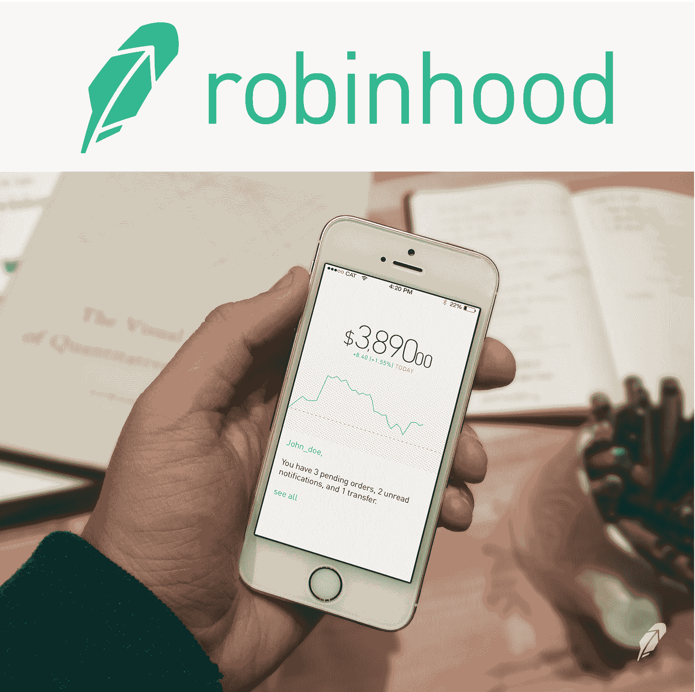
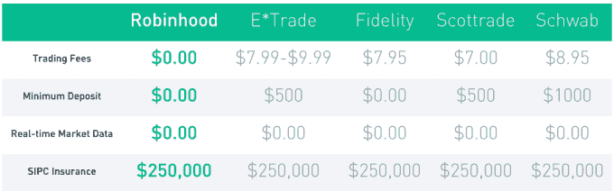
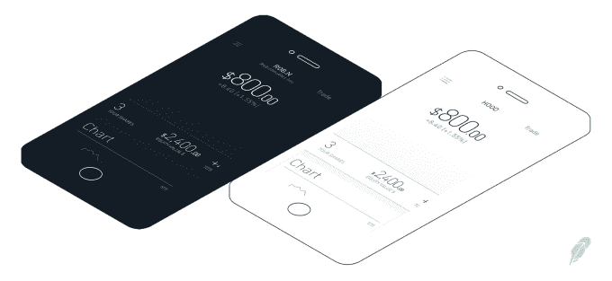
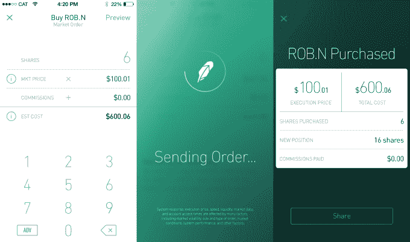

# 零佣金股票交易应用 RobinHood 启动私人测试版 

> 原文：<https://web.archive.org/web/https://techcrunch.com/2014/02/27/trade-stocks-free-robinhood/>

[RobinHood](https://web.archive.org/web/20221206001146/https://www.robinhood.com/) 即将让任何人免费买卖股票，而不是每次交易必须向 E*Trade 或 Scottrade 支付 7 美元。今天，RobinHood 开始邀请已经注册了的 16 万人[下载其光鲜亮丽的新应用，在那里你可以有效地跟踪和交易股票。“这是迄今为止最漂亮的经纪应用程序，尽管这并不意味着什么，”联合创始人弗拉德·特涅夫开玩笑说。](https://web.archive.org/web/20221206001146/https://www.robinhood.com/)

尽管罗宾汉让华尔街在你的口袋里看起来很时尚，但它的特别之处在于它所做的事情，而且是免费的。那就是[让你零佣金交易股票](https://web.archive.org/web/20221206001146/https://beta.techcrunch.com/2013/12/18/zero-commission-stock-trading-robinhood/)。你可能会认为执行交易会花掉罗宾汉的钱，但事实上，它可以通过移动你的交易赚钱。几十年来，投资者每买入或卖出 Scottrade、E*Trade 和其他经纪公司的股票，都要支付 7 至 10 美元，我们只是习惯性地认为这是你必须支付的费用。

那些想要免费交易的人可以[注册](https://web.archive.org/web/20221206001146/https://www.robinhood.com/)成为罗宾汉，并在接下来的几周到几个月内收到邀请邮件。既然你把自己的积蓄托付给它，罗宾汉希望极其谨慎地让人们上船，而不是尽可能快地上船。但很快，它预计将为其用户持有数亿美元，以便他们可以通过手机进行即时交易。

RobinHood 让 TechCrunch 第一次看到了它的新应用，它的投资者 Google Ventures 对设计的关注显而易见。整个应用程序的主题是白色或黑色，这取决于股票市场是开放还是关闭。与此同时，该应用程序的 chrome 会根据当前查看的股票当天是上涨还是下跌而变成绿色或红色。这个技巧让你一眼就能看出你是否可以正式交易，以及你做得有多好。

大多数金融应用程序只能让你监控股票，比如雅虎财经(Yahoo Finance)或第一版罗宾汉 T2(robin hood ),或者像大型零售经纪公司那样收费交易。RobinHood 的联合创始人 Baiju Bhatt 强调说，如果你想做深入的金融研究，你可能想坐在桌面前。但如果你想在任何空闲时间查看你的股票，并在勇气袭来或市场震荡时进行交易，RobinHood 可以让你轻而易举地做到这一点。【披露:我和弗拉德、白菊在大学是朋友。]

你可以设置警报，以防你的股票移动到某个百分比，或者设置限价单，当价格达到某个点时执行。当你准备进行实时交易时，只需选择你想买卖的股票数量。RobinHood 会预览这将花费你多少钱或为你赚多少钱，然后你刷卡确认交易(这会触发一些令人愉快的动画和嗡嗡声)。由于安全性可能是 RobinHood 的最大威胁，它甚至允许你设置一个特殊的 pin 码，要求你打开应用程序。

RobinHood 表示，它永远不会对交易收费。现在，它得到了来自谷歌风险投资公司、索引风险投资公司、安德森·霍洛维茨基金、罗森伯格风险投资公司和一些天使投资人的超过 300 万美元的投资。[但它计划通过](https://web.archive.org/web/20221206001146/https://beta.techcrunch.com/2013/12/18/zero-commission-stock-trading-robinhood/)向其他开发者收取 API 访问费，让用户通过保证金(他们被欠但尚未拥有的钱)进行交易，并通过支付订单流(股票交易所向初创公司支付费用，让其将交易量带到市场)来迅速实现自我维持。

不过，就目前而言，罗宾汉可以让股票交易民主化。如果你是一只交易数十万或数百万的肥猫，那 10 美元的费用没有多大意义。但是如果你并不富有，但仍想投资，这些佣金会逐渐吞噬你通过智能交易获得的收益。通过用一款应用和一支精干的工程团队取代实体店面和大批销售人员，RobinHood 可以将节省下来的成本传递给用户。

*您现在就可以[注册，提前获得 RobinHood](https://web.archive.org/web/20221206001146/https://www.robinhood.com/)*

—

相关金融科技新闻:

[罗宾汉如何提供零佣金股票交易](https://web.archive.org/web/20221206001146/https://beta.techcrunch.com/2013/12/18/zero-commission-stock-trading-robinhood/)

[雅虎财经对其 iOS 应用和网站进行现代化改造](https://web.archive.org/web/20221206001146/https://beta.techcrunch.com/2013/11/06/yahoo-refreshes-its-finance-service-with-updated-ios-apps-and-a-new-website/)

[想象 15 年来苹果、谷歌、雅虎和脸书的收购](https://web.archive.org/web/20221206001146/https://beta.techcrunch.com/2014/02/25/the-age-of-acquisitions/)