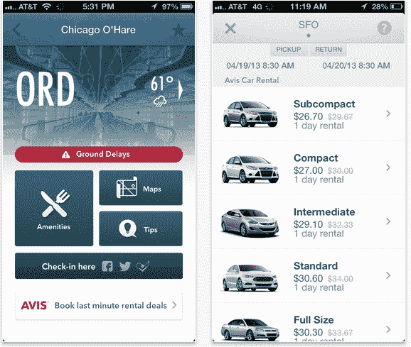

# 猫途鹰继续收购狂潮，收购实时旅游信息移动应用 gate guru 

> 原文：<https://web.archive.org/web/https://techcrunch.com/2013/06/19/tripadvisor-continues-its-acquisition-spree-buys-gateguru-mobile-app-for-real-time-travel-information/>

旅游门户网站[猫途鹰](https://web.archive.org/web/20221004115630/http://www.tripadvisor.com/)继续推进其移动和社交收购:今天公司[宣布](https://web.archive.org/web/20221004115630/http://finance.yahoo.com/news/tripadvisor-acquires-gateguru-100000016.html)已经收购了 [GateGuru](https://web.archive.org/web/20221004115630/http://www.gateguruapp.com/) ，一款提供机场、天气和航班实时信息的移动应用。其中很大一部分是从众包中获得的，与上周被谷歌收购的[Waze](https://web.archive.org/web/20221004115630/http://www.waze.com/)不同，公路旅行也是如此。GateGuru 和猫途鹰之间的交易条款尚未披露，但我们正在努力查明。

这不是收购，而是猫途鹰对其用户服务的直接扩展。随着越来越多的人开始使用移动和社交网络，该公司正在寻求扩展其已经在网上提供的服务——一个庞大的用户生成内容数据库，提供对目的地、酒店和其他旅行相关事物的评论，目前每月约有 2 亿活跃用户。就猫途鹰而言，几乎可以肯定的是，收购和利用已经建成的服务要比自己从头开始创建更容易。

TripAdvisor 公司联合创始人兼首席执行官 Steve Kaufer 在一份声明中表示:“
"Flying 通常是旅行中必不可少的一部分，我们一直在开发我们的航班产品套件，从 TripAdvisor 上的价格和可用性搜索，到我们屡获殊荣的 SeatGuru.com，还有座位地图等等。”。“GateGuru 很好地补充了我们现有的航班产品，我们期待着与 GateGuru 团队合作，继续管理 GateGuru 应用程序，并为猫途鹰移动体验添加强大的功能。”这也有助于 GateGuru 处于一个无处不在的好位置，iOS、Android 和 Windows Phone 的应用程序已经就位。

一方面，这是一个时代的标志，表明了当今市场中用户的重要性。旅行和移动自然是密不可分的，一旦用户真的在移动，实时信息也是如此。输入 GateGuru 的数据包括天气预报、安检等待时间和实时航班状态信息。但是，正如你从下面的屏幕截图中看到的，你也可以使用该应用程序来比较汽车租赁的价格，然后通过该应用程序租车。您可以看到一站式应用程序门户可以扩展为包括许多其他功能。

另一方面，这也是旅游初创行业正在进行整合的一个迹象:由于许多服务是在销售或大型广告购买的薄利上为规模而建的，如果你是一家大型酒店，你将寻求变得更大；如果你是一个小玩家，你会很挣扎。(这可能是问题的一部分，例如，俄罗斯旅游网站 Ostrovok 最近一轮裁员。)

同样有帮助的是，猫途鹰在 12 月从自由媒体获得了一大笔现金注入，该媒体持有该公司 3 亿美元的股份；这可能是推动这一系列收购的部分原因。

今天的新闻是猫途鹰在今年 3 月收购了另一家移动/社交初创公司 [TinyPost](https://web.archive.org/web/20221004115630/https://beta.techcrunch.com/2013/03/22/travel-site-tripadvisor-buys-tinypost-to-fill-out-its-mobile-and-social-ambitions/) ，几周后又迅速收购了 Gilt 的 [JetSetter](https://web.archive.org/web/20221004115630/https://beta.techcrunch.com/2013/04/09/tripadvisor-buys-luxury-travel-site-jetsetter-from-gilt/) ，然后是 5 月的[cruise](https://web.archive.org/web/20221004115630/http://www.tripadvisor.es/PressCenter-i5931-c1-Press_Releases.html)。其他以社交为重点的收购包括 2012 年 10 月的 [Wanderfly](https://web.archive.org/web/20221004115630/https://beta.techcrunch.com/2012/10/02/tripadvisor-acquires-wanderfly-to-continue-social-travel-push/) 。和 JetSetter 一样，GateGuru 的总部也在纽约，它将继续留在纽约。该公司表示，该应用背后的团队将向新举措总经理兼猫途鹰航班产品及其 SeatGuru 品牌负责人布莱恩·萨尔茨伯格(Bryan Saltzburg)汇报。

GateGuru 成立于 2011 年，在一群非常知名的投资者的支持下，已经筹集了至少 80 万美元。他们包括前脸书高管查马斯·帕里哈皮蒂亚(Chamath Palihapitiya)，他现在管理着社会+资本合伙风险投资基金；[艾伦·摩根](https://web.archive.org/web/20221004115630/http://www.crunchbase.com/person/allen-morgan)，梅菲尔德基金前董事总经理；和[汤姆·格罗瑟](https://web.archive.org/web/20221004115630/http://www.crunchbase.com/person/tom-glocer)，汤森路透前首席执行官，以及其他几位。

GateGuru 与投资界有着更深层次的联系:其创始人兼负责人丹·盖勒特[曾是一名风险投资家](https://web.archive.org/web/20221004115630/http://www.linkedin.com/profile/view?id=6999662&authType=NAME_SEARCH&authToken=U-oa&locale=en_US&srchid=9830241371638018954&srchindex=1&srchtotal=18&trk=vsrp_people_res_name&trkInfo=VSRPsearchId%3A9830241371638018954%2CVSRPtargetId%3A6999662%2CVSRPcmpt%3Aprimary)，为时代华纳投资公司和摩根大通工作。

[随着我们获得更多信息，更新本文]

