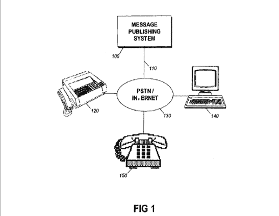

# Troll 在专利侵权诉讼中瞄准脸书和 Twitter TechCrunch

> 原文：<https://web.archive.org/web/http://techcrunch.com/2011/10/26/troll-targets-facebook-twitter-in-patent-infringement-lawsuits/>

# Troll 在专利侵权诉讼中瞄准脸书和 Twitter

EasyWeb Innovations，以下简称“EasyWeb”，或者“一些默默无闻的专利流氓，他们希望通过起诉真正创新的公司来赚钱，而不是制造和销售东西”，最近[对社交网络巨头](https://web.archive.org/web/20230203093105/http://news.priorsmart.com/easyweb-innovations-v-facebook-l4zm/)[脸书](https://web.archive.org/web/20230203093105/http://crunchbase.com/company/facebook)和[推特](https://web.archive.org/web/20230203093105/http://crunchbase.com/company/twitter)提起了专利侵权诉讼。诉讼声称 EasyWeb 拥有五项专利，如“信息发布系统，用于发布来自经确认的授权发件人的信息”。

值得注意的是原告的律师 John Demarais，他在专利诉讼界非常有名(他从为一些最大的科技公司辩护，从专利流氓到专门与专利流氓合作，攻击他们)。

无论如何，EasyWeb 声称脸书和 Twitter——后者上个月被[起诉](https://web.archive.org/web/20230203093105/http://newsandinsight.thomsonreuters.com/Legal/News/2011/09_-_September/Tech_company_sues_Twitter_for_patent_infringement/),脸书上周被起诉——故意侵犯了其在 2006 年至 2010 年间获得的五项专利。

这些专利是 US7032030、US7596606、US7685247、US7689658 和 US7698372。

*   [us 7032030](https://web.archive.org/web/20230203093105/http://patft.uspto.gov/netacgi/nph-Parser?Sect1=PTO1&Sect2=HITOFF&d=PALL&p=1&u=%2Fnetahtml%2FPTO%2Fsrchnum.htm&r=1&f=G&l=50&s1=7032030.PN.&OS=PN/7032030&RS=PN/7032030)–消息发布系统和方法
*   [us 7596606](https://web.archive.org/web/20230203093105/http://patft.uspto.gov/netacgi/nph-Parser?Sect1=PTO1&Sect2=HITOFF&d=PALL&p=1&u=%2Fnetahtml%2FPTO%2Fsrchnum.htm&r=1&f=G&l=50&s1=7596606.PN.&OS=PN/7596606&RS=PN/7596606)–用于发布来自已识别的授权发件人的消息的消息发布系统
*   [us 7685247](https://web.archive.org/web/20230203093105/http://patft.uspto.gov/netacgi/nph-Parser?TERM1=7685247&Sect1=PTO1&Sect2=HITOFF&d=PALL&p=1&u=%2Fnetahtml%2FPTO%2Fsrchnum.htm&r=0&f=S&l=50)–用于发布和转换来自已识别的授权发件人的消息的系统
*   [us 7689658](https://web.archive.org/web/20230203093105/http://patft.uspto.gov/netacgi/nph-Parser?Sect1=PTO1&Sect2=HITOFF&d=PALL&p=1&u=%2Fnetahtml%2FPTO%2Fsrchnum.htm&r=1&f=G&l=50&s1=7689658.PN.&OS=PN/7689658&RS=PN/7689658)–向用户发布来自已识别的授权发件人的消息的方法
*   [us 7698372](https://web.archive.org/web/20230203093105/http://patft.uspto.gov/netacgi/nph-Parser?Sect1=PTO1&Sect2=HITOFF&d=PALL&p=1&u=%2Fnetahtml%2FPTO%2Fsrchnum.htm&r=1&f=G&l=50&s1=7698372.PN.&OS=PN/7698372&RS=PN/7698372)–用于将来自已识别的授权发送者的消息发布给订户的系统

Easyweb 表示，它在 2011 年 6 月 2 日首次通知了 Twitter 和脸书关于专利的事情，然而，这两家公司都没有试图或采取任何行动来许可诉讼中的专利。

原告寻求损害赔偿(诉状嵌入在专利文件截图的下方)。

我联系了脸书和推特，但他们通常不对未决诉讼发表评论。

[scribd id = 70379891 key = key-1 ecvvdgjffkiyh 3 qssb mode = list]