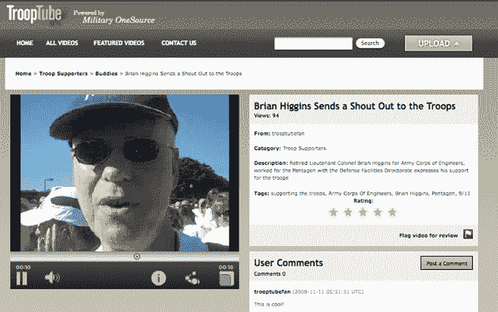

# TroopTube 将流式视频还原到我们国家最好的 TechCrunch

> 原文：<https://web.archive.org/web/https://techcrunch.com/2008/11/11/trooptube-restores-streaming-video-to-our-nations-finest/>

# TroopTube 将流式视频还原给我们国家最好的

自 2007 年以来，国防部已经[限制](https://web.archive.org/web/20221006201005/http://www.armytimes.com/news/2007/05/military_websitesblocked_070514/)海外军事人员访问包括 YouTube 和 MySpace 在内的一些热门网站，主要原因是带宽使用和可能的安全问题。为了庆祝退伍军人节， [Delve Networks](https://web.archive.org/web/20221006201005/http://www.delvenetworks.com/) 与 [Military OneSource](https://web.archive.org/web/20221006201005/http://www.militaryonesource.com/skins/MOS/home.aspx) (国防部的一项服务)合作推出了[troopertube](https://web.archive.org/web/20221006201005/http://www.trooptube.tv/)——一个类似 YouTube 的网站，为所有现役军人及其家人提供了一个在线分享视频的地方。

该网站具有 YouTube 或 Metacafe 等网站上的许多功能，但有一个关键的区别:你将无法在网络上的其他地方嵌入你的剪辑(军方 OneSource 希望保持 TroopTube 的隐私)。新网站是为军事人员设计的，但奇怪的是，似乎任何人都可以使用这个网站，如果他们想的话(尽管似乎没有任何动机这样做)。无论哪种方式，国防部将完全控制网站上出现的内容，因此它将能够监控有潜在安全风险的视频。

Delve Networks 是一个类似于 [Brightcove](https://web.archive.org/web/20221006201005/http://www.brightcove.com/) 和 [Ooyala](https://web.archive.org/web/20221006201005/http://www.ooyala.com/) 的在线视频平台，为开发者提供一套 API 来帮助创建和管理在线视频。该平台通过其基于云的服务处理分析、内容交付、代码转换和大多数其他关键功能，尽管视频托管在 TroopTube 自己的服务器上。

