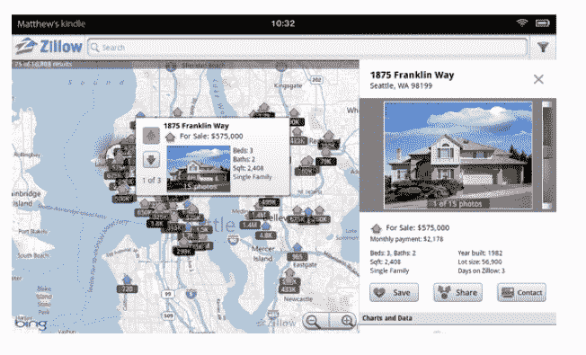

# Trulia 和 Zillow 将房地产应用程序引入 Kindle Fire 

> 原文：<https://web.archive.org/web/http://techcrunch.com/2011/11/14/trulia-and-zillow-bring-real-estate-apps-to-the-kindle-fire/>

# Trulia 和 Zillow 为 Kindle Fire 带来了房地产应用

Kindle Fire[已经开始发货](https://web.archive.org/web/20230205040251/https://techcrunch.com/2011/11/14/forget-the-negative-reviews-amazon-is-shipping-the-kindle-fire-a-day-early/)，我们听说[将有数千款应用](https://web.archive.org/web/20230205040251/https://techcrunch.com/2011/11/09/several-thousand-apps-including-netflix-are-ready-for-kindle-fire/)在定制的 Android 平板电脑上运行，包括脸书、潘多拉、网飞、愤怒的小鸟、Zynga、 [Hulu Plus](https://web.archive.org/web/20230205040251/https://techcrunch.com/2011/11/11/hulu-amazon-video-kindle-fire/) 和 ESPN ScoreCenter。如今，房地产搜索平台 Trulia 和 Zillow 都在为 Kindle Fire 推出专用应用。

Trulia 的新平板电脑应用将利用 Kindle Fire 的超宽视角，并将专注于列表视图、照片搜索和全屏幻灯片显示。与该网站的其他移动应用不同，这将不是一个基于地图的应用。

使用该应用程序，您可以通过设置过滤器和搜索参数来个性化您的公寓或住宅搜索，使用照片图库搜索在平板电脑的整个屏幕上查看酒店幻灯片，将搜索保存到您的帐户，并联系房源代理以获取更多详细信息或安排展览。

同样，Zillow 基于地图的应用程序允许你搜索近 1 亿套房屋的数据库，查看待售房屋、出租房屋和最近出售的房屋，按照房屋类型、列表类型、房屋大小、床、浴室和价格进行过滤，查看全屏照片，并保存最喜欢的房屋和搜索结果。

