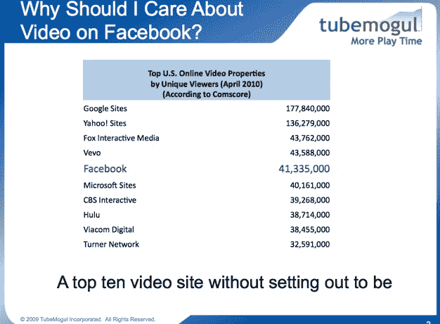
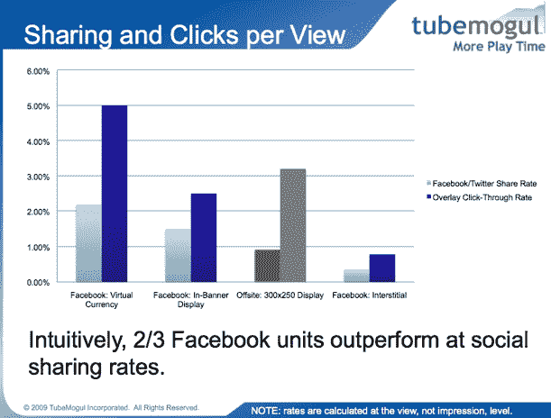

# TubeMogul:人们观看脸书视频的时间更长，点击的广告也更多

> 原文：<https://web.archive.org/web/https://techcrunch.com/2010/06/15/tubemogul-facebook-video-ads/>

# TubeMogul:人们观看脸书视频的时间更长，点击的广告也更多

按观众人数计算，脸书现在是第五大视频网站。ComScore 估计，每月有 4100 万人在脸书上观看视频，这一数字超过了 Hulu、CBS、Facebook 或微软的网站。脸书作为视频目的地的崛起值得注意的是，它甚至没有非常努力地去做一个视频网站。“我不认为脸书本身有视频战略，”TubeMogul 的首席执行官 Brett Wilson 说。

TubeMogul 在网络上追踪视频分析，它刚刚发布了一些有趣的数据，与其他网站相比，视频和视频广告在脸书的表现如何。平均而言，点击脸书视频的人更投入。他们倾向于比其他来源的观众看得更久——每次观看 1:45 分钟。:32 用于谷歌(Twitter 用户几乎相同，每次观看 1:44 分钟)。

这种更高的参与度转化为更高的视频广告完成率。大约 40%的脸书视频广告，给予或接受，通过不同的视频广告类型被观看。总的来说，在网络上，视频广告完成率徘徊在 25%左右。

脸书上有各种各样的视频广告——当你点击它们时，你的 feed 旁边的横幅广告会占据整个页面，应用程序页面上的视频广告，当你在页面之间导航时会显示视频的间隙广告。但是脸书上表现最好的视频广告是在游戏应用程序中，并与虚拟货币相关联(玩家观看广告以获得积分)。

“脸书的点击率和分享率似乎更高，”Wilson 说。脸书游戏中与虚拟货币相关的广告点击率为 5%，其中约 2%的视频广告在脸书和推特上分享。相比之下，网络上其他视频广告的点击率略高于 3%，社交分享率略低于 1%。甚至脸书横幅视频广告也比其他网站显示出更高的分享率(但平均点击率更低)。

