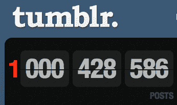
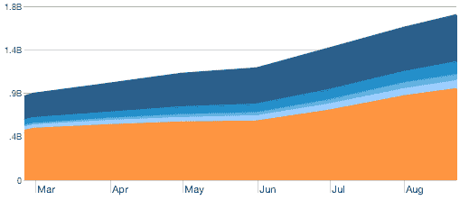

# Tumblr 仍在飙升，超过 10 亿条帖子 

> 原文：<https://web.archive.org/web/https://techcrunch.com/2010/08/23/tumblr-1-billionposts/>

# Tumblr 仍在飙升，超过了 10 亿条帖子

上个月，[我们更新了](https://web.archive.org/web/20221209135158/https://beta.techcrunch.com/2010/07/19/tumblr-stats/)关于 [Tumblr](tumblr.com) 的状态，其中包括一些令人印象深刻的数据:超过 600 万用户，每月 15 亿次浏览量，每天 450 万条新帖子。把这些都扔出窗外。

博客/微博/社交/whateveryouwanttocallit 网络今天的帖子总数刚刚突破 10 亿。看看每个 Tumblr 博客网址“/post/”区域后面的数字就知道了。几个小时前的某个时候，它超过了 10 亿——Tumblr 上关于第页的破计数器证实了这一点(它只被设置为高达 999，999，999)。

除了庞大的 10 亿用户，Tumblr 现在有 720 万用户。这些用户现在每天产生超过 520 万个帖子。他们的 Quantcast 数据现在每月有 17 亿的浏览量。

是的，网络还在涌动。

*【感谢* [*安德鲁*](https://web.archive.org/web/20221209135158/http://see.ndrw.me/post/1000043679/woohooo-we-dunit-its-a-billi-1-000-000-000)