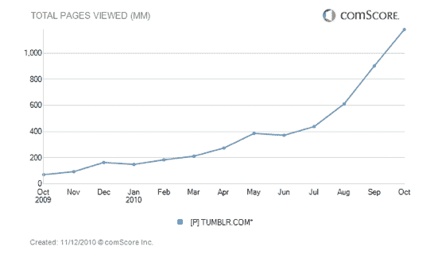
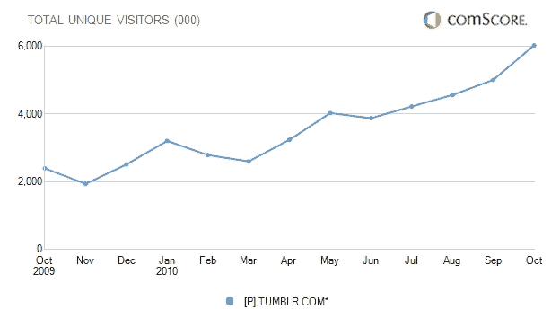

# 为什么对 Tumblr 这么感兴趣？尝试 1540%的页面浏览量增长 TechCrunch

> 原文：<https://web.archive.org/web/https://techcrunch.com/2010/11/12/tumblr-1540-percent-pageview-growth/>

# 为什么对 Tumblr 这么感兴趣？尝试 1540%的页面浏览量增长

Tumblr 现在吸引了很多关注，有传言称正在进行一轮大规模融资，并且正在大规模雇佣。为什么这么感兴趣？

去年六月的某个时候，博客服务 [Tumblr](https://web.archive.org/web/20221226092941/http://www.tumblr.com/) 到达了一个转折点。它的访客和浏览量刚刚起飞。根据 comScore 的数据，10 月份 Tumblr 在美国的浏览量达到了 12 亿次，同比增长了令人难以置信的 1，540%(见上图)。来自美国的独立访客达到 600 万，增长了 150%(见下图)。9 月份，全球游客约为 1400 万。

但是今年夏天肯定有什么东西开始流行了。如图表所示，这是增长真正起飞的时候。当时美国的浏览量只有 3.73 亿。8 月，它通过了第[个十亿分之一](https://web.archive.org/web/20221226092941/https://techcrunch.com/2010/08/23/tumblr-1-billionposts/)的累积帖子。所有这些帖子加起来。使用超级简单的博客服务的人越多(现在有近 970 万个不同的 Tumblogs)，该平台吸引的总体读者就越多，这就形成了更多出版商的良性循环。

**更新**:我问了几个风投，为什么他们认为 Tumblr 增长如此之快。Tumblr 董事会成员、Spark Capital 合伙人 Bijan Sabet 通过 Twitter DM 告诉我:

> 我不认为这是一件事。是一系列的事情(网络改进、网络效应、大卫的痴迷、iPhone 等等)。100%有机。

安[弗雷德·威尔逊](https://web.archive.org/web/20221226092941/http://www.crunchbase.com/person/fred-wilson)，他的风投公司 Union Square Ventures 也是投资者之一，尽管他不是董事会的合伙人，[回复](https://web.archive.org/web/20221226092941/http://www.avc.com/a_vc/2010/11/self-expression-matters.html):

> 我不知道，但我女儿这个周末从大学回家，告诉我她所有的朋友都摔倒了

换句话说，所有的孩子都在这么做。

