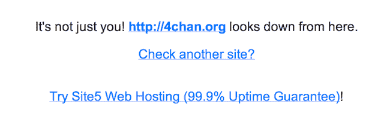
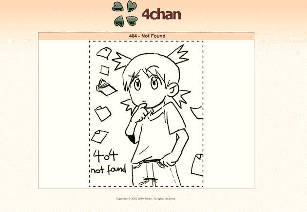
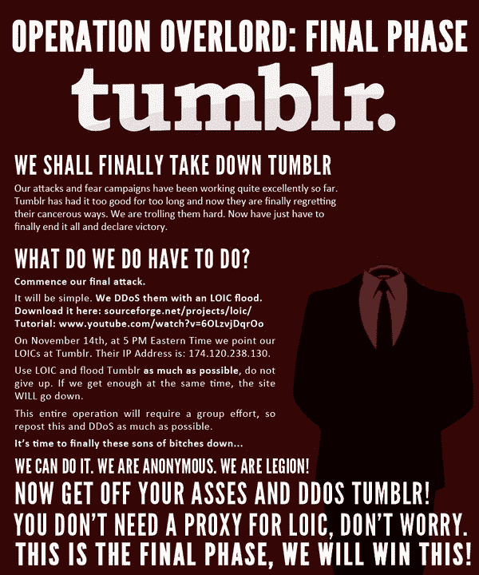
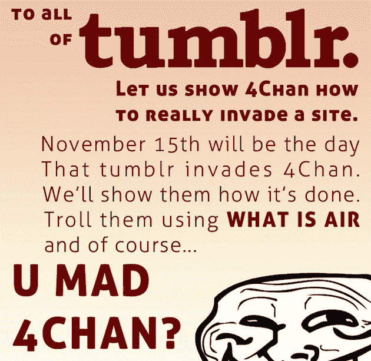

# Tumblr 刚刚是不是反向拿下了 4Chan？

> 原文：<https://web.archive.org/web/https://techcrunch.com/2010/11/14/tumblr-4chan-war/>

# Tumblr 刚刚是不是反向拿下了 4Chan？

今天本来应该是 [4Chan](https://web.archive.org/web/20230214014007/http://4chan.org/) 拿下 [Tumblr](https://web.archive.org/web/20230214014007/http://tumblr.com/) 的日子。反而看起来 4Chan 本身就宕机了。Tumblr 会是幕后黑手吗？

正如你所看到的，4Chan 是每个人的[down](https://web.archive.org/web/20230214014007/http://downforeveryoneorjustme.com/4chan.org)，不仅仅是我。至少在过去的 15 分钟里一直如此。这个时间很有意思，因为 4Chan DDoS 攻击开始的时间应该是美国东部时间下午 5 点，也就是大约 15 分钟前。有可能是本来[计划明天](https://web.archive.org/web/20230214014007/http://www.urlesque.com/2010/11/12/4chan-ddos-tumblr-raid/)反击的 Tumblr 用户，把它提前到今天来破 4Chan？

顺便说一下，Tumblr 仍然很受欢迎。

我相信还会有更多。

更新:似乎有相当多的人看到各种 Tumblr 网站也关闭了(尽管对其他人来说还在运行)。

**更新 2** :而且 [4Chan 版块都起来了](https://web.archive.org/web/20230214014007/http://boards.4chan.org/b/)，但是看起来满满的都是 Tumblr 用户，一吨的东西都在 404ing。

**更新 3**:Tumblr 创始人戴维·卡普说:

> 一如既往，我们积极暂停任何鼓励拒绝服务攻击或其他非法行为的帐户。

卡普还指出，我在上面发布的被黑的停机图像是假的，所以我删除了它。

*【via[安东尼·德·罗萨](https://web.archive.org/web/20230214014007/https://twitter.com/#!/antderosa/status/3933728556453888)*