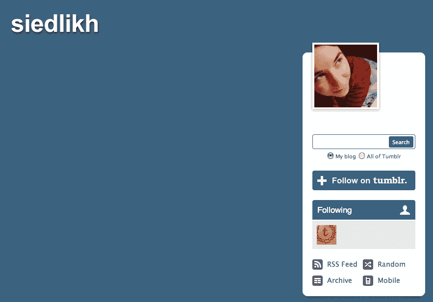
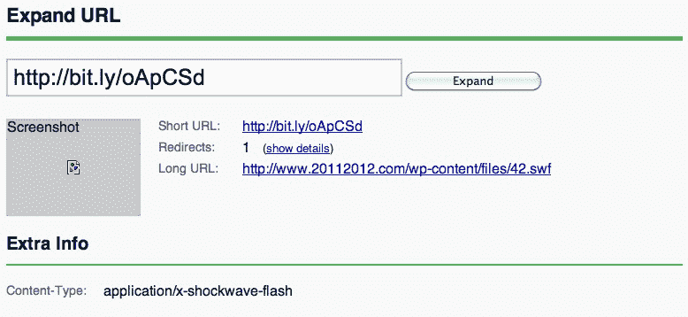

# Tumblr 承认其日益严重的垃圾邮件问题，并表示将竭尽全力

> 原文：<https://web.archive.org/web/http://techcrunch.com/2011/10/31/tumblr-acknowledges-its-growing-spam-problem-says-its-doing-everything-it-can/>

[Tumblr](https://web.archive.org/web/20230209185313/http://www.tumblr.com/) 是否面临日益严重的垃圾邮件问题？对于博客平台的许多常规用户来说，答案是“是的”。尽管 Tumblr 没有在 T2 开设自己的博客“T3”来公开介绍其在打击垃圾邮件方面的最新进展，但它最近确实解决了一位备受关注的 Tumblr 用户——NPR《新鲜空气》的联合制片人梅洛迪·克莱默的担忧。梅洛迪·克莱默在 T4 为 Tumblr 平台上的热门节目开设了一个博客“T5”。

对克莱默来说， [Tumblr 承认其意识到](https://web.archive.org/web/20230209185313/http://nprfreshair.tumblr.com/post/11988802095/update-from-tumblr-on-spammers)最近垃圾博客的增加，并“尽我们所能快速暂停这些博客，并阻止更多的博客被创建”。

上周，克罗地亚博主斯文·杜普利(斯文·杜普利)发布了一篇关于垃圾邮件机器人占 Tumblr 用户百分比的文章，引发了评论和黑客新闻的讨论。(BetaBeat 对此有很好的[总结](https://web.archive.org/web/20230209185313/http://www.betabeat.com/2011/10/24/does-tumblr-have-a-spam-bot-problem/))。其结果是，对一些 Tumblr 用户来说，这个问题比对其他用户来说更糟。

但是对于《NPR 新鲜空气》来说，这个问题已经严重到促使克莱默在本月早些时候给 Tumblr 垃圾邮件发送者发了一条尖刻的信息，也许是为了让 Tumblr 自己介入并解决这个问题:

> 亲爱的 Tumblr 垃圾邮件发送者:
> 
> 如果你打算关注新鲜空气，然后喜欢 30 篇文章，为什么不喜欢最近的文章呢？如果你只是想让人们找到你的页面，喜欢去年 2 月的帖子——一连串——可能不会有帮助。
> 
> 你的真的，
> 
> 蜂蜜

Tumblr 现在已经回复了这个问题，基本上确认它已经意识到日益严重的垃圾邮件问题，并且正在尽一切努力来解决这个问题。

[完整信息为](https://web.archive.org/web/20230209185313/http://nprfreshair.tumblr.com/post/11988802095/update-from-tumblr-on-spammers):

> 你好，梅洛迪。请注意，我们注意到最近有越来越多的奇怪网址的博客关注着大量的用户。我们正在尽我们所能快速暂停这些博客，并阻止更多的博客被创建。
> 
> 当 Tumblr 发现并暂停这些博客时，你可能会发现在一段时间内你的关注者计数似乎不正确。我们的跟随者索引系统会识别出某个博客已经被暂停，然后不把这个被暂停的博客计入你的跟随者数量。一段时间后，我们将正确更新您的关注者数量。
> 
> 一个或多个博客关注您、重新记录您的内容或喜欢您的内容的事实不会以任何方式危及您的 Tumblr 帐户或您的计算机的安全。
> 
> 如果你愿意，你可以屏蔽任何引起你关注的博客。屏蔽不会阻止某人显示为关注者，也不会阻止他们查看公共博客的网页或 RSS 源。但是您可以使用 http://tumblr.com/block，这样他们就不会在仪表板上看到您的帖子，也不会在帖子注释或仪表板通知中看到这些帖子，也不会收到他们的消息。
> 
> 我们很抱歉这个问题已经发生，我们正在尽我们所能迅速解决它。如果您有进一步的问题或疑虑，请告诉我们。

不幸的是，对于克莱默和 Tumblr 的其他用户群来说，这个问题可能不像垃圾邮件发送者只是通过平台的喜欢系统偷偷进入他们网站的链接那么简单，尽管这是最明显的问题。

垃圾邮件发送者通常使用 Tumblr 的“喜欢”按钮[来创建到他们网站的反向链接](https://web.archive.org/web/20230209185313/http://shortformblog.tumblr.com/post/11645079360/tumblr-likespam-problem),方法是创建数百或数千个虚假的 Tumblr 帐户，四处“喜欢”其他人的 Tumblr 帖子。这与垃圾邮件发送者渗透博客评论系统链接到他们的网站的问题没有什么不同，或者现在几乎被废弃的使用引用通告来指示别人何时链接到他们的帖子的系统。(在博客早期流行的引用通告，被垃圾邮件发送者泛滥成灾，以至于今天，大多数博客作者干脆关闭了它们。)

当然，Tumblr 的增长是显著的。9 月，[筹集了 8500 万美元的新资金](https://web.archive.org/web/20230209185313/https://techcrunch.com/2011/09/26/tumblr-raises-85-million-round-from-richard-branson-vcs/)，使其资金总额超过 1.25 亿美元。但是，当该公司谈到其“3000 万个博客”和“每天 4000 万个帖子”时，还不清楚其中有多大比例是由垃圾邮件发送者创建的。

或许更重要的是，Tumblr 上的垃圾邮件发送者不仅仅使用该平台来建立反向链接——在某些情况下，他们的 Tumblr 档案甚至包含有效载荷，比如指向恶意软件的链接。这里有一个例子，由 [shortformblog](https://web.archive.org/web/20230209185313/http://shortformblog.tumblr.com/post/11654489531/tumblr-fake-profiles) 揭露，他发现一个可疑的 Tumblr 简介的源代码中隐藏着 bit.ly 链接，指向一个流氓 Flash 文件下载。

如果点击 Tumblr 个人资料会导致你的电脑感染恶意软件，那么 Tumblr 就有一个严重的问题，比垃圾邮件和可疑的搜索引擎优化策略更糟糕。

当然，揭示恶意软件问题的广泛程度需要源代码检查和分析，这最好留给安全研究人员去做。也就是说，哪里有垃圾邮件，哪里就有恶意软件。

希望 Tumblr 能够利用新的资金，在问题变得更加严重之前，快速有效地解决这个问题。

***更新**:作为打击的一部分，看起来 Tumblr 现在正在其 like 链接上添加 ref=nofollow。(注:这不是公司的官方确认)。*

*图片来源: [shortformblog](https://web.archive.org/web/20230209185313/http://shortformblog.tumblr.com/post/11654489531/tumblr-fake-profiles)*